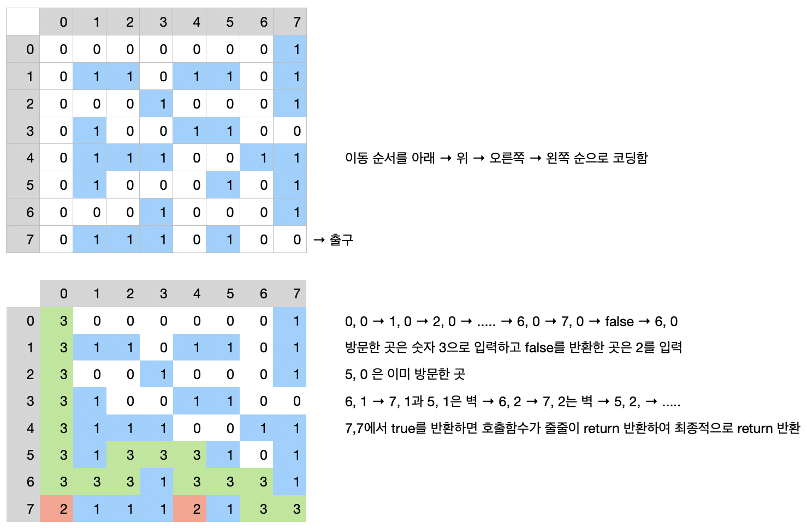

## 수업

CSS 우선순위

- class -> id -> inline 순으로 읽어 overwrite 
- overwrite 되지 않으려면 속성에 !important 붙인다. 

상속할 때 적용이 안 되는 태그가 많다. 강제로 상속하게 하려면 상속이 적용되지 않는 태그의 스타일을 따로 지정해서  속성값에 `inherit;`을 입력한다.  

```css
.content { color: blue; }
.content a, button { color: inherit; }
``` 

## flexbox에 관한 두 개의 좋은 설명글

- 기본 개념 잡기: [이번에야말로 CSS Flex를 익혀보자](https://studiomeal.com/archives/197){target=\_blank} 
- 응용: [flexbox로 만들 수 있는 10가지 레이아웃](https://d2.naver.com/helloworld/8540176){target=\_blank}


## 순환 알고리즘 미로 찾기

recursive thinking 현재 위치에서 출구까지 가는 경로가 있으려면

- 현재 위치가 출구이거나
- 이웃한 셀들 중 하나에서 현재 위치를 지나지 않고 출구까지 가는 경로가 있거나

### Decision Problem

답이 Yes or No 문제 = 현재 위치에서 출구로 가는 경로가 있는가? 없는가?

```
boolean findPath(x, y)
	if (x, y) is the exit
	    return true;
	else
		mark (x, y) as a visited cell;
	    for each neighboring cell (x', y') of (x, y) do
		    if (x', y') is on the pathway and not visited // 인접한 셀이 벽이 아니고 통로이면
			    if findPath(x', y')
				    return true;
		return false;
```

최종 pseudo code

```
boolean findPath(x, y)
	if (x, y) is either on the wall or a visited cell
		return false;
	else if (x, y) is the exit
		return true;
	else
		makr (x, y) as a visited cell;
		for each neighboring cell (x', y') of (x, y) do
			if findPath(x', y')
				return true;
		return false;
```

### 최종 코드

```java
// Maze
private static int N = 8;
private static int[][] maze = {
		{0, 0, 0, 0, 0, 0, 0, 1},
		{0, 1, 1, 0, 1, 1, 0, 1},
		{0, 0, 0, 1, 0, 0, 0, 1},
		{0, 1, 0, 0, 1, 1, 0, 0},
		{0, 1, 1, 1, 0, 0, 1, 1},
		{0, 1, 0, 0, 0, 1, 0, 1},
		{0, 0, 0, 1, 0, 0, 0, 1},
		{0, 1, 1, 1, 0, 1, 0, 0},
};
private static final int PATHWAY_COLOR = 0;  //white
private static final int WALL_COLOR = 1;     //blue
private static final int BLOCKED_COLOR = 2;  //red 방문했지만 출구로 갈 수 없는 경로
private static final int PATH_COLOR = 3;     //green 방문한 통로

public static void printMaze() {
	System.out.println("\n미로 지도");
	for(int i=0; i<maze.length; i++) {
		for(int j=0; j<maze[i].length; j++)
			System.out.print(maze[i][j] + " ");
		System.out.println();
	}
}

public static boolean exitMaze(int x, int y) {
	if (x < 0 || y < 0 || x >=N || y >= N) // 지도 바깥으로 나가면 false 반환
		return false;
	else if (maze[x][y] != PATHWAY_COLOR)  // 현재 위치가 통로가 아니면 false 반환
		return false;
	else if (x == N-1 && y == N-1) { // 출구이면
		maze[x][y] = PATH_COLOR;    // 방문한 곳으로 표시
		return true;
	}
	else {
		maze[x][y] = PATH_COLOR;    // 방문한 곳으로 표시
		if ( exitMaze(x+1, y) || exitMaze(x-1, y) || exitMaze(x, y+1) || exitMaze(x, y-1))
			return true;
		maze[x][y] = BLOCKED_COLOR;  // 통로를 찾지 못하면 막다른 곳으로 표시
		return false;  // 호출한 곳으로 되돌아감
	}
}
```


