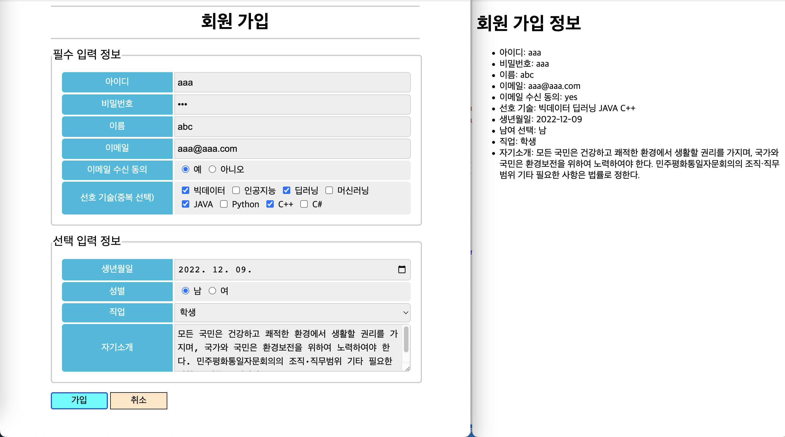

## 회원가입 페이지 만들기

```html
<!DOCTYPE html>
<html lang="en">
<head>
    <meta charset="UTF-8">
    <meta http-equiv="X-UA-Compatible" content="IE=edge">
    <meta name="viewport" content="width=device-width, initial-scale=1.0">
    <title>회원 가입</title>
    <!-- <link rel="stylesheet" href="https://unpkg.com/destyle.css@1.0.5/destyle.css"> -->
    <link rel="stylesheet" href="join.css">
</head>
<body>
    <h1>회원 가입</h1>
    <div class="container">
    <form action="join.php" method="post" target="_blank">
        <fieldset>
            <legend>필수 입력 정보</legend>
            <ul class="required">
                <li><span class="item">아이디</span><input type="text" class="in" name = "id" required></input></li>
                <li><span class="item">비밀번호</span><input type="password" class="in" name = "password" required></input></li>
                <li><span class="item">이름</span><input type="text" class="in" name = "name" required></input></li>
                <li><span class="item">이메일</span><input type="email" class="in" name = "email" required></input></li>
                <li><span class="item">이메일 수신 동의</span><span class="in">
                    <input type="radio" name="receive" value="yes" required>예</input>
                    <input type="radio" name="receive" value="no" required>아니오</input></span>
                </li>
                <li><span class="item">선호 기술(중복 선택)</span><span class="in">
                    <input type="checkbox" name="tech[]" value="빅데이터">빅데이터
                    <input type="checkbox" name="tech[]" value="인공지능">인공지능
                    <input type="checkbox" name="tech[]" value="딥러닝">딥러닝 
                    <input type="checkbox" name="tech[]" value="머신러닝">머신러닝 <br>
                    <input type="checkbox" name="tech[]" value="JAVA">JAVA
                    <input type="checkbox" name="tech[]" value="Python">Python
                    <input type="checkbox" name="tech[]" value="C++">C++
                    <input type="checkbox" name="tech[]" value="C#">C#
                </span>
                </li>
            </ul>
        </fieldset>
        <fieldset>
            <legend>선택 입력 정보</legend>
            <ul class="sel">
                <li><span class="item">생년월일</span><input type="date" name="birth" class="in"></li>
                <li><span class="item">성별</span><span class="in">
                    <input type="radio" name="gender" value="man">남</input>
                    <input type="radio" name="gender" value="woman">여</input></span>
                </li>
                <li><span class="item">직업</span>
                    <select name="job" class="in">
                        <option value="직장인">직장인</option>
                        <option value="학생">학생</option>
                        <option value="군인">군인</option>
                        <option value="의사">의사</option>
                        <option value="변호사">변호사</option>
                    </select>
                </li>
                <li><span class="item">자기소개</span><textarea class="in" name="about" rows="3"></textarea></li>
            </ul>
        </fieldset>
        <div class="btn">
            <button type="submit" class="sub">가입</button>
            <button type="reset" class="re">취소</button>
        </div>
    </form>
    </div>

</body>
</html>
```

```css
* {
    font-size: 100%;
    text-decoration: none;    /* 밑줄 없애기 */
    list-style-type: none;    /* li 태그의 점 없애기 */
}

h1 {
    font-size: 2rem;
    text-align: center;
    width: 80%;
    border-top: 2px solid #ccc;       /* 위 아래 직선 추가 */
    border-bottom: 2px solid #ccc;
    padding: 0.5rem 0;
    margin: 0 auto;     /* 가운데 정렬 */
}

.container {      /* 전체 내용을 80% 크기로 하고 가운데 정렬*/
    width: 80%;
    margin: 0 auto;
}

fieldset {
    font-size: 1.3rem;
    display: flex;            /* 내부의 li 태그 세로 정렬 */
    justify-content: column;
    border: 2px solid #ccc;
    border-radius: 5px;
    width: 100%;
    margin: 1rem auto;
    padding: 0rem;
}

ul {
    width: 100%;
    padding: 0;
    margin: 1rem 1rem;
}

input {
    border: 1px solid #ccc;
    margin: 0 .5rem;
}
li {
    display: flex;       /* li 태그 안의 span 태그 정렬 */
    justify-content: space-between;
}

.item {
    font-size: 1rem;
    display: flex;              /* 글자 수직 세로 정렬 위해 설정 */
    justify-content: center;    /* 글자 가운데 정렬 */
    align-items: center;        /* 글자 세로 정렬 */
    color: #fff;
    text-align: center;
    line-height: 1.5rem;
    background: #0bd;
    border-radius: 5px 0 0 5px;
    width: 30%;
    padding: .3rem;
    margin: .1rem;;
}

.in {
    font-size: 1rem;
    display: inline-block;
    flex-grow: 1;
    line-height: 1.5rem;
    background: #eee;
    border-radius: 0 5px 5px 0;
    width: 60%;
    padding: .3rem;
    margin: .1rem;
}

.btn {
    padding: 0;
}

button {
    border: 1px solid #000;
    width: 100px;
    height: 30px;
}

.sub {
    background: aqua;
}

.sub:hover{   /* 버튼 위에 마우스 올리면 색이 진해지는 효과 */
    background: rgb(3, 195, 195);
}

.re {
    background-color: bisque;
}

.re:hover { background-color: rgb(221, 176, 122);}

select, textarea {
    border: 1px solid #ccc;
}
```

```php
<!DOCTYPE html>
<html lang="en">
<head>
    <meta charset="UTF-8">
    <meta http-equiv="X-UA-Compatible" content="IE=edge">
    <meta name="viewport" content="width=device-width, initial-scale=1.0">
    <title>회원 정보</title>
</head>
<body>
    <h1>회원 가입 정보</h1>
    <ul>
        <li>아이디: <?php echo $_POST['id']; ?></li>
        <li>비밀번호: <?php echo $_POST['password']; ?></li>
        <li>이름: <?php echo $_POST['name']; ?></li>
        <li>이메일: <?php echo $_POST['email']; ?></li>
        <li>이메일 수신 동의: <?php echo $_POST['receive']; ?></li>
        <li>선호 기술: 
            <?php for($i=0; $i < count($_POST['tech']); $i++){
                echo $_POST['tech'][$i];
                echo " ";
            } ?>
        </li>
        <li>생년월일: <?php echo $_POST['birth']; ?></li>
        <li>남여 선택: <?php echo $_POST['gender']; ?></li>
        <li>직업: <?php echo $_POST['job']; ?></li>
        <li>자기소개: <?php echo $_POST['about']; ?></li>
    </ul>
</body>
</html>
```



## 알고리즘 - 입력한 좌표가 속한 blob 안의 셀 개수 출력하기

blob = 서로 연결된 픽셀(상하좌우 대각 방향)  
  
입력  
  
- N*N 크기의 2차원 grid  
- 하나의 좌표 (x, y)  
  
출력  
  
- 픽셀 (x, y)가 포함된 blob의 크기  
- (x, y)가 어떤 blob에도 속하지 않는 경우에는 0  
  
알고리즘  
  
- 현재 좌표가 지도 밖이라면 Return 0  
- 현재 픽셀이 image color가 아니거나 이미 카운트된 곳이라면 Return 0  
- 현재 픽셀이 image color이고 카운트되지 않은 곳이라면    
   * 현재 픽셀을 카운트 count++  
   * 현재 픽셀이 중복 카운트되는 걸 막기 위해 다른 색으로 칠함  
   * 현재 픽셀에 이웃한 모들 픽셀들(8개, 상하좌우 대각선)에 대해 재귀함수를 호출하여 그 픽셀이 속한 blob의 크기를 count++  
   * Return count  


```java
// 클래스
// 이미지에서 임의의 좌표가 속한 blob 안의 셀 개수 반환
private static int NN = 8;
private static int[][] imageBlob = {
		{1, 0, 0, 0, 0, 0, 0, 1},
		{0, 1, 1, 0, 0, 1, 0, 0},
		{1, 1, 0, 0, 1, 0, 1, 0},
		{0, 0, 0, 0, 0, 1, 0, 0},
		{0, 1, 0, 1, 0, 1, 0, 0},
		{0, 1, 0, 1, 0, 1, 0, 0},
		{1, 0, 0, 0, 1, 0, 0, 1},
		{0, 1, 1, 0, 0, 1, 1, 1},		
};
private static final int IMAGE_COLOR = 1;
private static final int COUNTED_COLOR = 2;

int count = 0;
public static int countBlob(int r, int c) {
	if (r < 0 || c < 0 || r >= NN || c >= NN)
		return 0;
	else if (imageBlob[r][c] != IMAGE_COLOR)
		return 0;
	else {
		imageBlob[r][c] = COUNTED_COLOR;
		// return에 1을 더하는 것은 현재 위치가 image color이기에 count++ 
		return 1 + countBlob(r-1, c) + countBlob(r-1, c+1)  //북, 북동
				 + countBlob(r, c+1) + countBlob(r+1, c+1)  //동, 동남
				 + countBlob(r+1, c) + countBlob(r+1, c-1)  //남, 남서
				 + countBlob(r, c-1) + countBlob(r-1, c-1); //서, 북서
	}
}
```

```java
// main 함수
int count = recur.countBlob(5, 3);
System.out.println("현재 좌표가 속한 Blob 안의 셀 개수 = " + count);
```
