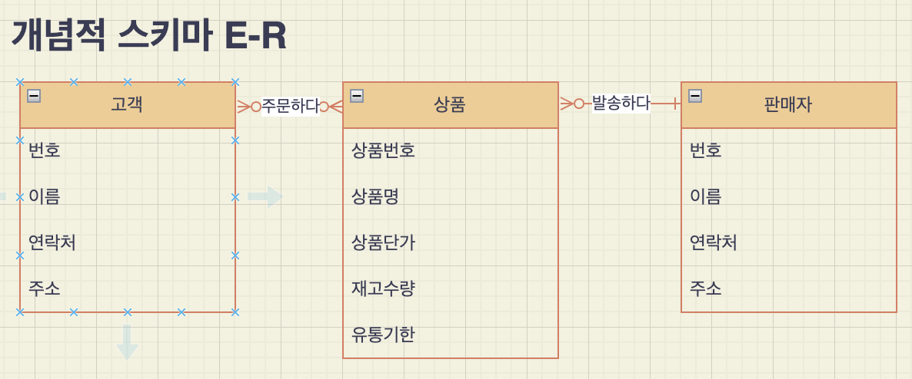
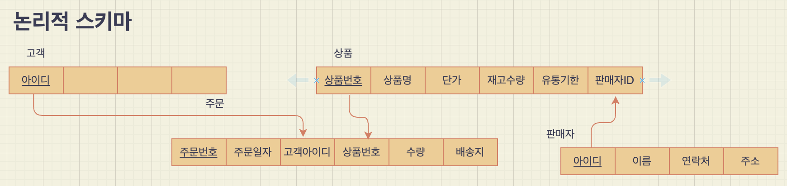

## 수업

- 파일 IO 
- 데이터베이스

### 데이터베이스

- **메타 데이터** = **시스템 카탈로그**(오라클 용어) = **데이터 사전** : DB의 수많은 테이블에 대한 정보 요약 저장
- 쿼리 날리면
    1. 구문 분석
    2. 시스템 카탈로그 이용해 테이블 정보 확인
    3. 권한 검사
    4. 효율적 실행 계획(execute plan) 생성 by 옵티마이저(최적화기) in DB engine
        - 경험 기반: cost base (시스템 카탈로그에 있는 통계 정보 이용)
        - 관례에 따라: rule base
        - => IO 최소화 목적 why? 데이터가 디스크에 저장되어 있기 때문
        - 디스크는 write를 동시에 할 수 없음(하나 밖에 없는 헤드가 있는 곳에 저장) => 여러 대의 디스크에 분산 처리
        - 실시간 서비스 위해 디스크에 있는 데이터를 메모리에 올려 사용하는 메모리 기반 DBMS = MMDBMS => 전원이 나가도 최신 데이터가 유지되도록 노력
        - => 휘발성 문제 해결 위해 SSD 기반 DB 개발. 단점은 수명이 짧음 => SSD의 여러 곳에 골고루 저장되게 해 특정 영역의 write 가능 횟수가 급격히 줄지 않도록 노력
- SQL 속도 개선을 위해 튜닝을 하려면 옵티마이저에 대해 잘 알아야 한다.

**프로그램-데이터 독립성**: DB는 파일을 논리적으로 모델링해서 사용하기 때문에 mysql을 쓰다가 oracle로 바꾼다고 해서 DB를 바꿀 필요는 없다.

데이터에 특화된 DB: 공간 DBMS, 시공간 DBMS

외래키

- 1:N => N쪽에 외래키 넣는다 eg. 교수:학생 => 학생테이블에 교수테이블의 기본키를 넣는다. 그래야 단일성이 유지된다.(교수테이블에 넣으려면 여러 학생을 같은 컬럼에 넣어야 하는 문제 발생)
- N:M => 중간에 매개하는 테이블을 만들어 매개 테이블에 양쪽의 외래키를 넣는다.

**트랜잭션**: DB에서 수행되는 논리적인 작업 모음

보안 관련 공부할 때 사용하는 운영체제: 칼리 리눅스

데이터 모델링 도구: DA# 

외부-개념-내부 단계로 나누는 이유는 독립성을 보장하기 위해서다. 한 쪽이 바뀌더라도 다른 쪽을 수정할 필요가 없도록

2 tier : 클라이언트가 서버에 직접 접속
3 tier : 2 tier로 서버에 부하가 집중되는 것을 완화하기 위해 중간에 middle ware를 두는 것

### 데이터 모델링 실습

1. 쇼핑몰 요구사항 정리
2. ER 다이어그램: 고객, 상품, 판매자
3. 외래키

#### 요구사항 분석

개체와 속성

1. 회원: *회원아이디*, 회원이름, 회원비밀번호, 회원연락처, 회원주소
2. 상품: *상품번호*, 상품명, 상품단가, 재고수량, 유통기한
3. 판매자: *판매자아이디*, 판매자이름, 판매자비밀번호, 판매자연락처, 판매자주소, 
4. 회원이 상품 주문: *회원아이디*, *주문번호*, 주문일자, *상품번호*, *주문수량, *배송지*
5. 판매자가 상품 발송: *판매자아이디*, *주문번호*, *상품번호*, *주문수량, *배송지*

관계

1. 회원 N **주문한다** M 상품
2. 판매자 1 **발송한다** N 상품

새발처럼 되어있는 것에 동그라미가 추가된 것은 옵션

## 객체지향 개념 익히기

[권오흠 교수 강의 - 상속](https://youtu.be/hLJ2_JMn6_k?list=PL52K_8WQO5oWz_LYm3xg23m5q9qJXoE4n){target=_blank}

- toString(): 객체의 값들을 하나의 문자열로 표현해서 리턴하는 메서드를 만들 때 많이 사용하는 이름
- Method Overriding
- Polymorphism: 수퍼클래스 타입의 참조 변수가 서브클래스 타입의 객체를 참조할 수 있다.
- Dynamic Binding
- split string
- array reallocation

## 미니 프로젝트 제안

유행을 따라 저도 미니 프로젝트를 제안하고자 합니다.
자바로 객체지향 프로그래밍을 연습하는게 목적입니다.  
구체적으로는 작은 GUI 앱을 만들려고 합니다. 

진행방법

1. 먼저 이번 주말 동안 안내 강좌를 봅니다. 
이번 주말에 다 보신 분에 한해서 모임을 진행하려고 합니다.

아래 링크된 강좌 중 3-1장 상속부터 3-5장 제너릭 프로그래밍까지입니다.
꽤 많은 분량이니 부지런히 보셔야 할 것 같습니다. 
이해가 안 되는 부분은 스터디 과정에서 풀어나갈 수 있으리라고 기대합니다.

[https://www.youtube.com/watch?v=hLJ2_JMn6_k&list=PL52K_8WQO5oWz_LYm3xg23m5q9qJXoE4n&index=26](https://www.youtube.com/watch?v=hLJ2_JMn6_k&list=PL52K_8WQO5oWz_LYm3xg23m5q9qJXoE4n&index=26){target=_blank}

함께 만들 앱은 이 강좌에서 만들어 가는 스케줄러앱을 GUI로 변형하는 것입니다.
잘 되면 db에 데이터를 저장하는 것까지 해보려고요.

2. 주말에 다 보시면 월요일에 모여 프로젝트 설계를 합니다.

3. 모임은 격일로 할까 합니다. 하루는 각자 코드로 구현을 하고 
월, 수, 금에 모여 각각의 코드를 리뷰하는 형식으로 진행하는 게 좋을 것 같습니다.
코드 리뷰 과정에서 속 쓰리는 일이 있겠지만,
다른 사람의 조언을 듣고 다른 사람의 코드를 보며 배우는 게 많을 것 같습니다.

4. 한 사람의 코드를 리뷰하는 데 30분 정도 예상을 하면 최대 3, 4명으로 진행해야 할 것 같습니다.
또한, 원격으로는 대화하기가 쉽지 않으니 교육장으로 오실 수 있는 분밖에 할 수 없을 것 같아요.

이상은 제가 생각나는 점을 나열한 것일 분 확정사항이 아닙니다. 
함께하실 분이 정해지면 다시 논의해 봐요.

관심 있으신 분은 DM 주세요.
