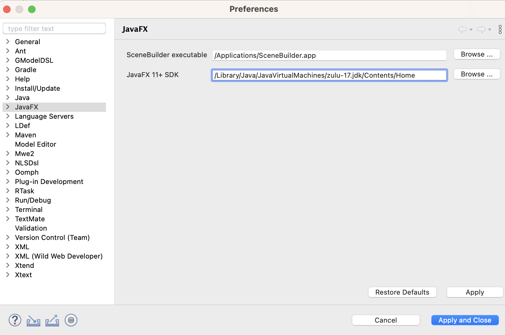

## javaFx가 포함되어 있는 jdk 설치 (Azul Zulu Java 17 (LTS) with JDK FX)

[출처](https://blogs.oregonstate.edu/cornercase/2022/04/21/the-apple-m1-and-java/){target=_blank}

jenv(Java environment manager) : an open-source tool that will allow us to manage several JDKs on Linux-type systems

```
$ brew install jenv
$ echo 'export PATH="$HOME/.jenv/bin:$PATH"' >> ~/.zshrc
$ echo 'eval "$(jenv init -)"' >> ~/.zshrc
$ jenv enable-plugin maven

// brew에 외부 저장소 등록 후 설치
$ brew tap mdogan/zulu  
$ brew install zulu-jdk17

// jenv 사용
$ jenv add /Library/Java/JavaVirtualMachines/zulu-17.jdk/Contents/Home/
$ jenv versions

// 사용할 자바 버전 설정
$ jenv global zulu64-17.0.5
$ jenv shell zulu64-17.0.5

// 확인
$ jenv versions
system
17.0
17.0.5
* zulu64-17.0.5 (set by JENV_VERSION environment variable)

// PATH 등록
$ echo 'jenv shell zulu64-17.0.2' >> ~/.zshrc

// shell 재실행
$ source ~/.zshrc

// scene-builder 설치: 경로 -> /Applications/SceneBuilder.app
$ brew install --cask scenebuilder
```

## 이클립스 설정

Eclipse >> Help >> Eclipse Marketplace >> javafx 검색 e(fx)clipse 설치



javafx 프로젝트 만들기

New >> Other >> JavaFX >> JavaFX Project

이클립스에서 JavaFX 설정이 여의치 않아 일단 Swing으로 만들어 보리고 했다.

### Calendar class 익히기

[공식 문서](https://docs.oracle.com/javase/7/docs/api/java/util/Calendar.html){target=_blank}

Calendar.YEAR => 예상과 달리 현재 연도를 반환하지 않고 필드 번호를 반환한다.

```java
Calendar cal = Calendar.getInstance();
System.out.println("Field number ERA: \t\t\t" + cal.ERA);                               // 0 AD, BC
System.out.println("Field number YEAR: \t\t\t" + cal.YEAR);                             // 1
System.out.println("Field number MONTH: \t\t\t" + cal.MONTH);                           // 2
System.out.println("Field number WEEK_OF_YEAR: \t\t" + cal.WEEK_OF_YEAR);               // 3
System.out.println("Field number WEEK_OF_MONTH: \t\t" + cal.WEEK_OF_MONTH);             // 4
System.out.println("Field number DATE: \t\t\t" + cal.DATE);                             // 5
System.out.println("Field number DAY_OF_MONTH: \t\t" + cal.DAY_OF_MONTH);               // 5
System.out.println("Field number DAY_OF_YEAR: \t\t" + cal.DAY_OF_YEAR);                 // 6
System.out.println("Field number DAY_OF_WEEK: \t\t" + cal.DAY_OF_WEEK);                // 7
System.out.println("Field number DAY_OF_WEEK_IN_MONTH: \t" + cal.DAY_OF_WEEK_IN_MONTH); // 8
System.out.println("Field number AM_PM: \t\t\t" + cal.AM_PM);                           // 9
System.out.println("Field number HOUR: \t\t\t" + cal.HOUR);                             // 10
System.out.println("Field number HOUR_OF_DAY: \t\t" + cal.HOUR_OF_DAY);                 // 11
System.out.println("Field number MINUTE: \t\t\t" + cal.MINUTE);                         // 12
System.out.println("Field number SECOND: \t\t\t" + cal.SECOND);                         // 13
System.out.println("Field number MILLISECOND: \t\t" + cal.MILLISECOND);                 // 14
System.out.println("Field number ZONE_OFFSET: \t\t" + cal.ZONE_OFFSET);                 // 15
System.out.println("Field number DST_OFFSET: \t\t" + cal.DST_OFFSET);                   // 16
```

현재 연도를 반환하려면 Calendar.get(Calendar.YEAR) 처럼 get() 메소드 안에 매개변수로 넣어야 한다.  
Calendar.get(int 필드 번호) => int 

월의 마지막 날 Calendar.getActualMaximum(Calendar.DATE)

```java
System.out.println(cal.get(cal.YEAR) + "년");			// 2022년
System.out.println(cal.get(cal.MONTH)+1 + "월");  		// 12월 <- 1월이 0 
System.out.println(cal.get(cal.DATE) + "일");			// 19일
System.out.println(cal.get(cal.DAY_OF_WEEK) + "요일"); 	// 2요일 <- 일요일부터 1
System.out.println(cal.get(cal.HOUR) + "시 (" + cal.get(cal.HOUR_OF_DAY) + "시)"); // 5시 (17시)
System.out.println(cal.get(cal.MINUTE) + "분");			// 12분
System.out.println(cal.get(cal.SECOND) + "초");			// 6초
```

add(int field, int amount): calendar field에 amount 만큼을 더하거나 뺀다. 반환값이 없고 자신을 바꾼다.

```java
cal.add(cal.DATE, 20); // add method는 반환값이 없어 print 못 함
System.out.println("현재 날짜로부터 20일 후는 " +  cal.get(cal.YEAR) + "년 " +  (cal.get(cal.MONTH)+1) + "월 " + cal.get(cal.DATE) + "일");  
cal.add(cal.DATE, -20); 
System.out.println("바꾼 날짜로부터 20일 전은 " +  cal.get(cal.YEAR) + "년 " +  (cal.get(cal.MONTH)+1) + "월 " + cal.get(cal.DATE) + "일");

// 현재 날짜로부터 20일 후는 2023년 1월 8일
// 바꾼 날짜로부터 20일 전은 2022년 12월 19일
```

