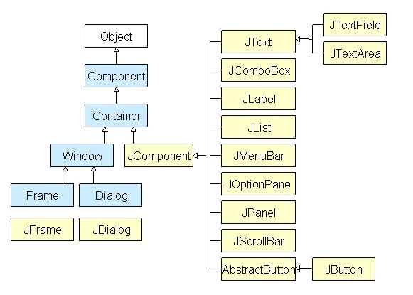
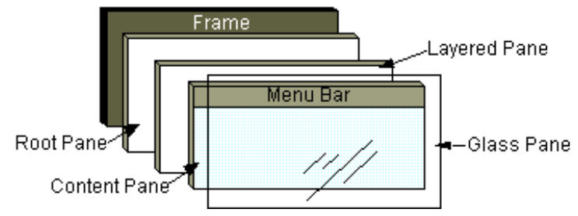
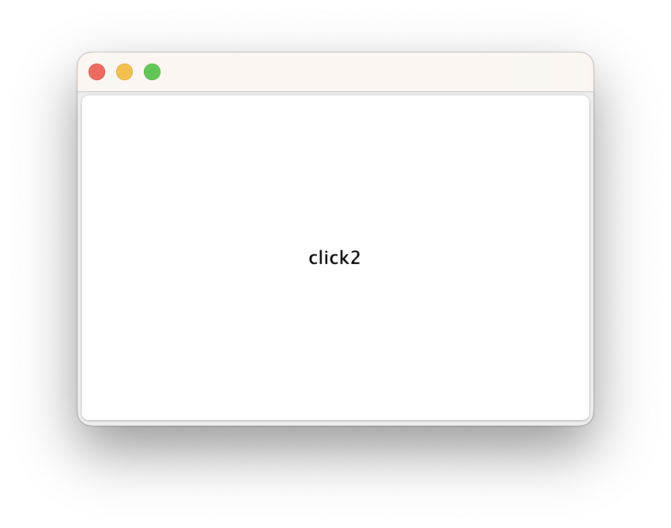
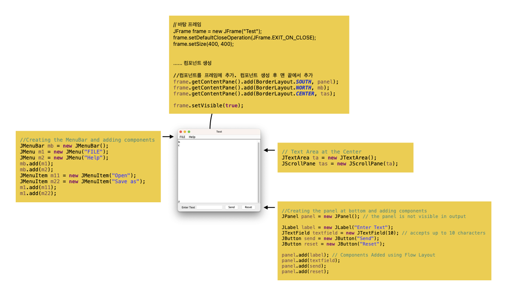

## 기본 구조



GUI를 만들려면, 적어도 1개의 컨테이너 객체가 있어야 한다.

### Swing Container 종류

- Panel: 컴포넌트를 윈도우에 배열하기 위한 컨테이너
- Frame: 완전하게 작동하는 윈도우
- Dialog: 팝업 윈도우처럼 쓰임

### Swing Container 구조



- GlassPane: 다른 패널 위에 존재하면서 기본적으로 숨겨져 있는 투명한 판
- JMenuBar: `jFrame.setJMenuBar ( new JMenuBar());`
- ContentPane: UI 컴포넌트가 배치되는 판. `jFrame.getContentPane().add( new JButton("확인"), BorderLayout.SOUTH );`
- LayeredPane: 여러 컴포넌트들이 겹쳐질 때 각 컴포넌트의 상하 위치를 결정.
- JTabbedPane: 탭 별로 다른 내용을 보여주기 위해 사용되는 컨테이너
- JScrollPane: 포함된 컴포넌트의 크기가 JScrollPane 자신보다 큰 경우 수평 또는 수직 스크롤 바를 이용해서 볼 수 있게 해준다

### 윈도우 종류

- JWindow: 완전한 윈도우 창 형태를 갖고 있는 최상위 레벨 컨테이너. 윈도우 경계선, 제목 표시줄, 메뉴바가 모두 없는 윈도우를 만드는 컨테이너.  
- JFrame: 완전한 윈도우 창 형태를 갖고 있는 최상위 레벨 컨테이너. 윈도우 경계선, 제목 표시줄, 메뉴바가 있는 윈도우를 만드는 컨테이너 클래스
- JDialog: 완전한 윈도우 창 형태를 갖고 있는 최상위 레벨 컨테이너. 


## 구현

### 구현 순서

1. 프레임 만들기
2. 레이아웃 정하기
3. 프레임에 컴포넌트 붙이기

## 프레임 만들기

- JFrame 클래스 상속: `public class App extends JFrame { ... }`
- JFrame 객체 생성: `JFrame frame = new JFrame()`

### main() 함수에서 생성자 호출하고 JFrame 나타내기

```java
	public static void main(String[] args) {
		App frame = new App(" ");
		frame.setVisible(true);
	}
```

### 생성자에서 타이틀, 크기, 위치, 버튼 지정.

```java
public App(String title) {
    setTitle(title);
    setSize(800, 600);
    setLocationRelativeTo(null); 					// 화면 중앙에 위치
    setDefaultCloseOperation(JFrame.EXIT_ON_CLOSE); // 종료 버튼 누르면 프로세스 종료
}
```

### 버튼 추가

```java
public class App extends JFrame{

public static void main(String[] args) {

	App frame = new App(" ");
	frame.setVisible(true);
}

public App(String title) {
	setDefaultCloseOperation(JFrame.EXIT_ON_CLOSE);
	setTitle(title);
	setSize(800, 600);
	setLocationRelativeTo(null); 			// frame을 화면 중앙에 위치
	
	JButton btn1 = new JButton("click1");   // 추가 코드
	JButton btn2 = new JButton("click2");   // 추가 코드
	this.getContentPane().add(btn1);   		// 추가 코드
	this.getContentPane().add(btn2);   		// 추가 코드
}
```



**문제점 => 두 버튼의 겹쳐진다.** => **레이아웃 매니저 필요**


### 기본 컴포넌트 구현



```java
public class App{


	public static void main(String[] args) {

		//Creating the Frame
		JFrame frame = new JFrame("Test");
		frame.setDefaultCloseOperation(JFrame.EXIT_ON_CLOSE);
		frame.setLocationRelativeTo(null);
		frame.setSize(400, 400);

		//Creating the MenuBar and adding components
		JMenuBar mb = new JMenuBar();
		JMenu m1 = new JMenu("FILE");
		JMenu m2 = new JMenu("Help");
		mb.add(m1);
		mb.add(m2);
		JMenuItem m11 = new JMenuItem("Open");
		JMenuItem m22 = new JMenuItem("Save as");
		m1.add(m11);
		m1.add(m22);

		//Creating the panel at bottom and adding components
		JPanel panel = new JPanel(); // the panel is not visible in output

		JLabel label = new JLabel("Enter Text");
		JTextField tf = new JTextField(10); // accepts up to 10 characters
		JButton send = new JButton("Send");
		JButton reset = new JButton("Reset");

		panel.add(label); // Components Added using Flow Layout
		panel.add(tf);
		panel.add(send);
		panel.add(reset);

		// Text Area at the Center
		JTextArea ta = new JTextArea();
		JScrollPane tas = new JScrollPane(ta);

		//Adding Components to the frame.
		frame.getContentPane().add(BorderLayout.SOUTH, panel);
		frame.getContentPane().add(BorderLayout.NORTH, mb);
		frame.getContentPane().add(BorderLayout.CENTER, tas);

		frame.setVisible(true);
	}

}

```


## 참고 자료

[어라운드 허브 스튜디오 ](https://www.youtube.com/watch?v=NwNK-dj-HG4){target=_blank}
[Java Swing Tutorial: How to Create a GUI Application in Java](https://www.guru99.com/java-swing-gui.html){target=_blank}
[Java Swing Tutorial](https://www.javatpoint.com/java-swing){target=_blank}
