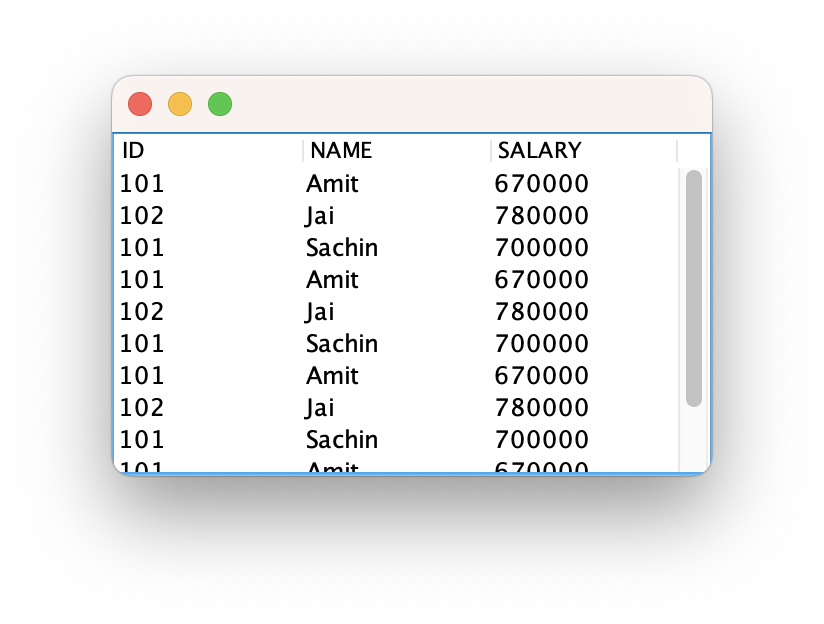

```java
public class Table {

	JFrame fr;
	
	Table(){
		
		fr = new JFrame();
		
		String data[][] = { 
				{"101","Amit","670000"},    
				{"102","Jai","780000"},    
				{"101","Sachin","700000"},
				{"101","Amit","670000"},    
				{"102","Jai","780000"},    
				{"101","Sachin","700000"},
				{"101","Amit","670000"},    
				{"102","Jai","780000"},    
				{"101","Sachin","700000"},
				{"101","Amit","670000"},    
				{"102","Jai","780000"},    
				{"101","Sachin","700000"}
		};    
		
		String column[] = {"ID","NAME","SALARY"}; 
		
		JTable tb = new JTable(data, column);
//		tb.setBounds(100, 30, 200, 300);
		JScrollPane sc = new JScrollPane(tb);
		
		fr.add(sc);
		fr.setSize(300, 200);
		fr.setVisible(true);
	}
	
	public static void main(String[] args) {

		new Table();
	}
}
```
