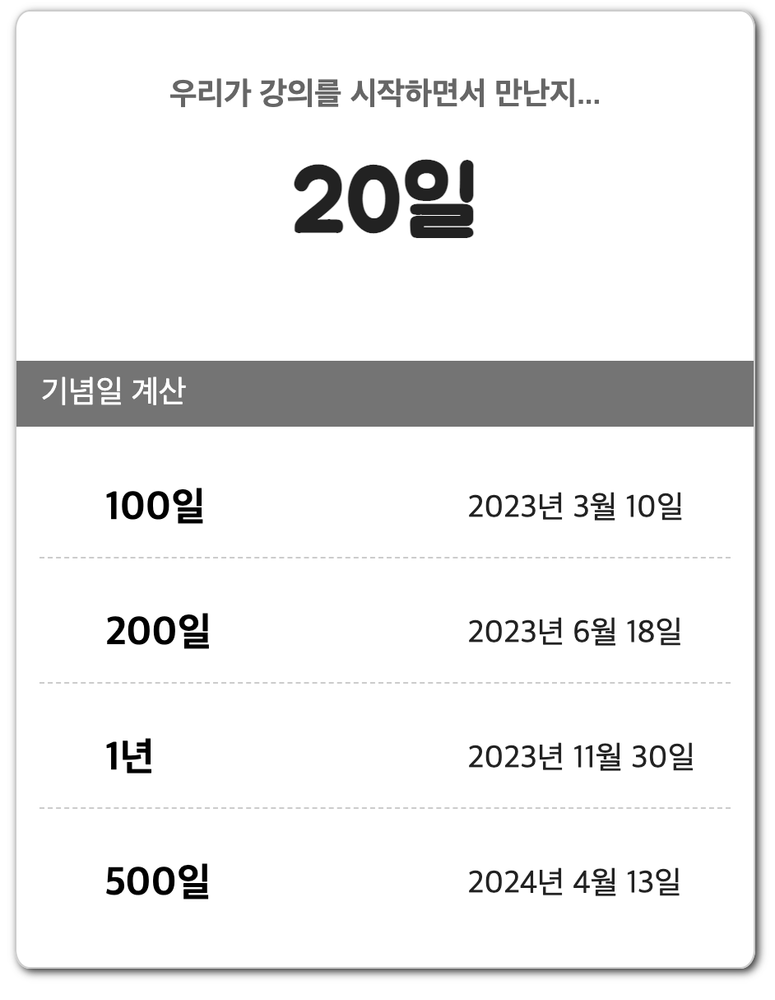

## 기념일을 미리 정하고 100일, 1년, 500일 후 날짜 구하기



```html
<!doctype html>
<html lang="ko">
<head>
	<title>D-Day for love</title>
	<link href="css/d-day.css" rel="stylesheet">
</head>
<body>
	<div class="container">
		<div class="day1">
			<h3>우리가 강의를 시작하면서 만난지...</h3>
			<p id="accent" class="accent"><span style="font-size:0.6em; font-style:italic">며칠?</span></p>
			</div>
			<div class="bar">기념일 계산</div>
			<div class="day2">
				<ul>
					<li class="item-title">100일</li>
					<li class="item-date" id="date100"></li>
				</ul>
				<ul>
					<li class="item-title">200일</li>
					<li class="item-date" id="date200"></li>
				</ul>
				<ul>
					<li class="item-title">1년</li>
					<li class="item-date" id="date365"></li>
				</ul>
				<ul>
					<li class="item-title">500일</li>
					<li class="item-date" id="date500"></li>
				</ul>      									    
			</div>
		</div>
		<script src="js/jstest.js"></script>
	</body>
</html>
```

```css
@import url('https://fonts.googleapis.com/css?family=Black+Han+Sans|Jua');

* {
	box-sizing: border-box;
}
.container{
  width:450px;
  margin:0 auto;
  /* background:url(images/heart.png) no-repeat 5px -100px;
  background-size:500px;   */
  border:1px solid #ccc;
  border-radius:2%;
  box-shadow:2px 2px 5px #333;
}
.day1{
  padding-top:20px;
  text-align:center;  
}
.day1 h3 {
  font-size:1.2em;
  color:#666;
}
.accent{
  margin-left:10px;
	margin-right:10px;
	margin-top:10px;
	font-family: 'Jua', sans-serif;
	font-weight:bold;
  font-size:3.5em;
  color:#222;
}
.bar {
	width:100%;
	margin:60px auto 0 auto;
	padding-left:15px;
	height:40px;	
	background:#747474;
	color:#fff;
	font-size:1.2em;
	line-height:40px;
}
.day2 {
  width:420px;
  margin:20px auto 20px auto;
}
.day2 ul {
  list-style: none;
  border-bottom:1px dashed #ccc;
  height:60px;
}
.day2 ul:last-child {
	border-bottom:none;
}
.item-title {
  float:left;
  width:160px;        
  font-weight:bold;
  font-size:1.5em;
  line-height:60px;
}
.item-date {
  float:left;
  margin-left:60px;
  font-size:1.2em;
  color:#222;
  text-align:right;
  line-height:60px;
}
```

```javascript
const today = new Date();
const start = new Date("2022-11-30");
document.querySelector("#accent").innerHTML = Math.floor((today - start)/1000/60/60/24) + "일";

function future(id, days){
    // date = new Date(start.getTime() + days*24*60*60*1000);
    let date = new Date(start);
    date.setDate(start.getDate() + days)
    document.querySelector(id).innerHTML = date.getFullYear() + "년 " + (date.getMonth()+1) +"월 " + date.getDate()+"일";
}

future("#date100", 100);
future("#date200", 200);
future("#date365", 365);
future("#date500", 500);
```

## 기념일 지정 후 경과일수를 입력하면 날짜 출력


```html
<!doctype html>
<html lang="ko">
<head>
   <title>D-Day for love</title>
   <link href="css/d-day.css" rel="stylesheet">
</head>
<body>
   <div class="container">
      <div class="day1">
         <h3>우리가 강의를 시작하면서 만난지...</h3>
         <p id="accent" class="accent">
                <span style="font-size:0.6em; font-style:italic">며칠??</span>
            </p>
         </div>
         <div class="bar">기념일 계산</div>
         <div class="day2">
            <ul>
               <li class="item-title"><input style="height: 30px" type="text"></li>
               <li class="item-date" id="date100"></li>
            </ul>
            <ul>
               <li class="item-title"><input style="height: 30px" type="text"></li>
               <li class="item-date" id="date200"></li>
            </ul>
            <ul>
               <li class="item-title"><input style="height: 30px" type="text"></li>
               <li class="item-date" id="date365"></li>
            </ul>
            <ul>
               <li class="item-title"><input style="height: 30px" type="text"></li>
               <li class="item-date" id="date500"></li>
            </ul>
         </div>
      </div><br>
        <button style="margin: auto; display: block; font-size: 25px;"> <b>계 산 하 기</b> </button>
        <p style="text-align: center; font-size: 30px;"> <b>하루 정도는 차이가 날 수 있어요~~</b></p>
      <script src="js/jstest.js"></script>
   </body>
</html>
```

```javascript
const today = new Date();
const start = new Date("2022-11-30");
document.querySelector("#accent").innerHTML = Math.floor((today - start)/1000/60/60/24) + "일";

const days = document.getElementsByTagName("input"); // 배열로 반환
const btn = document.querySelector("button");

btn.onclick = function () {
    for (let i=0; i<days.length;i++){
        if ( days[i].value != ""){
            date = new Date(start.getTime() + days[i].value*24*60*60*1000);
            document.getElementsByClassName("item-date")[i].innerHTML = date.getFullYear() + "년 " + 
                                                                        (date.getMonth()+1) +"월 " + 
                                                                        date.getDate()+"일";
        }
    }
}
```
