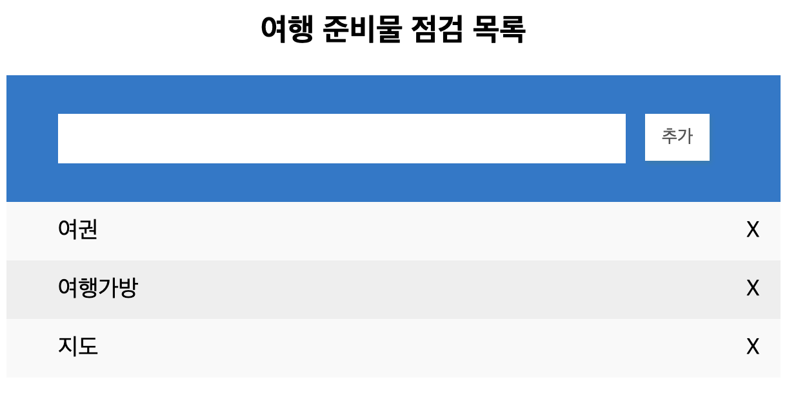

## 여행 준비물 목록 점검



- 추가 버튼을 누르면 배열 끝에 추가: push()
- 목록 오른쪽의 X 버튼을 누르면 배열에서 삭제: splice()


배열에서 원하는 위치의 요소 추출/삭제

- `배열변수.splice(인덱스)` : 인덱스 이후 모든 요소 반환 후 삭제
- `배열변수.splice(인덱스, 삭제할 개수)` : 인덱스 이후 삭제할 개수만큼 반환 후 삭제
-  `배열변수.splice(인덱스, 삭제할 개수, 데이터)` : 인덱스 이후 삭제할 개수만큼 삭제한 후 삭제한 자리에 데이터 삽입. 삭제할 개수를 0으로 하면 인덱스에 데이터 삽입. 데이터는 여러 개일 수 있다.

```html
<!doctype html>
<html lang="ko">
<head>
   <link rel="stylesheet" href="css/input.css">
   <link rel="stylesheet" href="css/list.css">
</head>
<body>
   <div id="wrapper">
      <h2>여행 준비물 점검 목록</h2>
      <form>
         <input type="text" id="item" autofocus="true">
         <button type="button" id="add" class="addBtn">추가</button>
      </form>
      <div id="itemList"></div>
   </div>
   <script src="js/jstest.js"></script>
</body>
</html>
```

```css
/* input.css */
* {
  box-sizing:border-box;
}
#wrapper {
  width:600px;
  margin:0 auto;
}
h2 {
  text-align:center;
}
form {
  background-color:#007acc;
  padding:30px 40px;
  color:white;
  text-align:center;
}
input {
  border:none; 
  width:440px;
  padding:10px;
  float:left;
  font-size:16px;
}
.addBtn {
  padding:10px;
  width:50px;
  border:none;
  background-color:#fff;
  box-shadow:1px 2px 4px #167dae;
  color:#555; 
  text-align:center;
  font-size:14px;
  cursor:pointer;
  transition:0.3;
}
form::after {
  content:"";
  display:table;
  clear:both;
}
```

```css
/* list.css */
form::after {
  content:"";
  display:table;
  clear:both;
}
ul{
  margin:0;
  padding:0;
  list-style: none;
}
ul li{
  cursor:pointer;
  position:relative;
  padding:12px 8px 12px 40px;
  background: #eee;
  font-size:18px;
  transition: 0.2s;
}
ul li:nth-child(odd) {
  background-color:#f9f9f9;
}
ul li:hover {
  background-color:#ddd;
}
.close {
  position:absolute;
  right:0;
  top:0;
  padding:12px 16px;
  border:none;
  background:rgba(255,255,255,0)
}
.close:hover {
  background-color:#007acc;
  color:white;
}
```

```javascript
// 여행 준비물 목록 배열 선언
const item_list = [];
const add_btn = document.querySelector("#add");

// 아이템 추가
add_btn.onclick = function() {
    let item = document.querySelector("#item").value;
    item_list.push(item);
    document.querySelector("#item").value = ''; //input 박스 비우기
    show();
}

// 아이템 리스트 보이기
function show(){
    let tag = "<ul>";
    for (let i=0; i<item_list.length; i++){
        tag = tag + "<li>" + item_list[i] + "<span class='close' id=" + i + ">X</span></li>"; // 특정 인덱스를 지우려면 id값을 주어야 함
    }
    tag += "</ul>"
    document.querySelector("#itemList").innerHTML = tag;

    // 삭제할 아이템 선택하기
    let remove_items = document.querySelectorAll(".close");
    for (let i=0; i <remove_items.length; i++){
        remove_items[i].onclick = remove;  //이벤트 리스너에 remove 함수 바이딩(등록)
    }
}

// 아이템 삭제
function remove(){
    let id = this.getAttribute("id");
    item_list.splice(id, 1);
    show();
}
```