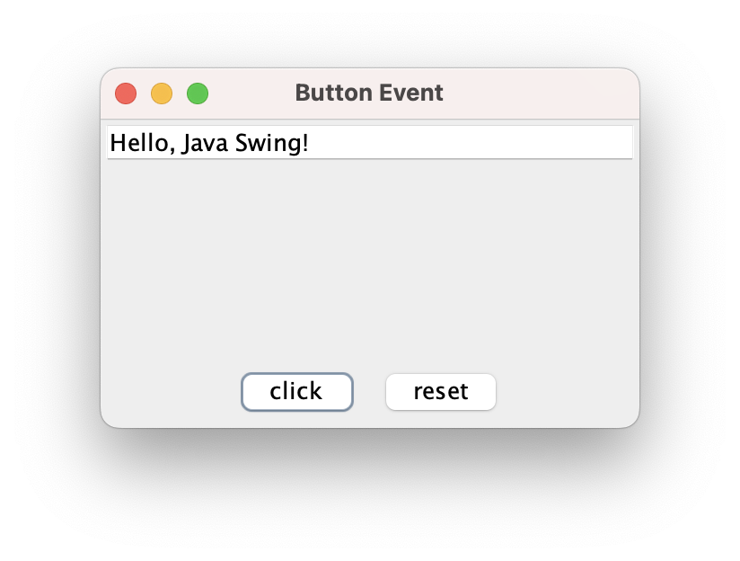

```java
public class ButtonEvent {

	public static void main(String[] args) {

		JFrame fr = new JFrame();
		fr.setTitle("Button Event");
		fr.setSize(300,200);
		fr.setLocationRelativeTo(null);

		JTextField textField = new JTextField(50);  // 하단에 버튼 2개 넣기(FlowLayout)
		JPanel btns = new JPanel(); 
		JButton clickBtn = new JButton("click");
		JButton resetBtn = new JButton("reset");
		btns.add(clickBtn);
		btns.add(resetBtn);

		// 상하단에 텍스트필드와 버튼 추가
		fr.getContentPane().add(BorderLayout.NORTH, textField); 
		fr.getContentPane().add(BorderLayout.SOUTH, btns);

		fr.setVisible(true);

		// 버튼 이벤트 - 텍스트 필드에 문자열 추가, 지우기
		clickBtn.addActionListener(new ActionListener() {

			@Override
			public void actionPerformed(ActionEvent e) {
				textField.setText("Hello, Java Swing!");
			}
		});

		resetBtn.addActionListener(new ActionListener() {

			@Override
			public void actionPerformed(ActionEvent e) {
				textField.setText("");
			}
		});
	}

}
```