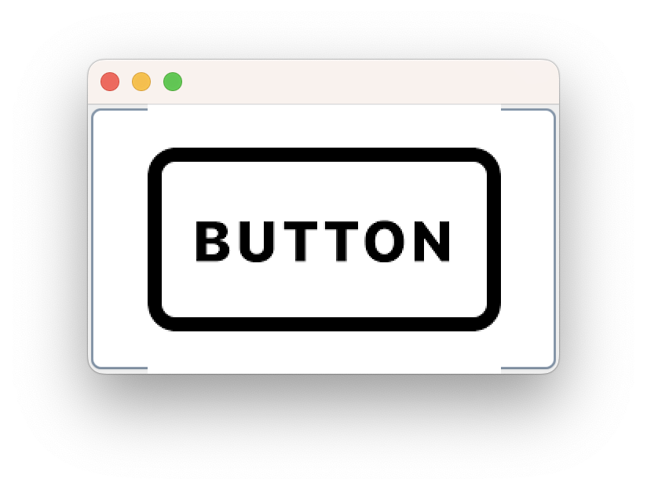

```java
public class Btn {

	Btn(){
		JFrame fr = new JFrame();
		fr.setDefaultCloseOperation(JFrame.EXIT_ON_CLOSE);
		fr.setSize(300, 200);
		
		JButton btn = new JButton(new ImageIcon("btn.png"));
		btn.setBounds(100, 100, 50, 30); // x, y, width, height
		fr.add(btn);
		
		fr.setVisible(true);
	}
	
	public static void main(String[] args) {

		new Btn();
	}

}
```