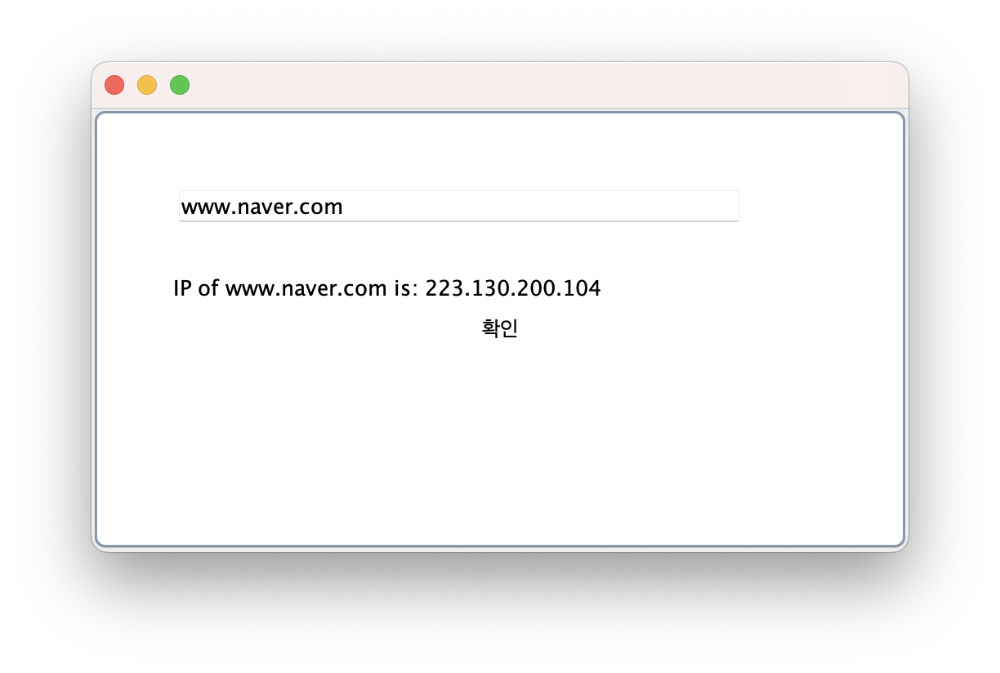

```java
public class GetIP extends JFrame implements ActionListener{

	private JTextField tf;
	private JLabel la;
	private JButton btn;
	
	GetIP(){
		tf = new JTextField(50);
		tf.setBounds(50, 50, 350, 20);
		
		la = new JLabel();
		la.setBounds(50, 100, 350, 20);
		
		btn = new JButton("확인");
		btn.setBounds(100, 150, 75, 20);
		btn.addActionListener(this);    // 액션
		
		setSize(500, 300);
		add(tf);
		add(la);
		add(btn);
		setVisible(true);
	}

	@Override
	public void actionPerformed(ActionEvent e) {
		try {
			String host = tf.getText();
			String ip = java.net.InetAddress.getByName(host).getHostAddress(); // 아이피 가져오기
			la.setText("IP of " + host + " is: " + ip);
			
		}catch(Exception ex) {
			System.out.println(ex);
		}
	}

	public static void main(String[] args) {
		
		new GetIP();
	}
}
```