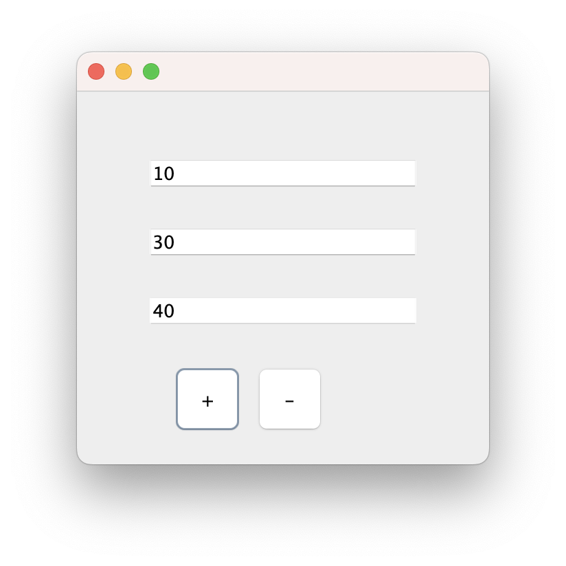

```java
public class Calc extends JFrame implements ActionListener{

	JTextField tf1;
	JTextField tf2;
	JTextField tf3;
	JButton btnPlus;
	JButton btnMinus;

	Calc(){

		tf1 = new JTextField();
		tf1.setBounds(50, 50, 200, 20);
		tf2 = new JTextField();
		tf2.setBounds(50, 100, 200, 20);
		tf3 = new JTextField();
		tf3.setBounds(50, 150, 200, 20);
		tf3.setEditable(false);     // 이 필드는 출력용이어서 편집 금지
		
		btnPlus = new JButton("+");
		btnPlus.setBounds(70, 200, 50, 50); 
		btnMinus = new JButton("-");
		btnMinus.setBounds(130, 200, 50, 50);
		
		btnPlus.addActionListener(this);
		btnMinus.addActionListener(this);

		add(tf1);
		add(tf2);
		add(tf3);
		add(btnPlus);
		add(btnMinus);

		setSize(300, 300);
		setLayout(null);   // 이것을 안 쓰면 버튼 레이아웃이 망가진다. 왜 그럴까?
		setVisible(true);
	}

	@Override
	public void actionPerformed(ActionEvent e) {

		try {
			String s1 = tf1.getText();  // JTextField to String
			String s2 = tf2.getText();

			int a = Integer.parseInt(s1);  // String to Integer
			int b = Integer.parseInt(s2);
			int c = 0;

			if(e.getSource() == btnPlus) {
				c = a + b;
			} else if (e.getSource() == btnMinus) {
				c = a - b;
			}

			String result = String.valueOf(c); // Object to String. null -> "null"
			tf3.setText(result);

		} catch(Exception ee) {
			System.out.println(ee);
		}
	}

	public static void main(String[] args) {
		new Calc();
	}
}
```
