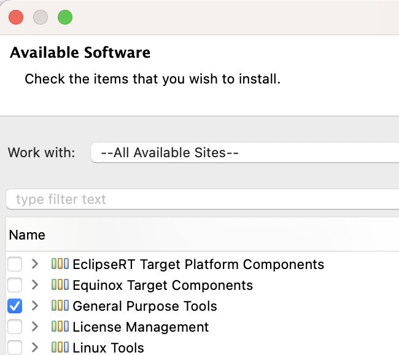
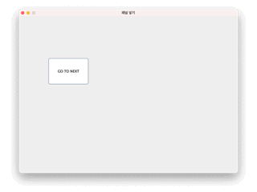

## 이클립스 자바 스윙 윈도우 빌더 설치

1. Help >> Install new Software >> --All Available Sites-- >> General Purpose Tools 설치



2. 이클립스 재실행

## 윈도우 빌더로 레이아웃 만들기

1. 패키지 우클릭 >> other >> WindowBuilder >> Swing Designer >> Application Window
2. Class name 입력
3. 좌측 하단의 Design 탭을 클릭한 후 디자인

## 버튼을 클릭하면 Pane을 나타내고, 숨기는 기능 구현



1. AbsoluteLayout 버튼 끌어다 JFrame에 드랍하면 absolute layout 적용됨
2. 화면 크기, 타이틀, 위치, 크기 변경 금지는 코드로 바로 입력

```java
private void initialize() {
    frame = new JFrame();
    frame.setTitle("패널 넣기");
    frame.setBounds(100, 100, 800, 600);
    frame.setLocationRelativeTo(null);		// 화면 중앙에 위치
    frame.setResizable(false);				// 크기 변경 금지
    frame.setDefaultCloseOperation(JFrame.EXIT_ON_CLOSE);
    frame.getContentPane().setLayout(null);  // absolute layout
}
```

3. panel 추가 >> 패널에도 absolute layout 적용. (왼쪽 컴포넌트의 패널 위에 드랍하는 게 딜레이가 적음)
4. 버튼 추가: 변수명, 텍스트, 크기, 위치 변경
5. 버튼 우클릭 >> Add event handler >> action >> actionPerformed

```java
package guiProject;

import java.awt.EventQueue;

import javax.swing.JFrame;
import javax.swing.JPanel;
import javax.swing.JButton;
import java.awt.event.ActionListener;
import java.awt.event.ActionEvent;

public class StudySwing {

	private JFrame frame;

	/**
	 * Launch the application.
	 */
	public static void main(String[] args) {
		EventQueue.invokeLater(new Runnable() {
			public void run() {
				try {
					StudySwing window = new StudySwing();
					window.frame.setVisible(true);
				} catch (Exception e) {
					e.printStackTrace();
				}
			}
		});
	}

	/**
	 * Create the application.
	 */
	public StudySwing() {
		initialize();
	}

	/**
	 * Initialize the contents of the frame.
	 */
	private void initialize() {
		frame = new JFrame();
		frame.setTitle("패널 넣기");
		frame.setBounds(100, 100, 800, 600);
		frame.setLocationRelativeTo(null);		// 화면 중앙에 위치
		frame.setResizable(false);				// 크기 변경 금지
		frame.setDefaultCloseOperation(JFrame.EXIT_ON_CLOSE);
		frame.getContentPane().setLayout(null);
		
		JPanel endPage = new JPanel();
		endPage.setBounds(0, 0, 794, 566);
		frame.getContentPane().add(endPage);
		endPage.setLayout(null);
		
		JButton btnBefore = new JButton("GO TO LAST");
		btnBefore.setBounds(500, 150, 150, 100);
		endPage.add(btnBefore);
		
		JPanel startPage = new JPanel();
		startPage.setBounds(6, 0, 788, 566);
		frame.getContentPane().add(startPage);
		startPage.setLayout(null);

		btnBefore.addActionListener(new ActionListener() { // startPage 보이게
			public void actionPerformed(ActionEvent e) {
				startPage.setVisible(true);
				endPage.setVisible(false);
			}
		});
		
		JButton btnNext = new JButton("GO TO NEXT");      // endPage 보이게
		btnNext.addActionListener(new ActionListener() {
			public void actionPerformed(ActionEvent e) {
				endPage.setVisible(true);
				startPage.setVisible(false);
			}
		});
		
		btnNext.setBounds(100, 150, 150, 100);
		startPage.add(btnNext);
		
		endPage.setVisible(false);   // 시작할 때 endPage가 안 보이도록 설정
		
	}
}
```

