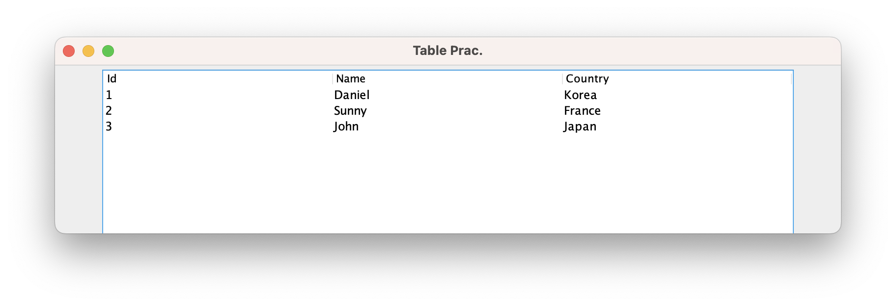

```java
public class TableEx {

	public static void main(String[] args) {

		JFrame frame = new JFrame("Table Prac.");
		JPanel panel = new JPanel();
		
		String [] headings = new String[] {"Id", "Name", "Country"};
		Object[][] data = new Object[][] {
			{"1", "Daniel", "Korea"},
			{"2", "Sunny", "France"},
			{"3", "John", "Japan"}
		};
		
		JTable table = new JTable(data, headings);     // (data, column-headings)
		table.setPreferredScrollableViewportSize(new Dimension(700, 600)); 
		table.setFillsViewportHeight(true);
		panel.add(new JScrollPane(table));
		
		frame.add(panel);
		frame.setVisible(true);
		frame.setSize(800, 600);
		frame.setDefaultCloseOperation(JFrame.EXIT_ON_CLOSE);
		frame.setLocationRelativeTo(null);
	}
}
```
