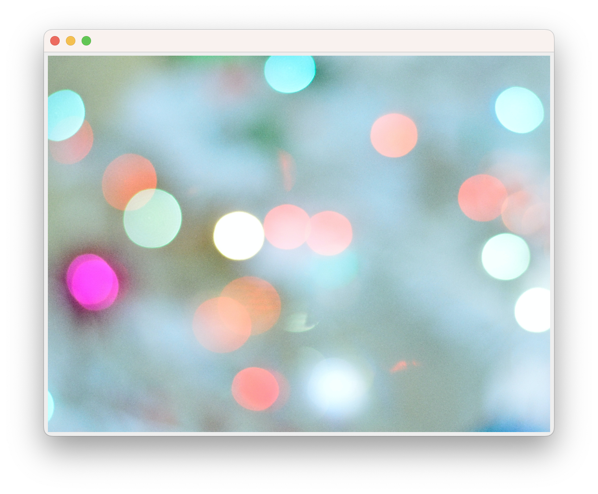

```java
class ImagePanel extends JPanel {
	private Image img;
	
	public ImagePanel(Image img) {
		this.img = img;
		setSize(new Dimension(img.getWidth(null), img.getHeight(null))); // 이미지 크기에 맞게 패널 크기 조정됨
//		setPreferredSize(new Dimension(img.getWidth(null), img.getHeight(null)));  // 이미지 크기에 맞게 창 크기 설정
		setPreferredSize(new Dimension(640, 480));  // 창 크기만 줄고 이미지 크기는 유지
		setLayout(null);  // absolute layout
	}
	
	public void paintComponent(Graphics g) {  // 이미지 화면에 그리
		g.drawImage(img, 0, 0, null); 			// 이미지, x, y, 전체 크기
	}
}

public class BackImage {

	public static void main(String[] args) {

		JFrame frame = new JFrame();
		frame.setSize(640, 480);
		frame.setLocationRelativeTo(null);
		frame.setDefaultCloseOperation(JFrame.EXIT_ON_CLOSE);
		frame.setVisible(true);
		
		// 창 크기에 맞게 이미지 출력
		try {
			BufferedImage bufferedImage = ImageIO.read(new File("./image/background01.jpg"));
			Image image = bufferedImage.getScaledInstance(800, 500, Image.SCALE_DEFAULT);
			ImagePanel panel = new ImagePanel(image);
			frame.setLayout(new FlowLayout());
			frame.add(panel);
			frame.pack();
		} catch (IOException e) {
			// TODO Auto-generated catch block
			e.printStackTrace();
		}
		
		/* 원본 크기
		ImagePanel panel = new ImagePanel(new ImageIcon("./image/background01.jpg").getImage());
		frame.add(panel);
		frame.pack(); 		// 이미지 크기에 맞게 패널 크기 작아짐
		*/
	}
}
```
