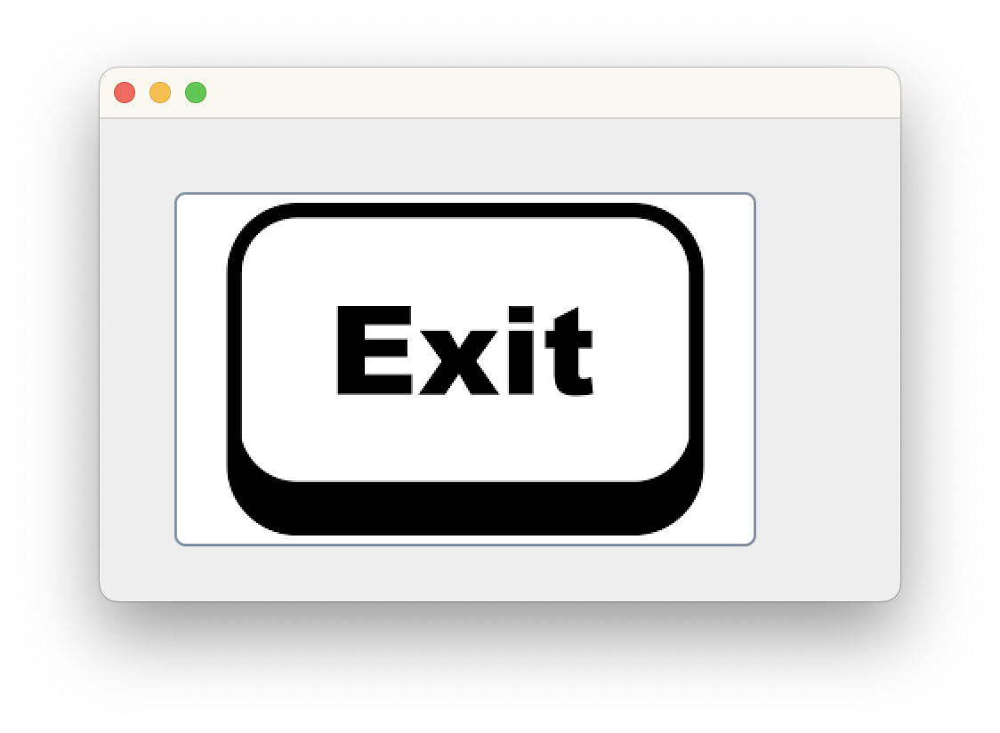

Window Builder 이용

```java
public class ButtonImage {

	private JFrame frame;

	/**
	 * Launch the application.
	 */
	public static void main(String[] args) {
		EventQueue.invokeLater(new Runnable() {
			public void run() {
				try {
					ButtonImage window = new ButtonImage();
					window.frame.setVisible(true);
				} catch (Exception e) {
					e.printStackTrace();
				}
			}
		});
	}

	/**
	 * Create the application.
	 */
	public ButtonImage() {
		initialize();
	}

	/**
	 * Initialize the contents of the frame.
	 */
	private void initialize() {
		frame = new JFrame();
		frame.setBounds(100, 100, 450, 300);
		frame.setDefaultCloseOperation(JFrame.EXIT_ON_CLOSE);
		frame.getContentPane().setLayout(null);
		
		JPanel panel = new JPanel();
		panel.setBounds(0, 0, 450, 272);
		frame.getContentPane().add(panel);
		panel.setLayout(null);
		
		JButton btnNewButton = new JButton("");
		btnNewButton.setIcon(new ImageIcon("/Users/jun/eclipse-workspace/guiProject/image/exitbtn.png"));
		btnNewButton.setBounds(40, 39, 331, 205);
//		btnNewButton.setPressedIcon(new ImageIcon("클릭할 때 이미지"));
		panel.add(btnNewButton);
	}

}
```