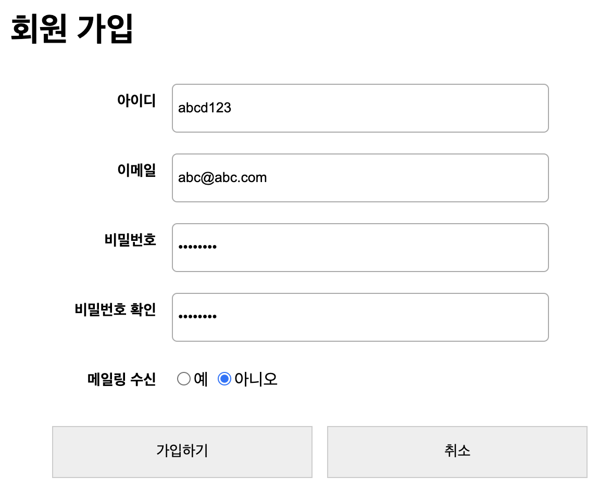

## 입력 문자 제한 - 정규표현식

영어와 숫자만으로 4글자 이상 15자 이하의 문자로 구성

```javascript
regex = /[^a-zA-z0-9]/;
regex.test(userid.value) // -> bool로 반환
```

```javascript
let userid = document.querySelector("#user-id");
userid.addEventListener("change", function(){
    regex = /[^a-zA-z0-9]/;
    if (userid.value.length < 4 | userid.value.length > 15 | regex.test(userid.value)) {
        alert("아이디 양식에 맞춰 입력하세요.")
        userid.value = "";
        this.focus();
    };
})
```

## 문자열 관련

- 대상문자열.includes('찾을문자열') : 문자열 포함 여부를 bool로 리턴
- 정규식.test('대상문자열') : 정규표현식으로 문자열 포함 여부를 bool로 리턴
- 대상문자열.match(정규식) : 정규표현식으로 문자열 반환


## 로그인 페이지



```html
<!DOCTYPE html>
<html lang="ko">
<head>
	<link rel="stylesheet" href="css/register.css">
</head>
<body>
	<div id="container">
		<h1>회원 가입</h1>
		<form action="#" id="register">
			<ul id="user-info">
				<li>
					<label for="user-id" class="field">아이디</label>
					<input type="text" id="user-id" placeholder="4~15자리의 영문과 숫자로 입력" required>
				</li>
				<li>
					<label for="email" class="field">이메일</label>
					<input type="email" id="email" required>
				</li>
				<li>
					<label for="user-pw1" class="field">비밀번호</label>
					<input type="password" id="user-pw1" placeholder="8자리 이상" required>
				</li>
				<li>
					<label for="user-pw2" class="field">비밀번호 확인</label>
					<input type="password" id="user-pw2" required>
				</li>
				<li>
					<label class="field">메일링 수신</label>
					<label class="r"><input type="radio" value="yes" name="mailing">예</label>
					<label class="r"><input type="radio" value="no" name="mailing">아니오</label>
				</li>
			</ul>
			<ul id="buttons">
				<li>
					<button type="submit" class="btn btnBlack">가입하기</button>					
				</li>
				<li>
					<button type="reset" class="btn btnGray">취소</button>
				</li>
			</ul>
		</form>
	</div>
	<script src="js/jstest.js"></script>
</body>
</html>
```

```css
#container{
	width:600px;
	margin:0 auto;
}
ul {
	list-style:none;
}
ul li {
	clear:both;
}
.field {
	float:left;
	width:100px;
	font-weight:bold;
	font-size:0.9em;
	line-height: 55px;
	text-align:right;
	margin-right:15px;
}
input[type="text"], input[type="password"], input[type="email"] {
	float:left;
	width:350px;
	height:35px;
	border:1px solid #aaa;
	border-radius:5px;
	padding:5px;
	margin:10px 0;
	float:left;	
}

.r {
	line-height:55px;
}

#buttons > li {
	display:inline-block;
}
button {
	width:250px;
	height:50px;
	margin-right:10px;
	border:1px solid #ccc;
	background:#eee;
	font-size:0.9em;
}
```

```javascript
let userid = document.querySelector("#user-id");
userid.addEventListener("change", function(){
    regex = /[^a-zA-z0-9]/;
    if (userid.value.length < 4 | userid.value.length > 15 | regex.test(userid.value)) {
        alert("아이디 양식에 맞춰 입력하세요.")
        userid.value = "";
        this.focus();
    };
})

let pw1 = document.querySelector("#user-pw1");
let pw2 = document.querySelector("#user-pw2");

pw1.addEventListener("change", function(){
    if (pw1.value.length < 8) {
        alert("비밀번호는 8자리 이상입니다.")
        this.focus();
    }
})

pw2.addEventListener("change", function(){
    if (pw1.value != pw2.value) {
        alert("비밀번호가 다릅니다.")
        this.focus();
    };
})
```

```javascript
// 강사님 코드
var id_valid = document.querySelector("#user-id");
id_valid.onchange = checkId;
function checkId() {
    if (id_valid.value.length < 4 || id_valid.value.length > 15) {
        alert("아이디 약관을 지켜주세요.");
        id_valid.focus(); // select() vs focus()
    }
}
var pw_valid = document.querySelector("#user-pw1");
pw_valid.addEventListener("change", checkPw);
function checkPw() {
    if (pw_valid.value.length < 8) {
        alert("비밀번호 약관을 지켜주세요.");
        document.querySelector("#user-pw1").value = "";
        pw_valid.focus();
    }
}
var pw_valid_check = document.querySelector("#user-pw2");
pw_valid_check.onchange = checkPw2;
function checkPw2() {
    if (pw_valid.value != pw_valid_check.value) {
        alert("비밀번호를 동일하게 입력시켜주세요.");
        pw_valid_check.select();
    }
}
```

