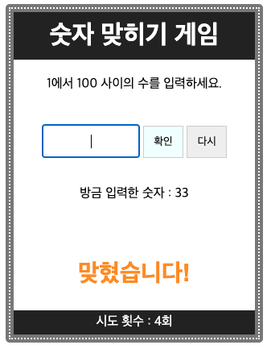
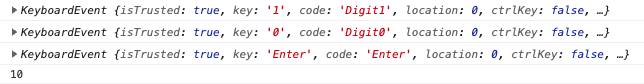

## 폼 요소는 name으로 접근 가능

- 드롭다운목록 : (document.폼이름.)드롭다운이름변수.options[드롭다운이름변수.selectedIndex]
- 라디오 버튼 : (document.폼이름.)라이오버튼이름[인덱스번호]  -> checked -> bool



## 주의할 점

`<form action="">` 태그 안의 버튼은 키보드 입력 구현 시 두 번 클릭되는 현상이 발생한다. `action="#"` 이렇게 바꾸면 한 번만 클릭된다.

아래 코드에서 주안점을 둔 것은 

- 텍스트 필드에 포커스가 되었을 때 기존에 입력된 글자가 지워지게 한 것과 
- 마우스로 텍스트 필드를 클릭하고 확인 버튼을 누르는 방식 뿐 아니라 키보드 만으로 작동하게 한 점이다.

아래는 키보드 입력을 콘솔에 나타낸 것이다.



처음에 터미널에서 하던 while(true) 방식으로 코드를 짰는데 브라우저에서 무한루프에 빠져 작동되지 않아 꽤 애를 먹었다. 왜 그런지 이유를 찾지 못했다. 게임을 종료할 때는 그냥 브라우저를 끄면 되고, 새 문제를 내는 것은 함수를 호출하지 않고 페이지를 리로드하는 방식으로 코드를 구성했다.

```javascript
const inTry = document.getElementById("try");
const btnChk = document.getElementById("check");
const btnRst = document.getElementById("reset");
const info = document.getElementById("number");
const display = document.getElementById("display");
const counter = document.getElementById("counter");
const success = "<h2 class='quest'>맞혔습니다!</h2>";
const up = "<h2>UP</h2>";
const down = "<h2>DOWN</h2>";
let guess;

let target = Math.floor(Math.random() * 100) + 1;  // 정답
let cnt = 0;
console.log(target);

function displayResult(status){
    info.innerHTML = "<p>방금 입력한 숫자 : " + guess +"</p>"
    display.innerHTML = status;
    counter.innerHTML = "시도 횟수 : " + cnt+ "회";
}

inTry.addEventListener("focus", function(){
    inTry.value = "";
})

btnChk.onclick = chkTarget;
inTry.addEventListener("keydown", function(event) {
    console.log(event);
    if (event.key == 'Enter') {
        chkTarget();
        inTry.value = "";
    }
});

btnRst.addEventListener("click", function(){
    window.location.reload();
})

function chkTarget() {
    guess = parseInt(inTry.value); // 사용자 추측값
    cnt += 1;
    console.log( inTry.value);

    if ( target == guess ){ 
        displayResult(success);
    } else if (target > guess) {
        displayResult(up);
    } else if (target < guess) {
        displayResult(down);
    }
};
```

```html
<!doctype html>
<html lang="ko">
<head>
	<meta charset="utf-8">
	<title>숫자 맞히기</title>
	<meta name="viewport" content="width=device-width, initial-scale=1">    
	<link rel="stylesheet" href="css/question_1.css">
</head>
<body>
	<div id="wrapper">
		<h1>숫자 맞히기 게임</h1>
		<p>1에서 100 사이의 수를 입력하세요.</p>
		<form action="#">
			<label><input type="text" id="try" autofocus></label>
			<input type="button" value="확인" id="check" class="btn btn-1">
			<input type="reset" value="다시" id="reset" class="btn btn-2">
		</form> <br>
		<div id="number" class="info"></div>
		<div id="display" class="output"></div>
		<div id="counter" class="footer"></div>
	</div>
	<script src="js/jstest.js"></script>
</body>
</html>
```

```css
#wrapper {
  position:relative;
  width:300px;
  height:400px;
  margin:0 auto;
  text-align:center;
  border:10px solid #777;
  border-radius:5px;
  outline:2px dotted #fff;
  outline-offset:-6px;        
}
h1 {
  margin-top:0;
  padding:10px;
  background-color:#222;
  color:white;
}
form {
  margin-top:40px;
}
input[type="text"] {
  width:120px;
  height:40px;
  padding:0;
  border:#ccc 1px solid;
}
.btn {
  width:50px;
  height:40px;        
  /* border-radius:50%; */
  padding:10px 3px;
  border:#ccc 1px solid;        
        
}      
.btn-1 {
  background-color:azure;  
}
.btn-2 {
  background-color: #eee;
}
#display {
  font-size:30px;
  margin-top:70px;
}
.output {
  font-size:20px;
  font-weight:bold;
}
#counter {
  position:absolute;
  left:0;     
  bottom:0;
  width:100%;
  height:30px;

}
.footer {
  background-color:#222;
  color:white;
  line-height:30px;
}

.quest {        
  font-family:arial;
  font-size:30px;
  color:darkorange;
  /* text-shadow:1px 1px 3px #222; */
  padding:2px 1px;
}

#try {
  font-size: 1rem;
  text-align: center;
}
```