<!-- TOC -->

- [수업](#%EC%88%98%EC%97%85)
    - [Apache Tomcat 설치: brew install tomcat@9](#apache-tomcat-%EC%84%A4%EC%B9%98-brew-install-tomcat9)
    - [Apache Tomcat 실행: brew services restart tomcat@9](#apache-tomcat-%EC%8B%A4%ED%96%89-brew-services-restart-tomcat9)
    - [리눅스 폴더 구조](#%EB%A6%AC%EB%88%85%EC%8A%A4-%ED%8F%B4%EB%8D%94-%EA%B5%AC%EC%A1%B0)
    - [throws](#throws)
    - [서블릿](#%EC%84%9C%EB%B8%94%EB%A6%BF)
    - [web.xml](#webxml)
    - [jsp](#jsp)
    - [이클립스 설정](#%EC%9D%B4%ED%81%B4%EB%A6%BD%EC%8A%A4-%EC%84%A4%EC%A0%95)
    - [웹 프로젝트 만들고 서버 구동](#%EC%9B%B9-%ED%94%84%EB%A1%9C%EC%A0%9D%ED%8A%B8-%EB%A7%8C%EB%93%A4%EA%B3%A0-%EC%84%9C%EB%B2%84-%EA%B5%AC%EB%8F%99)
    - [servlet, html, jsp 만들고 실행](#servlet-html-jsp-%EB%A7%8C%EB%93%A4%EA%B3%A0-%EC%8B%A4%ED%96%89)
- [공부](#%EA%B3%B5%EB%B6%80)
    - [homebrew로 한방에 설치하기기](#homebrew%EB%A1%9C-%ED%95%9C%EB%B0%A9%EC%97%90-%EC%84%A4%EC%B9%98%ED%95%98%EA%B8%B0%EA%B8%B0)
        - [참고자료](#%EC%B0%B8%EA%B3%A0%EC%9E%90%EB%A3%8C)

<!-- /TOC -->

## 수업

Backend

- 웹서버 : 아파치 톰캣(AT) 대부분 OS 사용 가능. 오픈소스
- java : 라이브러리: servlet, jsp(내부적으로는 servlet으로 변환되어 컴파일), 프레임워크: spring
- python : 프레임워크: Django, 경량 프레임워크: Flask

### Apache Tomcat 설치: brew install tomcat@9

설치 위치 : `/opt/homebrew/opt/tomcat/bin/catalina`

```
Configuration files: /opt/homebrew/etc/tomcat@9

tomcat@9 is keg-only, which means it was not symlinked into /opt/homebrew,
because this is an alternate version of another formula.

If you need to have tomcat@9 first in your PATH, run:
  echo 'export PATH="/opt/homebrew/opt/tomcat@9/bin:$PATH"' >> ~/.zshrc


To restart tomcat@9 after an upgrade:
  brew services restart tomcat@9
Or, if you don't want/need a background service you can just run:
  /opt/homebrew/opt/tomcat@9/bin/catalina run
==> Summary
🍺  /opt/homebrew/Cellar/tomcat@9/9.0.70: 628 files, 15.4MB
==> Running `brew cleanup tomcat@9`...
Disable this behaviour by setting HOMEBREW_NO_INSTALL_CLEANUP.
Hide these hints with HOMEBREW_NO_ENV_HINTS (see `man brew`).
```

echo 'export PATH="/opt/homebrew/opt/tomcat@9/bin:$PATH"' >> ~/.zshrc

### Apache Tomcat 실행: `brew services restart tomcat@9`

웹서버 실행: `brew services start tomcat@9`
웹서버 중지: `brew services stop tomcat@9`


확인 -> 웹 브라우저 localhost:8080

서비스 제공 파일 위치하는 폴더: /opt/homebrew/Cellar/tomcat/10.1.4/libexec/webapps/docs

### 리눅스 폴더 구조

- bin: 실행파일 포함
- lib: 라이브러리 포함
- conf: 환경설정 

### throws

파일 안의 여러 try-catch 문이 같은 오류를 처리할 때 이를 각각 처리하지 않고 부모 클래스로 던져 부모가 처리하게 하는 것

### 서블릿

서블릿 파일 함수 안에 html 코드 삽입


### web.xml

서블릿이 만든 여러 파일을 관리
웹서버 요청이 들어오면 먼저 web.xml 파일을 검사

### jsp

html 문서 안에 자바 코드 삽입
컴파일, web.xml에 등록하지 않아도 됨(내부에서 자동으로 해줌)

### 이클립스 설정

Help -> Install new Software -> (in work with put in: https://download.eclipse.org/releases/2020-12/) -> (open drop down menu)Web, XML, Java EE and OSGi Enterprise Development -> Select options :JST Server Adapters, JST Server Adapters Extensions, JST Server UI (the last one is for the event that the server ui isnt present which it wasnt on my version of eclipse)

in the event that you already have one of these installed it won't run an install on that particular one but run an update on it instead.

apache tomcat이 안 보일 때
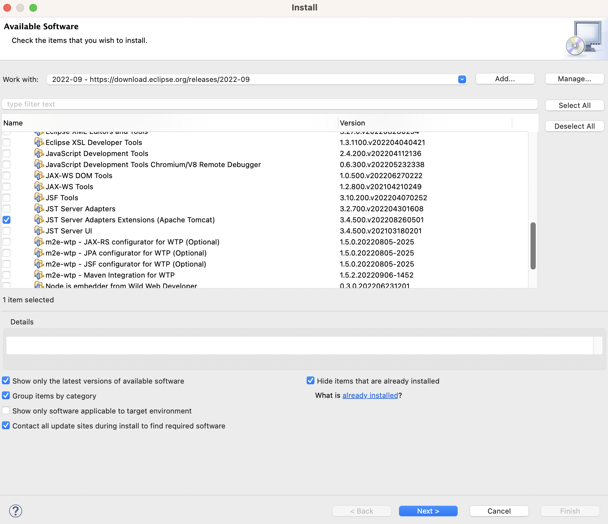


dynamic web project 안 보일 때
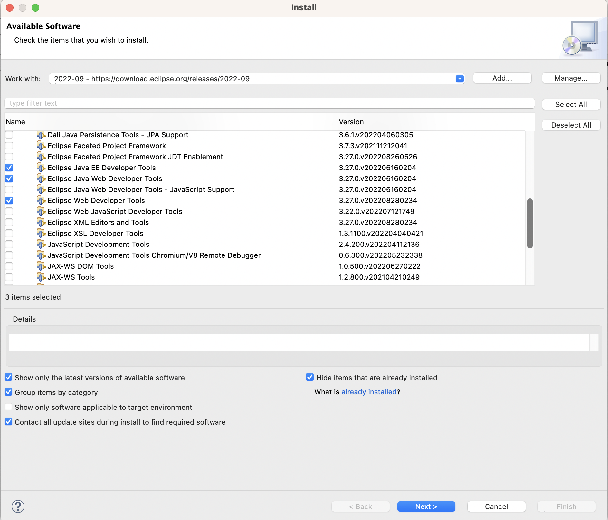

-> 우측 하단에 설치 진행과정 표시 확인

runtime environment 등록

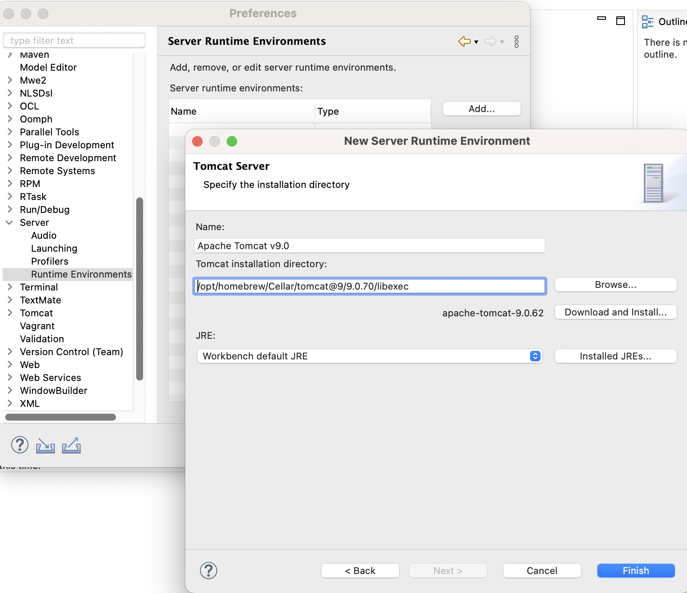


### 웹 프로젝트 만들고 서버 구동

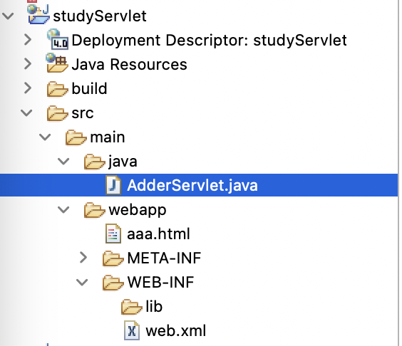

File >> new >> others >> Dynamic Web Project

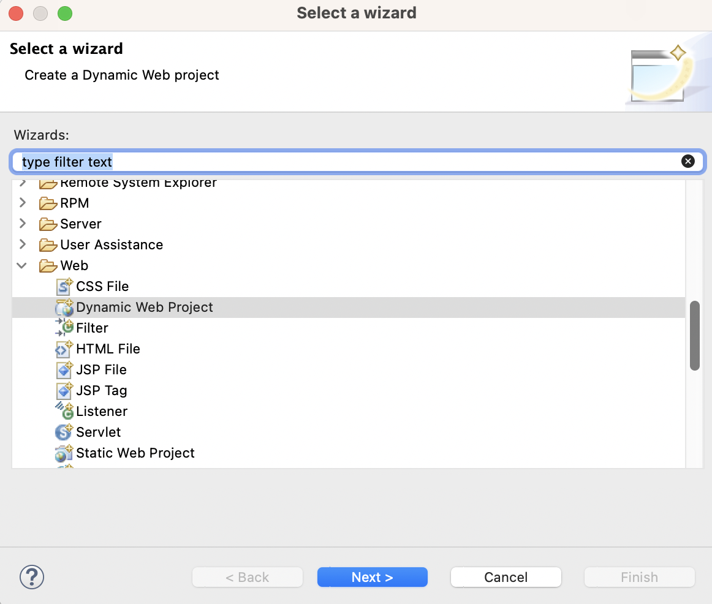


Project Explorer에 Servers 폴더가 만들어지고, 중앙 하단의 Servers 탭에 Tomcat 서버가 나타나야 한다.

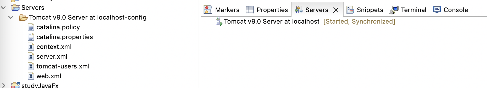
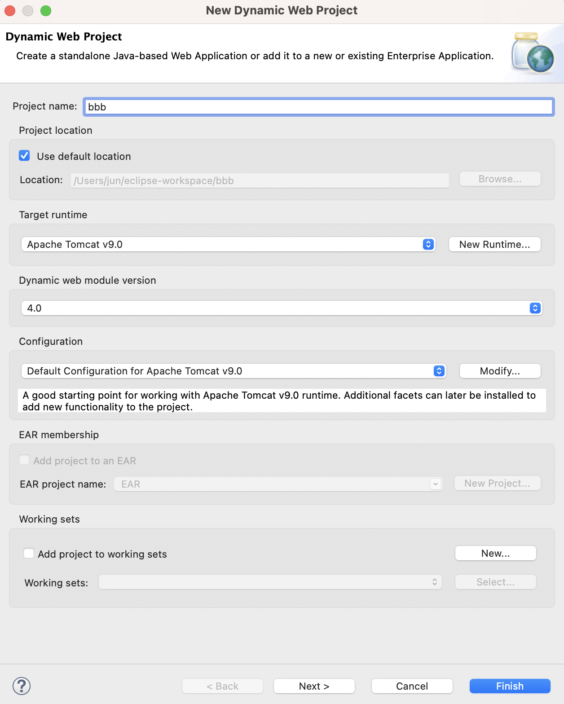
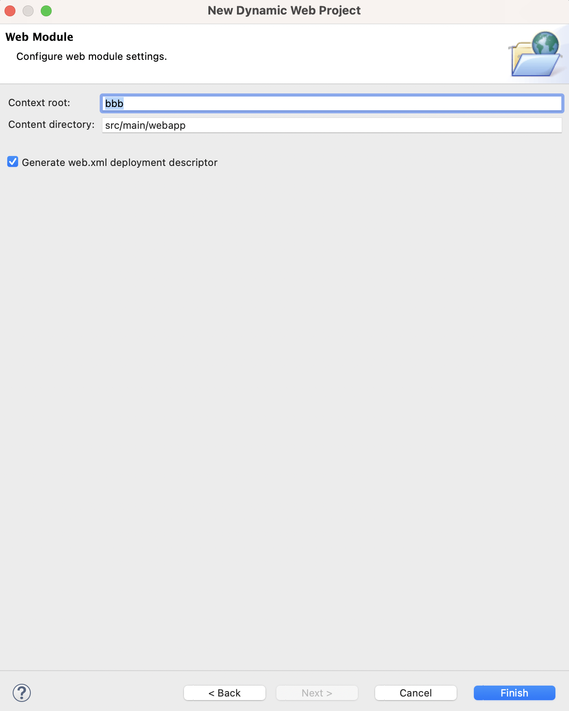

web.xml 자동 생성에 꼭!! 체크

톰캣 서버 우클릭 후 start -> 오류가 나면 실행된 톰캣 서버가 있을 수 있으니 서버 중지(brew services stop tomcat@9)

이클립스 비정상 종료 등의 이유로 8080 포트가 사용되고 있을 때 강제 종료 : 
- 프로세스 확인 : `lsof -i tcp:8080` 
- 강제 종료: `kill $(lsof -t -i:8080)`


### servlet, html, jsp 만들고 실행

- java 폴더 우 클릭 >> new >> other >> Servlet
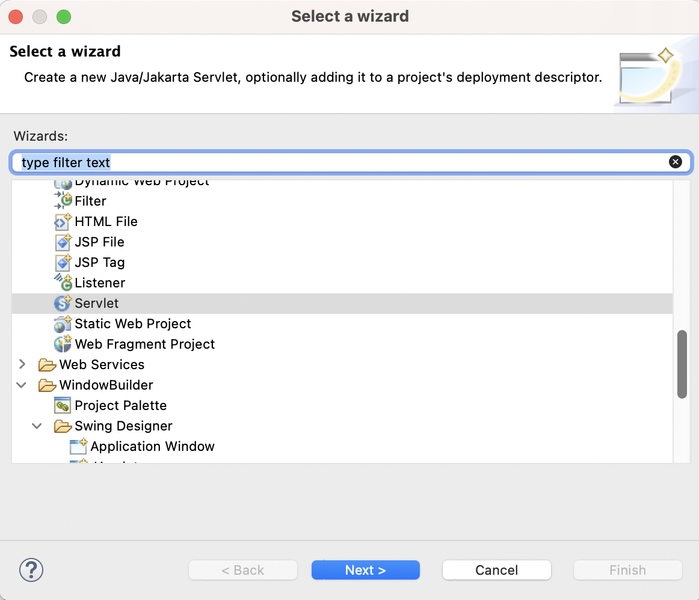

- webapp 폴더 우클릭 >> new >> HTML 파일 -> html 파일 작성
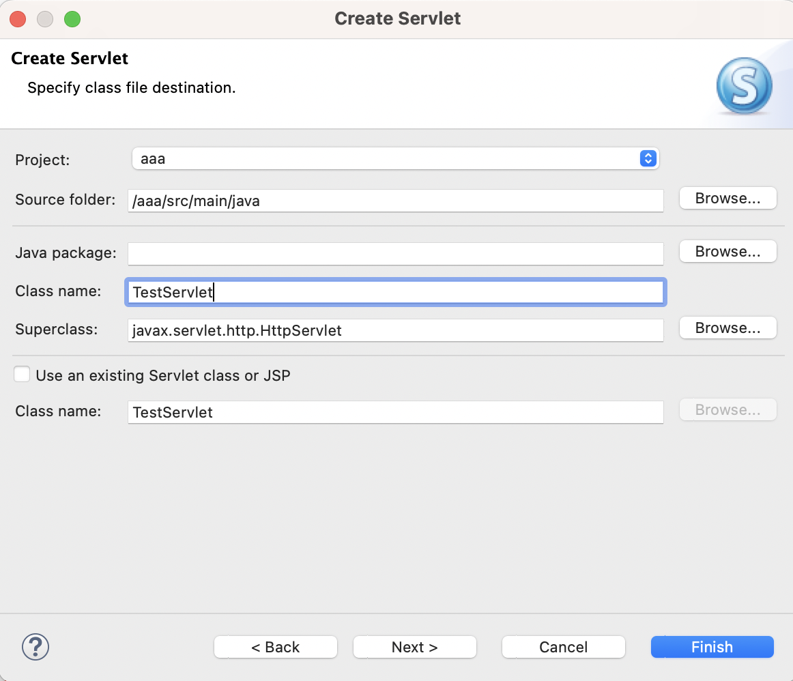

- web.xml 파일 작성

```xml
<?xml version="1.0" encoding="UTF-8"?>
<web-app xmlns:xsi="http://www.w3.org/2001/XMLSchema-instance" xmlns="http://xmlns.jcp.org/xml/ns/javaee" xsi:schemaLocation="http://xmlns.jcp.org/xml/ns/javaee http://xmlns.jcp.org/xml/ns/javaee/web-app_4_0.xsd" id="WebApp_ID" version="4.0">
  <display-name>studyServlet</display-name>
  <servlet>
    <servlet-name>adder-servlet1</servlet-name>  <!--  서블릿 이름은 아무 이름이나 작성 -->
    <servlet-class>AdderServlet</servlet-class>  <!--  서블릿 파일명과 같게 -->
  </servlet>
  <servlet-mapping>
    <servlet-name>adder-servlet1</servlet-name>  <!--  서블릿 이름을 위와 같은 이름으로 -->
    <url-pattern>/adder</url-pattern>            <!--  action에 지정한 경로 "/" 반드시 포함 -->
  </servlet-mapping>
</web-app>
```

- 먼저 servlet 파일 run as 하여 컴파일
- webapp 폴더 안의 html 파일 우클릭 >> run as >> Run on Server >> Tomcat 선택 >> restart 선택 -> 웹브라우저 열리며 실행됨
- servlet 파일을 찾지 못할 경우 Tomcat 서버 더블클릭 >> 하단의 Modules 탭 >> Add >> Path가 "/"인 것 추가

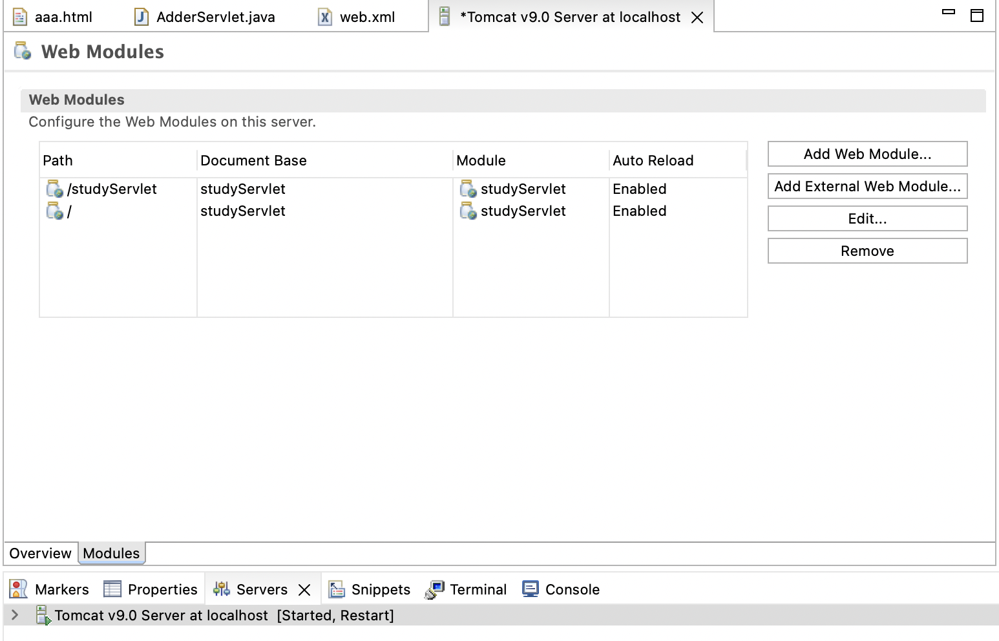

- jsp 파일도 같은 방법으로 작성 -> /Users/jun/eclipse-workspace/.metadata/.plugins/org.eclipse.wst.server.core/tmp0/work/Catalina/localhost/firstWeb/org/apache/jsp 폴더 안에 변환된 java와 class 파일 존재

## 공부

### homebrew로 한방에 설치하기기

- Homebrew: 개발 관련 패키지 설치
- cask: 웹사이트에서 받을 수 있는 어플리케이션 설치
- mas: 앱스토어에서 받을 수 있는 어플리케이션 설치 (brew install mas)

맥에 설치된 brew 패키지들을 Brewfile로 뽑아내기: `$ brew bundle dump`

Brewfile 이용해서 설치(같은 위치에서) : `$ brew bundle`

#### 참고자료

- [팀 개발환경 만들기](https://velog.io/@iamchanii/Brewfile%EC%9D%84-%EC%9D%B4%EC%9A%A9%ED%95%B4%EC%84%9C-%ED%8C%80-%EA%B0%9C%EB%B0%9C-%ED%99%98%EA%B2%BD-%EB%A7%8C%EB%93%A4%EA%B8%B0){target=_blank}
- [Homebrew 로 Mac 한 방에 셋업하기](https://blog.gangnamunni.com/post/brew_cask_mas/){target=_blank}

[MAC caps lock 을 escape + ctrl 로 사용해보자](https://leedo1982.github.io/wiki/ESC_CTRL_CAPSLOCK/){target=_blank}
[Getting Started with Hammerspoon](https://www.hammerspoon.org/go/){target=_blank}
