ssh 키 세팅 확인한다. 없으면 `ssh-keygen -t rsa -b 4096 -C "your_email@example.com"` 명령으로 만든 뒤 id_rsa.pub 파일을 github에 등록한다.

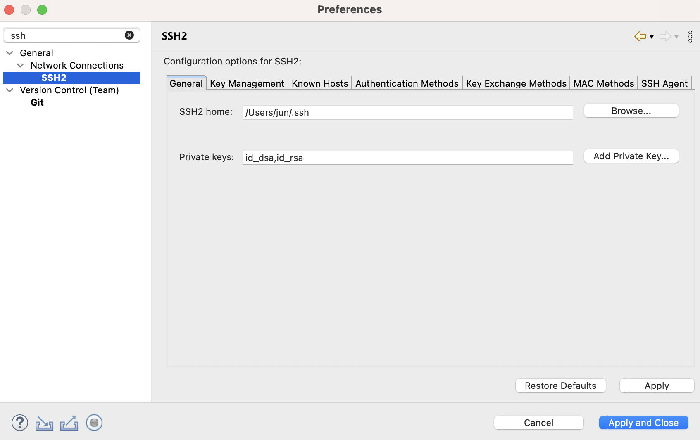

## 새로운 리포지토리 만들기

1. 먼저 github에서 repository를 만든다. README 파일을 만들지 않아야 이클립스와 연결하기 편하다
2. 이클립스에서 프로젝트를 만든다. 프로젝트 우클릭 >> Team >> Share Project >> Use or create repository ... 클릭 >> 중앙의 프로젝트명 옆 체크박스 클릭 >> 하단의 Create Repository 버튼 클릭 >> Finish

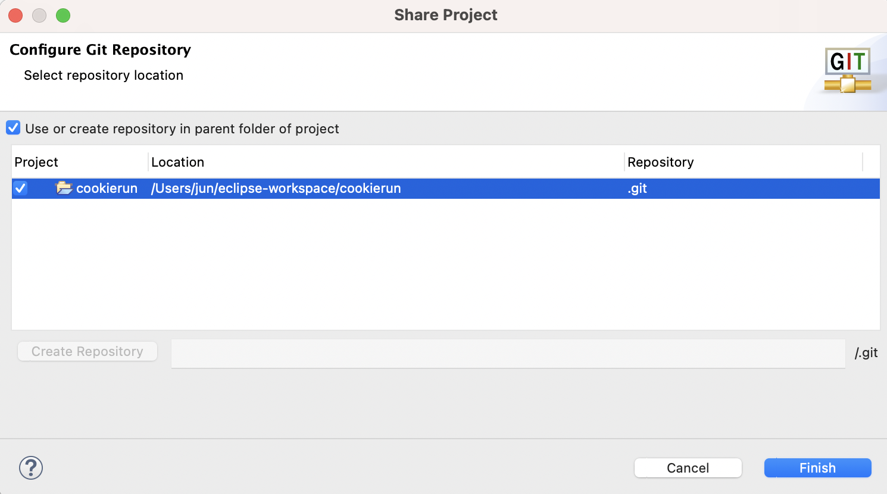

## add, commit, push

1. 파일 작성 후 프로젝트 우클릭 >> Team >> Add to Index
2. 프로젝트 우클릭 >> Team >> Commit ... >> 에러메시지 나도 무시 >> 우측 하단의 Commit Message 입력 >> Commit 버튼 클릭

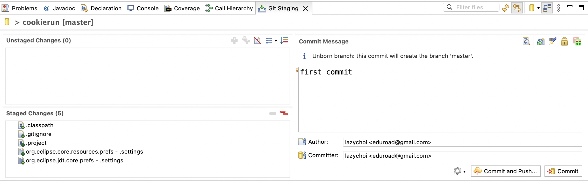

3. Team >> push 

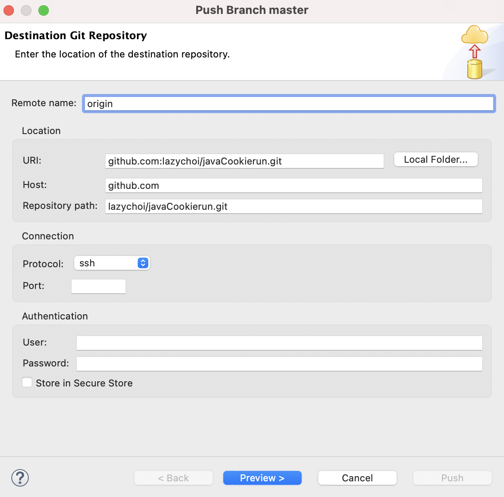

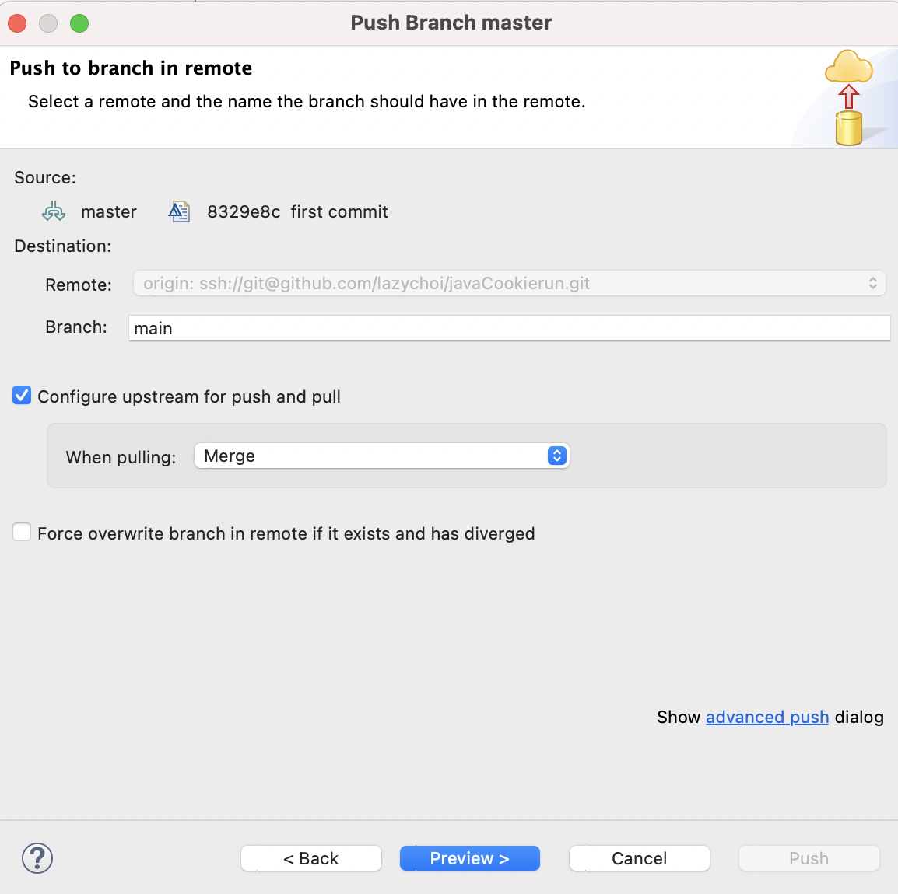

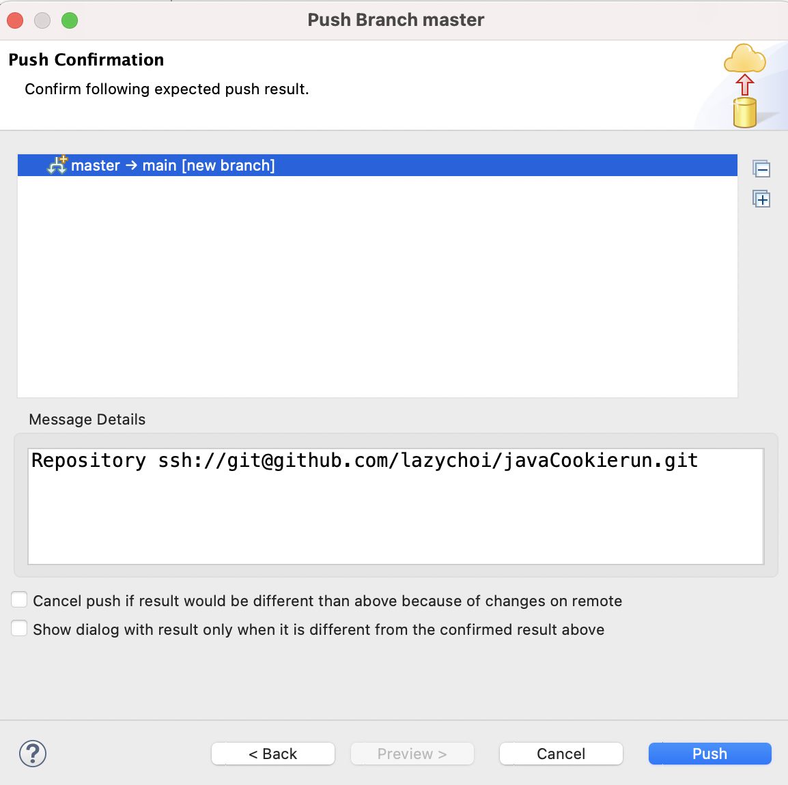

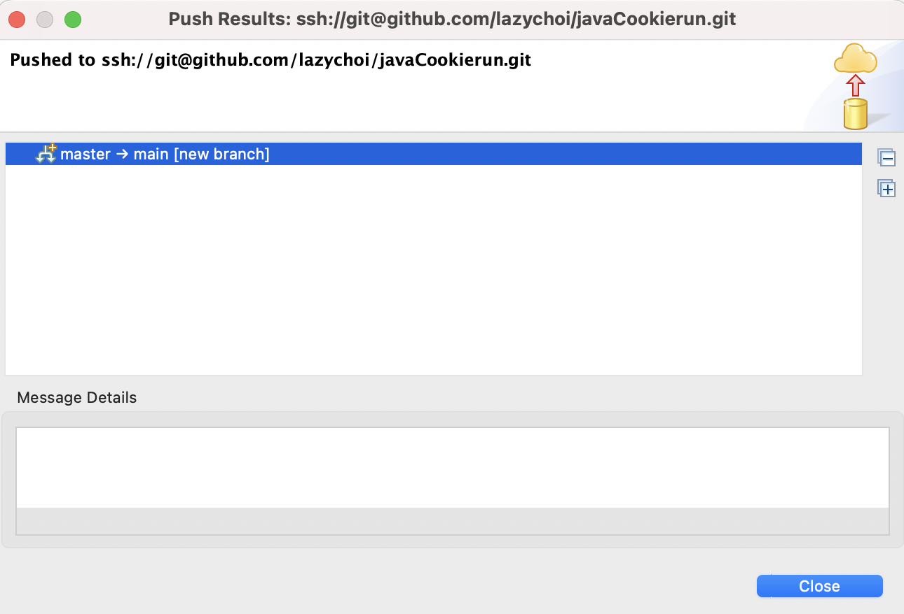

[출처- eclipse 프로젝트와 Github 저장소 연결](https://youtu.be/Py8WRioG_ms?list=PLqaSEyuwXkSopmCFiv0v7seTIRN5rrEtP){target=_blank}

## 기존 리포지토리를 이클립스에 clone하여 열기

1. git perspective 설정

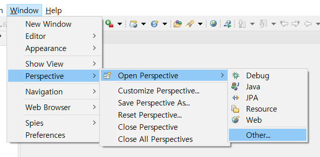

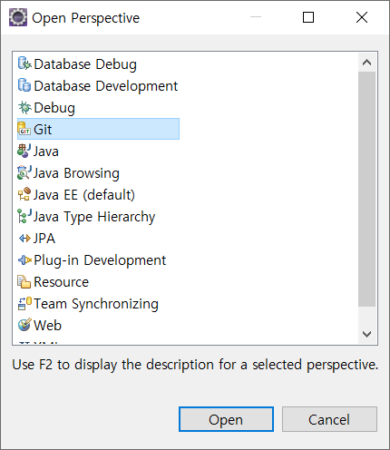

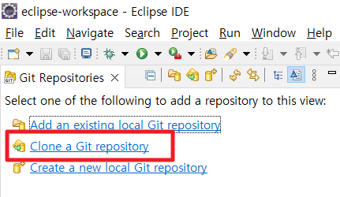

2. github 주소 입력

url에 github 주소를 붙여넣으면 나머지는 자동으로 입력된다. ssh가 등록되어 있으니 User, Password는 입력하지 않아도 된다. 수정하지 말고 next 버튼 클릭하면 main 브랜치가 선택되어 있다. next 버튼 클릭.

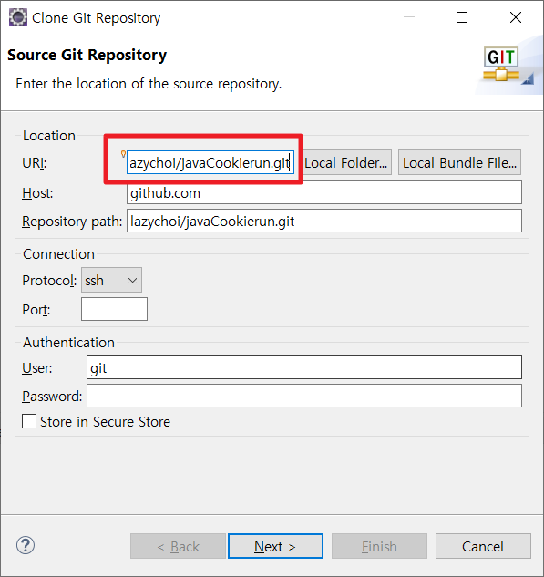

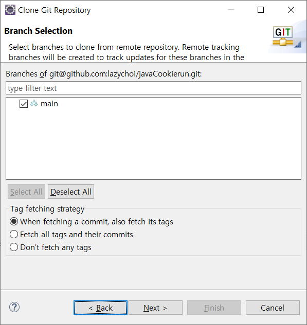

3. 로컬 저장소 설정

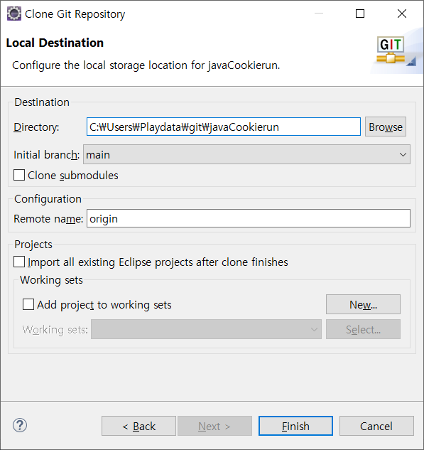

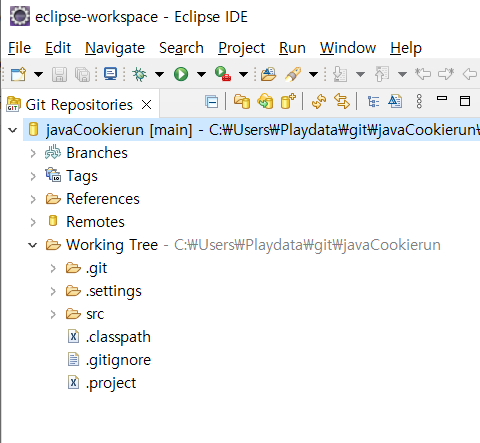

4. 프로젝트 임포트

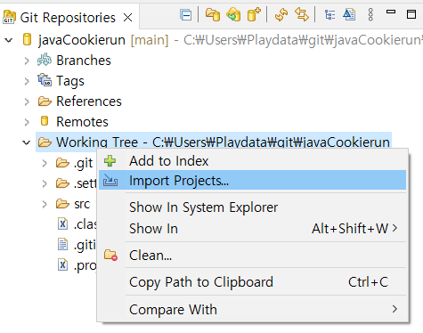

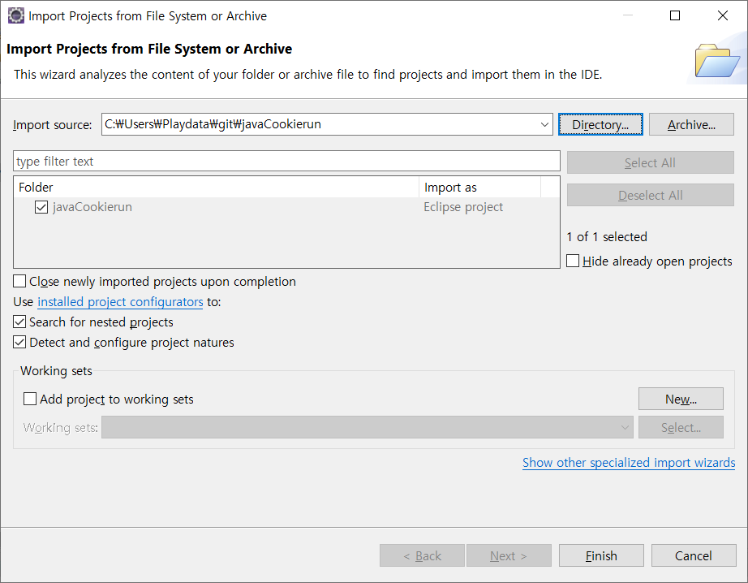

5. 자바 기본 환경으로 돌아가기

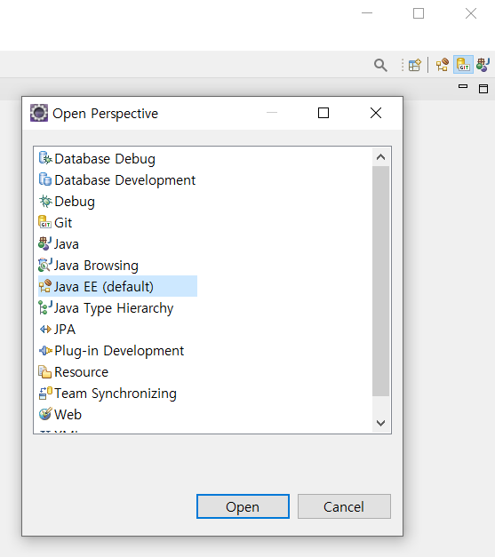

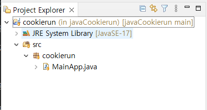