## 프로젝트 만들기 

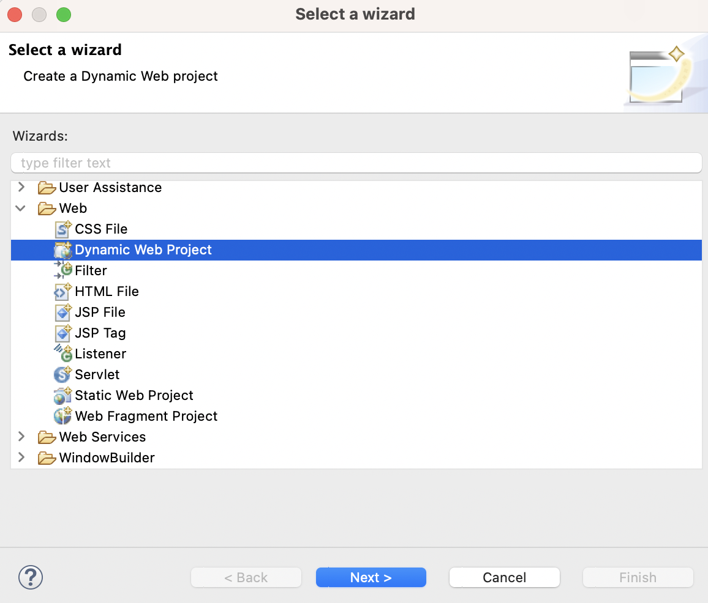

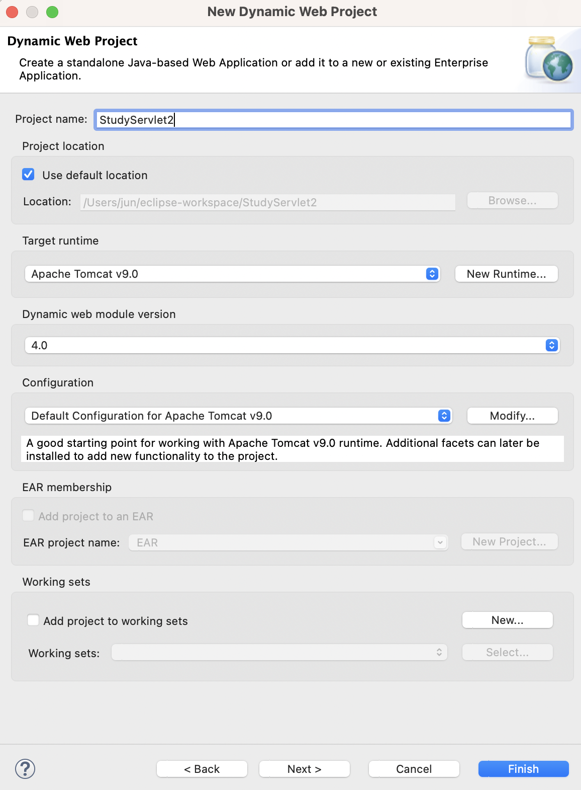

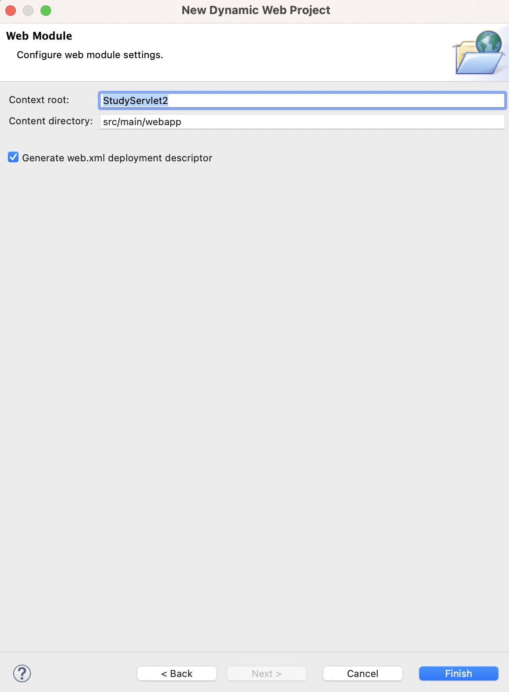

## HTML 파일 작성

src >> main >> webapp 우클릭 >> New >> HTML File

## Servlet 파일 작성

src >> main >> java 우클릭 >> New >> other >> Web >> Servlet 

## 톰캣 서버 설정

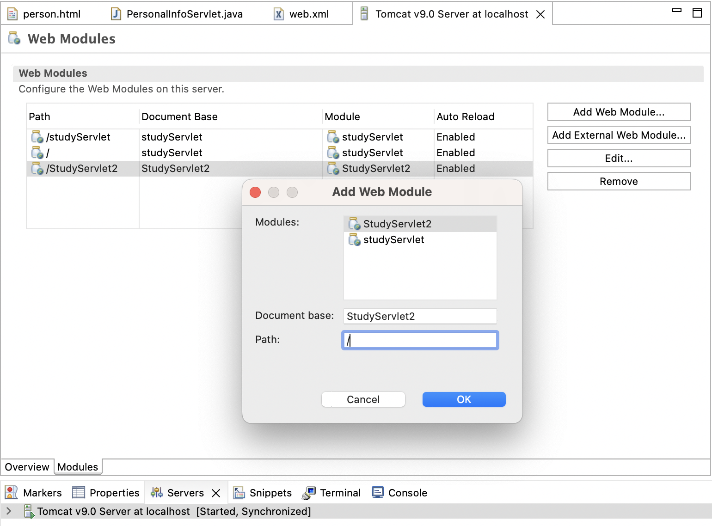

- 이클립스 재설치: homebrew로 설치하지 않고 홈페이지에서 설치 파일을 내려받아 설치. 웹 개발도 해야 하므로 Eclipse IDE for Enterprise Java and Web Developers 버전 설치

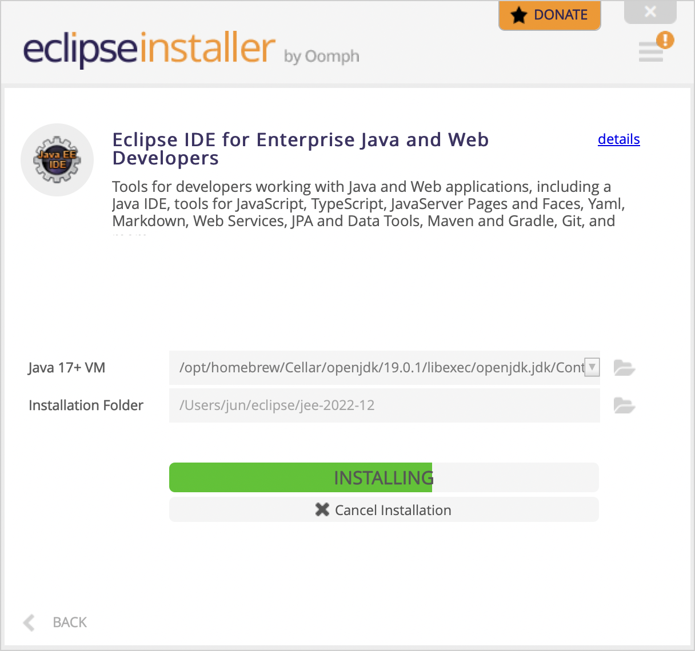

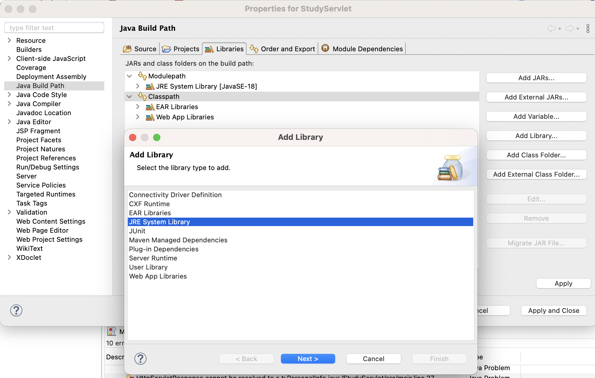

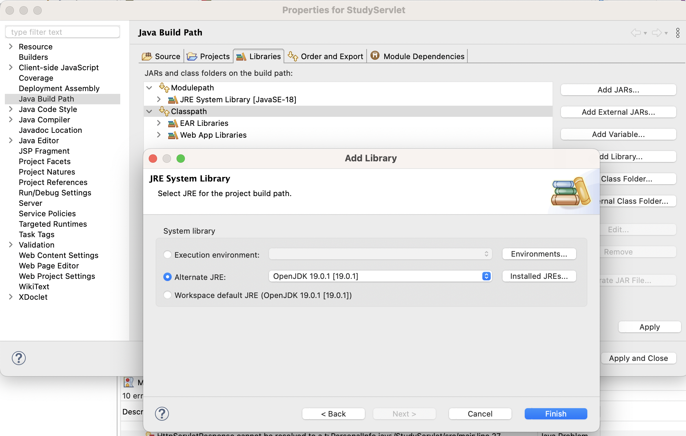

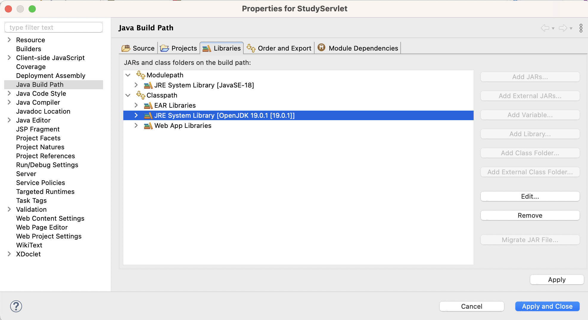

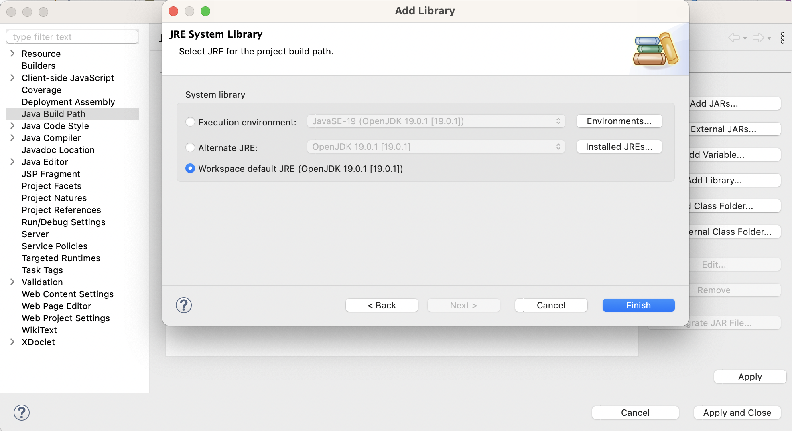

## java.servlet 등에 오류 나는 것 해결

1. Properties >> Server에 톰캣이 등록되어 있어야 함

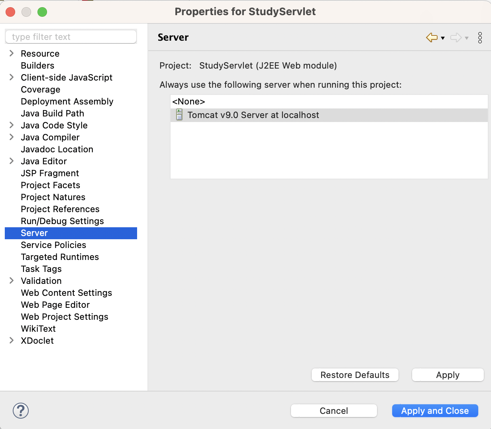

서버에 톰캣 등록하는 방법은 하단의 Server 탭에서 

2. Properties >> Java Build Path >> Libraries >> Add Libraries >> Server Runtime >> 톰캣 선택

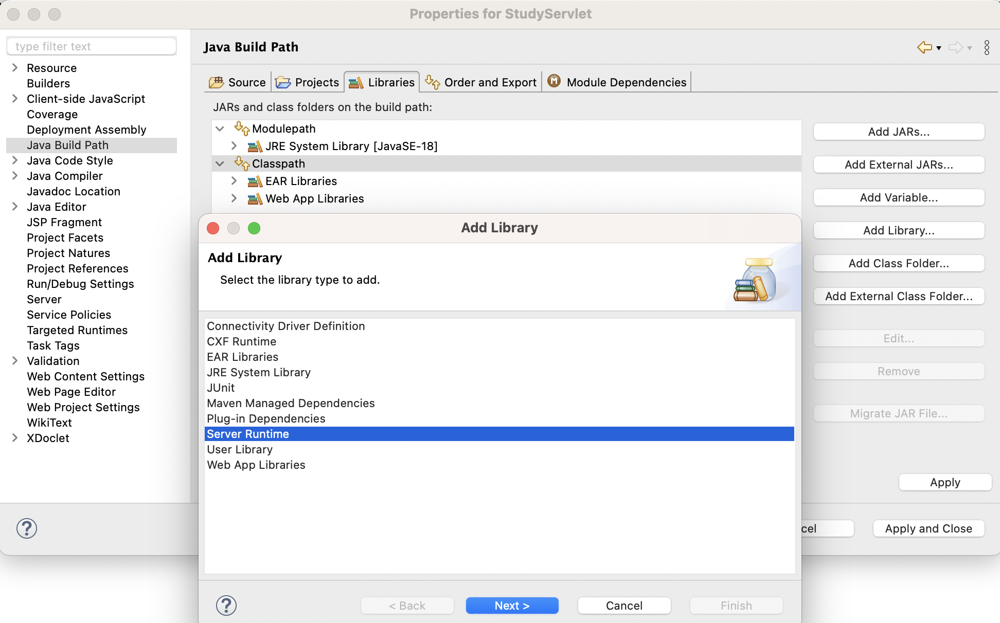

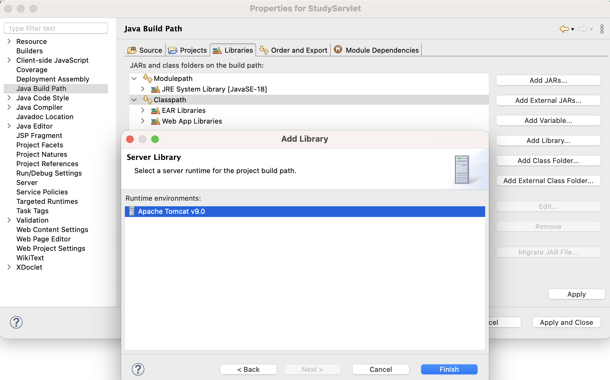

## 404 not found 에러 해결

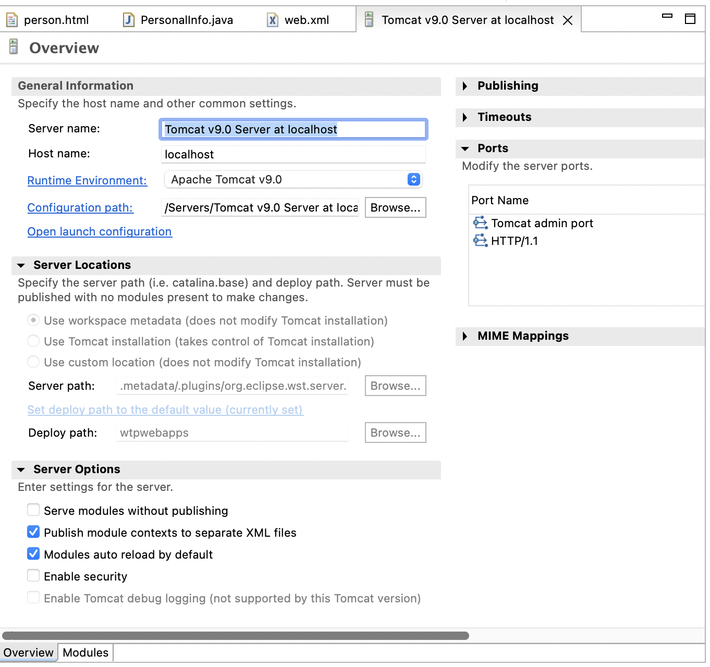

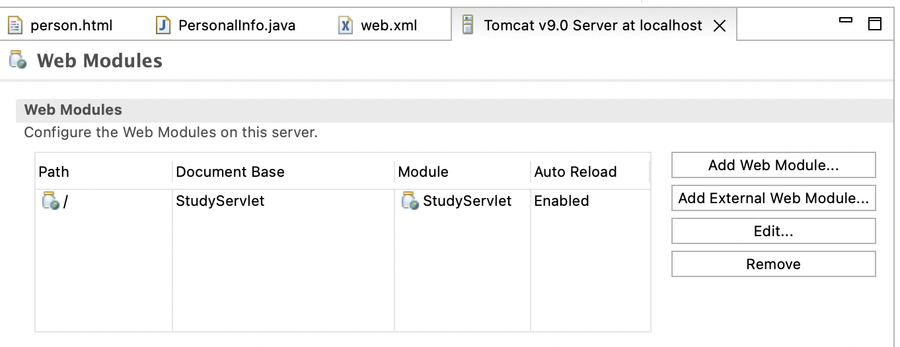