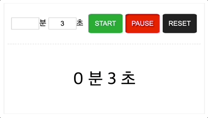

- start 버튼 클릭
    - display에 1초씩 감소하는 문자 출력(setInterval) 
- stop 클릭
    - start button -> RESUME
    - clearInterval -> 재개하도록 하려면 setInterval 함수를 매개변수로 받아야 한다
- resume(start) 버튼 클릭
    - resume 일 때 setInterval 재개
    - display 값이 0 일 때 시간이 만료되었다는 메시지 출력
- reset 버튼 클릭
    - 2초 후에 리셋된다는 메시지 출력
    - 페이지 리로드

**기억해야 할 중요한 점**: 코드가 실행될 때에는 입력 필드의 값이 빈 상태이기 때문에 요소.value로 가져오면 아무 것도 없다. 버튼을 클릭한 후에 입력 필드의 값을 가져와야 한다.

## javascript

```javascript
// 내 코드
const minute = document.querySelector("#startMin");
const second = document.querySelector("#startSec");
const btnStart = document.querySelector(".start-btn");
const btnPause = document.querySelector(".pause-btn");
const btnReset = document.querySelector(".reset-btn");
const display = document.querySelector("#display");
const message = document.querySelector("#pause_message");

let min = 0;
let sec = 0;
let regex = /[^0-9]/;
let timer = null;
let toggle = true;    // start 버튼 여러번 클릭 방지용

// 0 이상의 숫자 외의 값 입력 금지
minute.addEventListener("change", function(){
    min = minute.value;
    if (min < 0 | regex.test(min)){
        alert("0 이상의 값을 입력하세요");
    }
})

second.addEventListener("change", function(){
    sec = second.value;
    if(sec <= 0 | regex.test(sec)){
        alert("0 보다 큰 값을 입력해주세요.")
    }
});

// start 버튼
btnStart.addEventListener("click", function(){
    if (toggle) {                           // start 버튼 여러 번 누르는 것 방지
        timer = setInterval(start, 1000);
        toggle = false;
    } else {
        message.innerText = "이미 실행 중입니다";
        setTimeout(function() {message.innerText = "";}, 3000);
    }
});

// pause 버튼
btnPause.addEventListener('click', function(){
    clearInterval(timer);
    btnStart.setAttribute("value", "RESUME");
    toggle = true;
});

// reset
btnReset.addEventListener("click", function(){
    clearInterval(timer);
    display.innerHTML = `0 분 0 초`;
    reset();
});

// 함수
function start(){
    if (btnStart.getAttribute("value") != 'RESUME') {
        display.innerHTML = `${min} 분 ${sec} 초`;
        sec = sec - 1;
        if (sec == 0 && min != 0){
            sec = 60;
            min -= 1;
        }
    } else {
        btnStart.setAttribute("value", "START");
    }
    // 타임아웃 확인. 0으로 조건을 걸면 1초에서 멈춤
    if (min == 0 && sec == -1){
        clearInterval(timer);
        reset();
    }
}

function reset(){
    message.innerHTML = "타이머가 정상 종료되었습니다.<br>2초 후에 페이지가 새로고침됩니다."
    setTimeout(function() {location.reload();}, 3000);
}

// 강사님 코드
var start_button = document.querySelector(".start-btn");
start_button.addEventListener("click", startTimer);
var stop_button = document.querySelector(".pause-btn");
stop_button.addEventListener("click", pauseTimer);
var reset_button = document.querySelector(".reset-btn");
reset_button.addEventListener("click", resetTimer)
start_flags = true;
pause_flags = true;
function startTimer() {
    if (start_flags == false && pause_flags == false) { // PAUSE를 누르고 나서
        timer = setInterval(countTimer, 1000);
        document.querySelector('#pause_message').innerText = "타이머 다시 동작중";
    } else if (start_flags == false && pause_flags == true) { // START 누르고 START 누르면
        clearInterval(timer);
        alert("이미 타이머가 동작 중입니다.")
        timer = setInterval(countTimer, 1000);
    } else { // 처음 시작
        min = document.querySelector('#startMin').value;
        sec = document.querySelector('#startSec').value;
        timer = setInterval(countTimer, 1000);
        start_flags = false;
    }
}
function countTimer() {
    if (sec != 0) {
        sec = sec - 1;
        document.querySelector('#display').innerText = min + "분 " + sec + "초";
    }
    else {
        if (min != 0) {
            min = min - 1;
            sec = 59;
        }
        else {
            document.querySelector('#display').innerText = "타이머 정상 종료";
            document.querySelector('#pause_message').innerText = "2초 후 새로고침 됩니다.";
            setTimeout(function () {window.location.reload()}, 2000);
        }
    }
}
function pauseTimer() {
    clearInterval(timer);
    pause_flags = false;
    resume = document.querySelector(".start-btn");
    resume.value = "RESUME";
    document.querySelector('#pause_message').innerText = "타이머 일시 중지됨";
}
function resetTimer() {
    clearInterval(timer);
    document.querySelector('#display').innerText = "타이머 강제 리셋";
    document.querySelector('#pause_message').innerText = "2초 후 새로고침 됩니다.";
    setTimeout(function () {window.location.reload()}, 2000);
}
```

## html

```html
<!DOCTYPE html>
<html lang="ko">
<head>
    <meta charset="utf-8" />
    <meta name="viewport" content="width=device-width, initial-scale=1.0">
    <title>자바스크립트 타이머</title>
    <link href="css/question_3.css" rel="stylesheet">
</head>
<body>
    <div id="wrapper">
		<form>
        	<label><input type="text" id="startMin">분</label>
        	<label><input type="text" id="startSec">초</label>
        	<input type="button" value="START" class="start-btn">
			<input type="button" value="PAUSE" class="pause-btn">
        	<input type="button" value="RESET" class="reset-btn">
      	</form>
      	<hr>
	      <div id="display" class="remaining"></div>
		  <p id="pause_message" style="color: red;"></p>
    </div>
    <script src="js/jstest.js"></script>
</body>
</html>
```

## css

```css
#wrapper {
  width:400px;
  height:200px;
  margin:0 auto;
  padding-top:20px;
  text-align:center;
  border:1px solid #eee;
}

input[type="text"] {
  width:50px;
  height:20px;
  border:1px solid #ccc;
  text-align: center;
}

input[type="button"] {
  width:70px;
  height:40px;
  border-radius:10%;
  border:1px solid #ddd;;
}

.start-btn{
  margin-left:5px;
  background-color:#093;
  color:white;
}

.start-btn:hover {
  background-color:#0c4;
}

.pause-btn{
  background-color:red;
  color:white;
}

.pause-btn:hover {
  background-color:rgba(243, 112, 112, 0.651);
}    

.reset-btn{
  background-color:#222;
  color:white;
}

.reset-btn:hover {
  background-color:#666;
} 

ns > button:hover {
  background-color:#222;
  color:white;
  border:1px solid white;
}

hr {
  margin-top:20px;
  border:1px dashed #eee;
  width:96%;
}      

.remaining {
  margin-top:50px;
  font-size:34px;        
}

.accent {
  color:blue;
  font-size:34px;
  font-weight:bold;
}
```