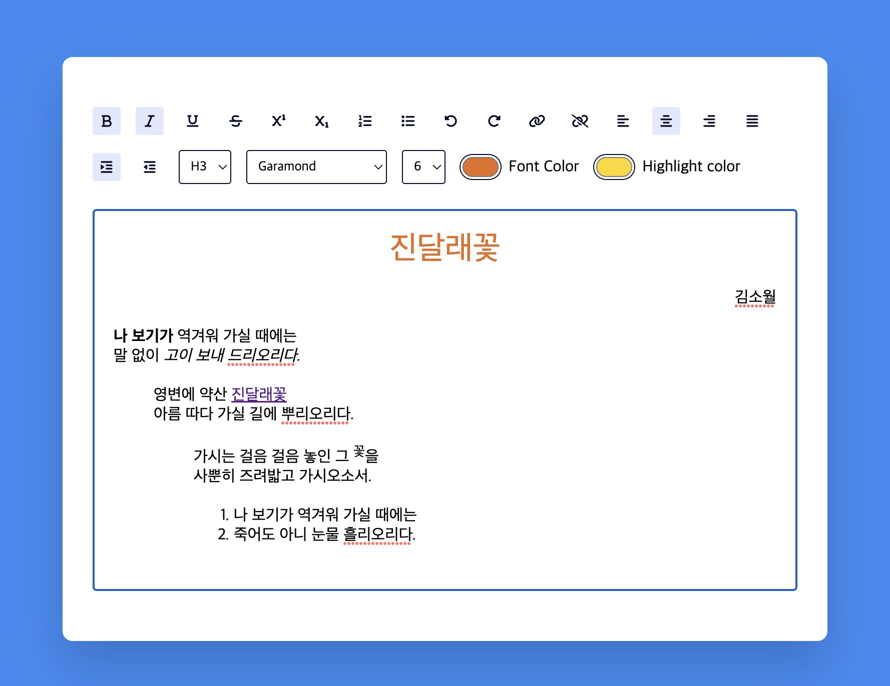

[이곳 영상](https://youtu.be/la-0HOaNL10){target=_blank}을 보고 따라했다. UI를 어떻게 구성하는지 잘 배웠다. 다만 실제로 텍스트 모양을 바꾸는 함수를 직접 만들지 않고 권장하지 않는 `document.execCommand(command, defaultUi, value);`를 사용한 점이 아쉽다.

## HTML

```html
<!DOCTYPE html>
<html lang="en">
<head>
    <meta charset="UTF-8">
    <meta http-equiv="X-UA-Compatible" content="IE=edge">
    <meta name="viewport" content="width=device-width, initial-scale=1.0">
    <title>편집기</title>
    <link rel="stylesheet" href="editor.css">
    <script src="https://kit.fontawesome.com/231eaa05f7.js" crossorigin="anonymous"></script>
</head>
<body>
    <div class="container">
        <div class="options">
            <!-- 텍스트 포맷 -->
            <button id="bold" class="option-button format">
                <i class="fa-solid fa-bold"></i>
            </button>
            <button id="italic" class="option-button format">
                <i class="fa-solid fa-italic"></i>
            </button>
            <button id="underline" class="option-button format">
                <i class="fa-solid fa-underline"></i>
            </button>
            <button id="strikethrough" class="option-button format">
                <i class="fa-solid fa-strikethrough"></i>
            </button>
            <button id="superscript" class="option-button">
                <i class="fa-solid fa-superscript"></i>
            </button>
            <button id="subscript" class="option-button">
                <i class="fa-solid fa-subscript"></i>
            </button>

            <!-- 목록 포맷 -->
            <button id="insertOrderedList" class="option-button">
                <i class="fa-solid fa-list-ol"></i>
            </button>
            <button id="insertUnorderrdList" class="option-button">
                <i class="fa-solid fa-list"></i>
            </button>

            <!-- 취소/재실행 -->
            <button id="undo" class="option-button">
                <i class="fa-solid fa-rotate-left"></i>
            </button>
            <button id="redo" class="option-button">
                <i class="fa-solid fa-rotate-right"></i>
            </button>

            <!-- 링크 -->
            <button id="createLink" class="option-button">
                <i class="fa fa-link"></i>
            </button>
            <button id="unlink" class="option-button">
                <i class="fa fa-unlink"></i>
            </button>

            <!-- 정렬 -->
            <button id="justifyLeft" class="option-button align">
                <i class="fa-solid fa-align-left"></i>
            </button>
            <button id="justifyCenter" class="option-button align">
                <i class="fa-solid fa-align-center"></i>
            </button>
            <button id="justifyRight" class="option-button align">
                <i class="fa-solid fa-align-right"></i>
            </button>
            <button id="justifyFull" class="option-button align">
                <i class="fa-solid fa-align-justify"></i>
            </button>
            <button id="indent" class="option-button spacing">
                <i class="fa-solid fa-indent"></i>
            </button>
            <button id="outdent" class="option-button spacing">
                <i class="fa-solid fa-outdent"></i>
            </button>

            <!-- Headings -->
            <select name="" id="formatBlock" class="adv-option-button">
                <option value="H1">H1</option>
                <option value="H2">H2</option>
                <option value="H3">H3</option>
                <option value="H4">H4</option>
                <option value="H5">H5</option>
                <option value="H6">H6</option>
            </select>

            <!-- 폰트 -->
            <select name="" id="fontName" class="adv-option-button"></select>
            <select name="" id="fontSize" class="adv-option-button"></select>

            <!-- 글자색 -->
            <div class="input-wrapper">
                <input type="color" id="foreColor" class="adv-option-button">
                <label for="foreColor">Font Color</label>
            </div>
            <div class="input-wrapper">
                <input type="color" id="backColor" class="adv-option-button">
                <label for="backColor">Highlight color</label>
            </div>

            <div id="text-input" contenteditable="true"></div>
        </div>
    </div>

    <script src="editor.js"></script>
</body>
</html>
```

## CSS

```css
* {
    padding: 0;
    margin: 0;
    box-sizing: border-box;
}

body {
    background-color: #338cf4;
}

.container {
    background-color: #fff;
    width: 100vmin;
    padding: 50px 30px;
    position: absolute;
    transform: translate(-50%, -50%);  /* transform : trnaslate (x축기준 이동시킬 값 , y축 기준 이동 시킬 값) */
    left: 50%;
    top: 50%;
    border-radius: 10px;
    box-shadow: 0 25px 50px rgba(7, 20, 35, 0.2); /* 우측 밑 블러정도 그림자크기 색상*/
}


/* 메뉴 버튼 스타일 */
.options {
    display: flex;    /* 부모에서 선언 */
    flex-wrap: wrap;  /* flex item이 flex container를 벗어났을 때 줄을 바꿈 */
    align-items: center;    /* 수직 정렬 */
    gap: 15px;    /* gap between rows and columns */
}

button {
    height: 28px;
    width: 28px;
    display: grid;
    place-items: center;  /* align items along both the block and inline directions at once (i.e. the align-items and justify-items properties) in a relevant layout system such as Grid or Flexbox.*/
    border-radius: 3px;  /* border 가 none인데 왜 설정하지? */
    border: none;
    background-color: #fff;
    outline: none;
    color: #020929;
}

/* H1 - H6 */
select {
    padding: 7px;
    border: 1px solid #020929;
    border-radius: 3px;
}

.option label,
.options select {
    font-family: "Poppins", sans-serif;
}

/* 글자색 - label. color picker */
.input-wrapper {
    display: flex;
    align-items: center;
    gap: 8px;
}

input[type="color"]{
    appearance: none;
    background-color: transparent;
    width: 40px;
    height: 28px;
    border: none;
    cursor: pointer;
}

input[type="color"]::-webkit-color-swatch{
    border-radius: 15px;
    box-shadow: 0 0 0 2px #fff, 0 0 0 3px #020929;
}
input[type="color"]::-moz-color-swatch{
    border-radius: 15px;
    box-shadow: 0 0 0 2px #fff, 0 0 0 3px #020929;
}

/* 텍스트 입력 */
#text-input{
    margin-top: 10px;
    border: 1px solid #dddddd;
    padding: 20px;
    height: 50vh;
    width: 100vw;  /* 원 코드에는 없음 */
}

/* 버튼 활성화 모양 설정 */
.active {
    background-color: #e0e9ff;
}
```

## JAVASCRIPT

```javascript
let optionsButtons = document.querySelectorAll(".option-button");
let advancedOptionButton = document.querySelectorAll(".adv-option-button");
let fontName = document.getElementById("fontName");
let fontSizeRef = document.getElementById("fontSize");
let writingArea = document.getElementById("text-input");
let linkButton = document.getElementById("createLink");
let alignButtons = document.querySelectorAll(".align")
let spacingButtons = document.querySelectorAll(".spacing");
let formatButtons = document.querySelectorAll(".format");
let scriptButtons = document.querySelectorAll(".script");

// List of fontlist
let fontList = ["Arial", "Verdana", "Times New Roman", "Garamond", "Georgia", "Courier New", "cursive"];

// Initialize Settings
const initializer = () => {
    // 선택되어 있는 버튼을 활성화모양으로 만드는 함수 호출 
    // link, unlink, lists, undo, redo 버튼은 한 번만 사용되기에 선택상태를 나타낼 필요 없다.
    // function calls for highlighting buttons
    // No highlights for link, unlink, lists, undo, redo since they are one time operations
    highlighter(formatButtons, false); // 활성화/비활성화 토글 bold, italic, underline, strikethrough, superscript, subscript
    highlighter(alignButtons, true);
    highlighter(spacingButtons, true);
    highlighter(scriptButtons, true);

    // 폰트 선택 드롭다운 버튼에 폰트 이름 추가
    fontList.map( (value) => {
        let option = document.createElement("option");
        option.value = value;
        option.innerHTML = value;
        fontName.appendChild(option);
    });

    // 폰트 크기 드롭다운 버튼에 숫자 크기(1~7) 추가
    for( let i=1; i<=7; i++){
        let option = document.createElement("option");
        option.value = i;
        option.innerHTML = i;
        fontSizeRef.appendChild(option);
    }
    // 기본 폰트 크기 설정
    fontSizeRef.value = 3;

    // main logic
    const modifyText = (command, defaultUi, value) => {
        // 선택된 텍스트에 명령 실행
        document.execCommand(command, defaultUi, value);
    };

    // 매개변수가 필요 없는 기능
    optionsButtons.forEach( (button) => {
        button.addEventListener("click", () => {
            modifyText(button.id, false, null);
        });
    });

    // 매개변수가 필요한 기능(색상, 폰트 등)
    advancedOptionButton.forEach( (button) => {
        button.addEventListener("change", () => {
            modifyText(button.id, false, button.value);
        });
    });

    // link
    linkButton.addEventListener("click", () => {
        let userLink = prompt("URL을 입력하세요");
        if(/http/i.test(userLink)){
            modifyText(linkButton.id, false, userLink);
        } else {
            userLink = "http://" + userLink;
            modifyText(linkButton.id, false, userLink);
        }
    })
};

// --------------- 문법 -------------------
// arr.map : 배열 요소 전체를 대상으로 함수를 호출하고, 함수 호출 결과를 배열로 반환
// fontName : <select name="" id="fontName" class="adv-option-button"></select>
// option -> <option></option>
// option.value -> <option value="폰트이름"></option>
// option.innerHTML -> <option value="폰트이름"></option>
// appendChild -> <select name="" id="fontName" class="adv-option-button"><option value="폰트이름"></option></select>

// --------------- 문법 -------------------
// 클래스 속성값 전체를 바꾸고 싶을 때는 className으로, 
// 개별 클래스를 조작하고 싶을 때는 classList를 사용하면 됩니다.
// classList에 구현된 메서드는 다음과 같습니다.
// elem.classList.add/remove("class") – class를 추가하거나 제거
// elem.classList.toggle("class") – class가 존재할 경우 class를 제거하고, 그렇지 않은 경우엔 추가
// elem.classList.contains("class") – class 존재 여부에 따라 true/false를 반환

// 클릭된 버튼 활성화모양/비활성화모양으로 만들기 className = button, needsRemoval = boolean
const highlighter = (className, needsRemoval) => {
    className.forEach( (button) => {
        button.addEventListener("click", () => {
            // needsRemoval == true -> 묶음 버튼(list, link, align) 중 오직 버튼 하나만 활성화모양이 됨
            if (needsRemoval) {
                let alreadyActive = false;
    
                // 현재 클릭된 버튼이 이미 클릭(활성화)되어 있다면
                if (button.classList.contains("active")) {
                    alreadyActive = true;
                }
    
                // 다른 버튼의 활성화모양 제거 Remove highlight from other buttons
                highlighterRemover(className);
                if (!alreadyActive) {    // 클릭된 버튼이 활성화 상태가 아니라면
                    // 클릭된 버튼 활성화모양 클래스 추가
                    button.classList.add("active"); 
                }
            } else { // 묶음 버튼이 아니라면 활성화 상태 토글
                button.classList.toggle("active");
            }
        });
    });
};

const highlighterRemover = (className) => {
    className.forEach( (button) => {
        button.classList.remove("active");
    });
}

window.onload = initializer();
```