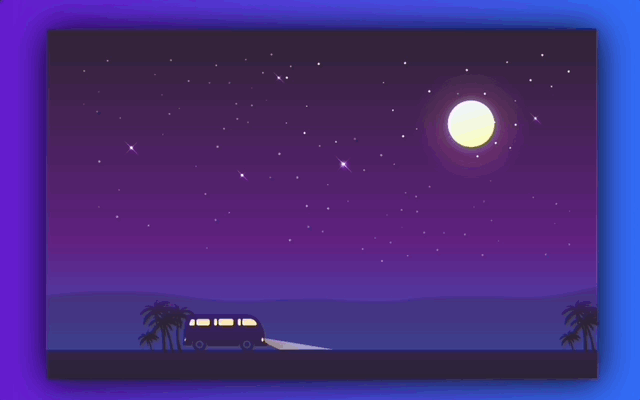

- [gradient 코드 샘플 제공 사이트](https://webgradients.com/){target=_blank}
    - `body{ linear-gradient(to right, #6a11cb 0%, #2575fc 100%); }`
- `overflow: hidden;` : 땅이 움직이는 효과를 위해 이미지 넓이를 500%로 늘렸다. 화면보다 큰 부분을 보이지 않게 설정한다. 이것을 적용하지 않으면 가운데 사각형 바깥에도 땅이 보인다.
- `background-size: cover;` : 배경 그림을 키우거나 줄여 영역 크기에 맞춘다.
- `background-repeat: repeat-x;` : 배경 그림을 X축 방향으로 반복한다.
- `animation: moveRight 6s linear infinite;` : moveRight에 설정한 애니매이션을 선형으로 6초마다 무한 반복한다.
- `moveRight{ 100%{transform: translate(-2950px);} }` : 


```CSS
body { margin: 0; background-image: linear-gradient(to right, #6a11cb 0%, #2575fc 100%); overflow: hidden;}
.night { height: 80vh; width: 70vw; margin: 5rem auto; background-image: url('./images/night.png'); background-size: cover; position: relative; box-shadow: 1px 2px 60px rgba(0, 0, 0, 4); overflow-x: hidden;}
.surface { height: 140px; width: 500%; background: url(./images/earth.png); display: block; position: absolute; bottom: 0%; left: 0%; background-repeat: repeat-x; animation: moveRight 6s linear infinite;}
.car { position: absolute; bottom: 7%; left: 24%; animation: suspension 1s linear infinite;}
/* Animation*/  
@keyframes moveRight{ 100%{transform: translate(-2950px);} }
@keyframes suspension{ 100%{transform: translateY(-1px);} 50%{transform: translateY(2px);} 0%{transform: translateY(-1px);}}
```

```HTML
<div class="night">
    <div class="surface"></div>
    <div class="car"></div>
</div>
```

