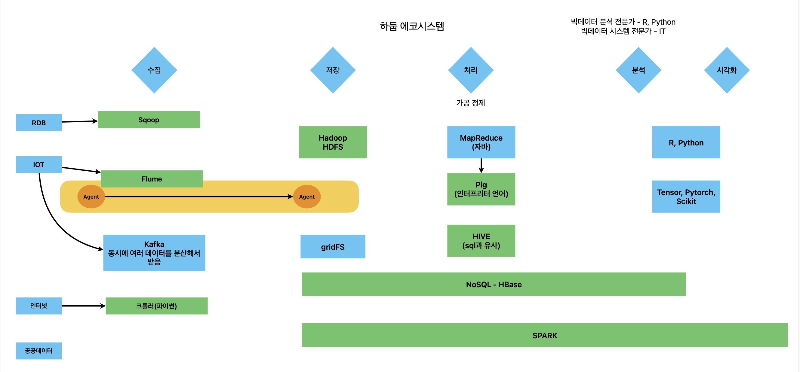

## 하둡

- HDFS : 하둡 분산 파일 시스템. 파일을 여러 대의 하드디스크(컴퓨터)에 나누어 저장
- Mapreduce : 병렬처리하게 하는 라이브러리. 자바로 만듦

## 하둡 문제점 개선

- NOSQL : 비정형데이터베이스. 4종류(key-value, Column??, Graph, document)
- SPARK : 고속 메모리 처리 + 머신러닝 라이브러리 + 시각화 라이브러리 + SQL 인터페이스

## NOSQL

- 스케일업 : cpu, ram 같은 하드웨어 추가
- 스케일아웃 : 컴퓨터 추가 <- NOSQL

NOSQL만으로 분산 환경 구성 가능

## 기술 개념

- RDBMS : ACID
- NOSQL : CAP

## 빅데이터 단계

## 하둡 설치

1. 독립형: 
2. 의사가상분산환경: 리눅스에 하둡 1개 설치 -> 여러 개 하둡처럼 작동
3. 완전분산: 여러대 컴퓨터에 설치

- VirtualBox-6.1.18-142142-Win.exe
- ubuntu-20.04.2.0-desktop-amd64.iso
- HDP_3.0.1_virtualbox_181205.ova

윈도우에 VirtualBox 설치 -> 가상환경 4개 추가 후 각각 우분투 설치