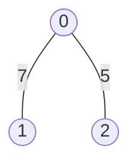
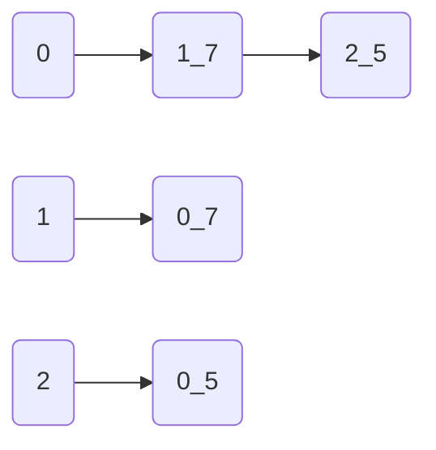
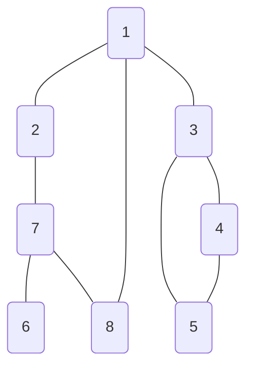

## 깊이 우선 탐색(DFS, Depth-First Search)

그래프 표현 방식:

- 인접 행렬(Adjacency Matrix) 방식: 연결되어 있지 않은 노드는 무한비용(논리적으로 정답이 아닌 큰 값, eg. 999999999) 선언
- 인접 리스트(Adjacency List) 방식
- 파이썬에서는 모두 2차원 리스트로 표현한다.



### 인접 행렬 방식

```python
INF = 999999999

graph = [
    [0, 7, 5],
    [7, 0, INF],
    [5, INF, 0]
]
```

### 인접 리스트 방식



### 구현



탐색 순서: 1 -> 2 -> 7 -> 6 -> 8 -> 3 -> 4 -> 5

```python
# DFS 메서드 정의
def dfs(graph, v, visited):
    # 현재 노드를 방문 처리
    visited[v] = True
    print(v, end=' ')
    
    # 현재 노드와 연결된 다른 노드를 재귀적으로 방문
    for i in graph[v]:
        if not visited[i]:
            dfs(graph, i, visited)

# 그래프 정보 맵
# 각 노드가 연결된 정보를 리스트 자료형으로 표현(2차원 리스트)
graph = [
    [],           # 0번 인덱스 비워둠
    [2, 3, 8],    # 1과 연결된 노드
    [1, 7],       # 2와 연결된 노드
    [1, 4, 5],    # 3과 연결된 노드
    [3, 5],
    [3, 4],
    [7],
    [2, 6, 8],
    [1, 7]
]

# 방문 유무 확인 위한 맵 -> 초기값은 모두 False(방문 안 함)
# 각 노드가 방문한 정보를 리스트 자료형으로 표현(1차원 리스트)
# 노드 개수 + 1 (0번 인덱스 포함) => 인덱스 번호를 노드번호로 사용하기 위함
visited = [False] * 9

# 정의된 DFS 함수 호출
dfs(graph, 1, visited)
# 1 2 7 6 8 3 4 5 
```

실행 추적

```text
graph[1] -> [2, 3, 8]
    2 -> not visited
            -> graph[2] -> [1, 7]
                1 -> visitied
                7 -> not visited
                        -> graph[7] -> [2, 6, 8]
                            2 -> visited
                            6 -> not visited
                                    -> graph[6] -> [7]
                                        7 -> visited
                                        return => None
                            8 -> not visited
                                    -> graph[8] -> [1, 7]
                                        1 -> visited
                                        7 -> visited
                                        return => None
                    return => None
        return => None

    3 -> not visited    
```
