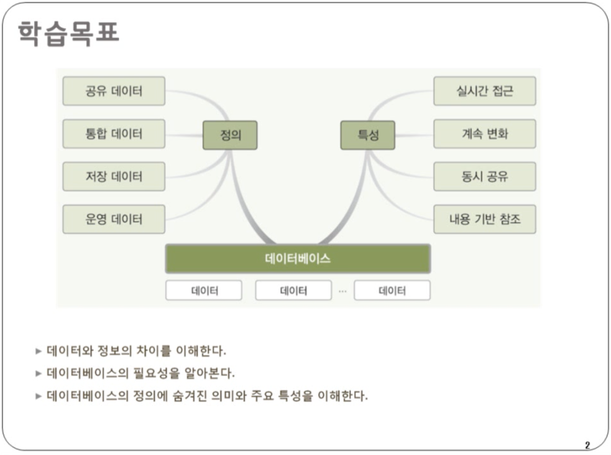
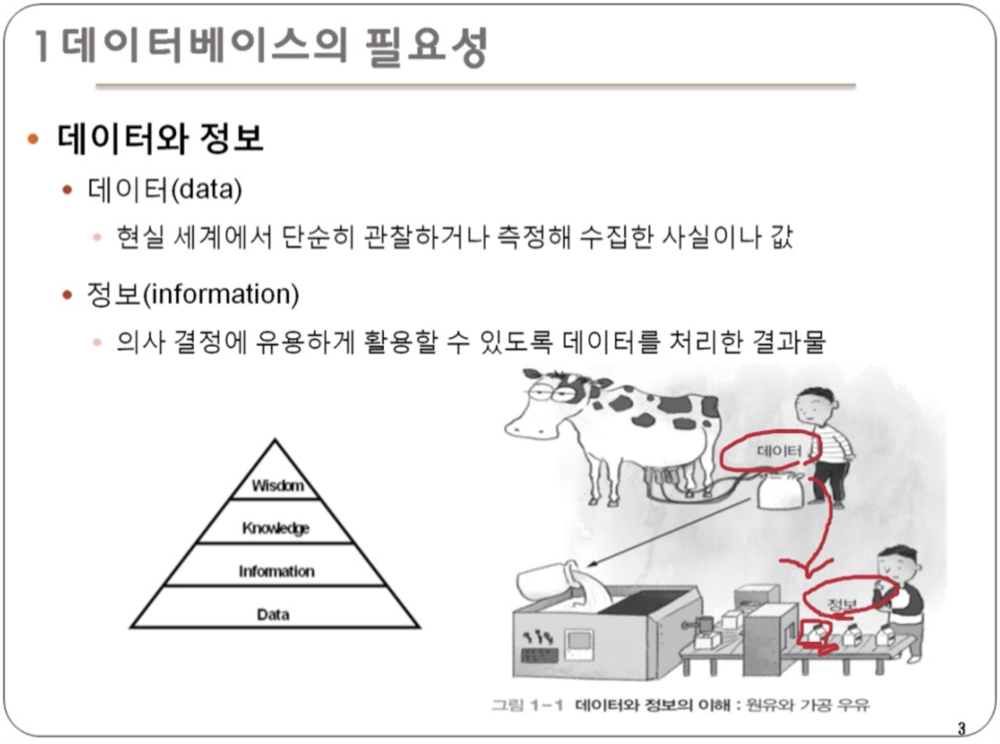
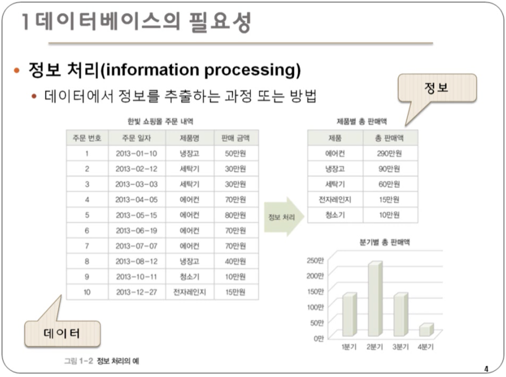
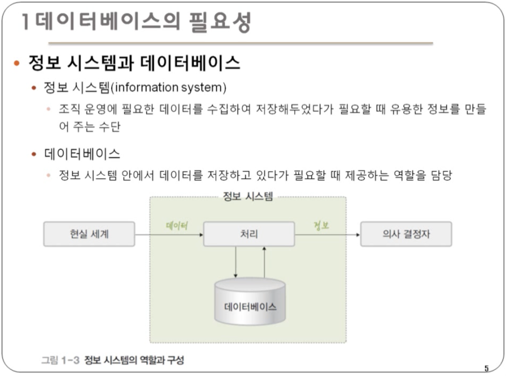
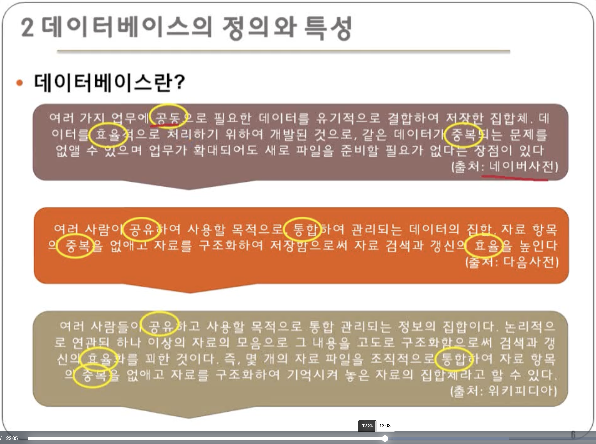
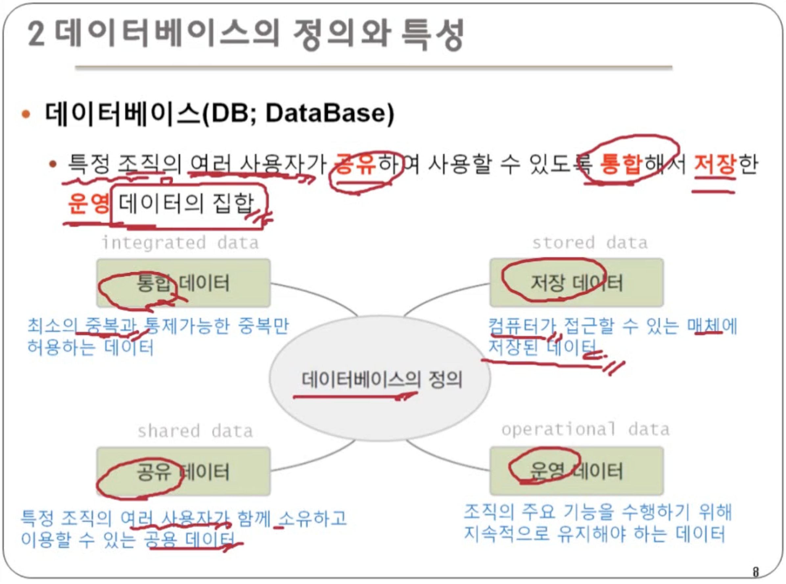
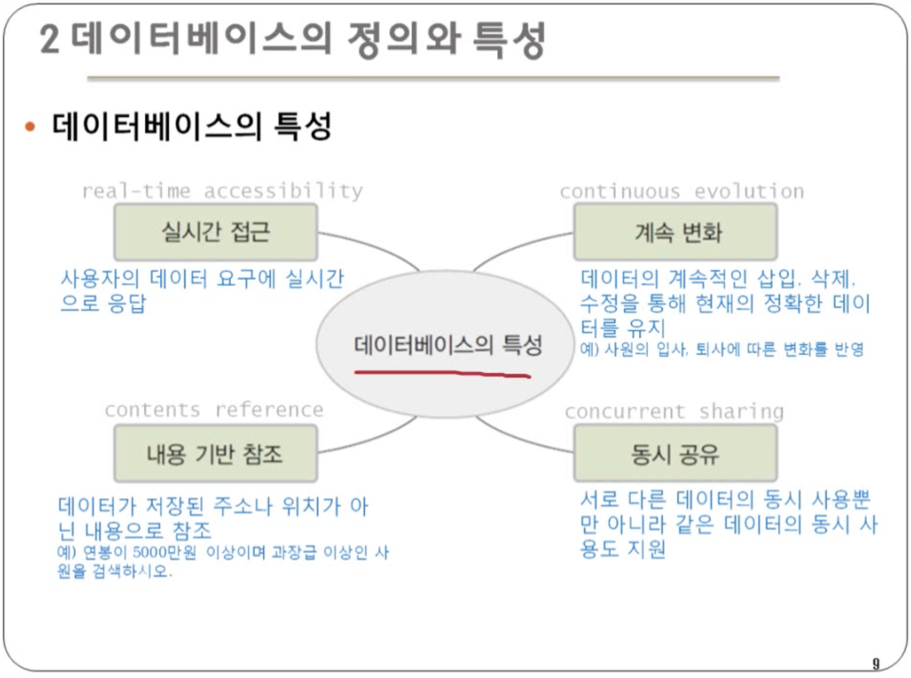

[강의](http://www.kocw.net/home/search/kemView.do?kemId=1163794)

데이터에서 정보를 의사결정자에게 제공

- DIKW : 피라미드 위로 올라갈수록 가치(value) 증가
- 데이터 : 가공하기 전의 순수한 상태의 수치들. 의미 없는 사실이나 값. eg.쿠팡에서 A란 사람이 검색한 기록
- 정보 : 데이터를 유의미하게 가공한 2차 데이터. 의이 있게 구조화된 데이터 집합 eg. A는 샤오미와 보스의 헤드폰을 검색했다.
- 지식 : 정보를 의미 있게 처리하고 활용한 것. eg. A가 헤드폰을 구매하기 위해 고민하고 있다.
- 지혜 : 지식을 활용할 수 있는 창의적인 아이디어. eg. 두 제품의 특성을 모두 가지고 있는 소니 제품을 추천해야겠다.

예전에는 정보화시대라고 불렀지만, 지금은 빅데이터시대라고 부름

데이터를 통해 에어컨이 많이 팔리고 , 청소기가 가장 적게 팔린다는 정보 얻음
→ 사이트를 청소기를 중심으로 개편하든지, 청소기에 대한 프로모션을 진행하자.

정보 시스템 : 조직 운영에 필요한 데이터를 수집하여 저장해 두었다가 필요할 때 유용한 정보를 만들어 주는 수단.

동그라미 친 것이 데이터베이스의 특성

데이터베이스 : 특정 조직의 여러 사용자가 **공유**하여 사용할 수 있도록 **통합**하여 **저장**한 **운영** 데이터의 집합

- **통합** 데이터 : 최소의 중복과 통제가능한 중복만 허용하는 데이터
- **공유** 데이터 : 특정 조직의 여러 사용자가 함께 소유하고 이용할 수 있는 공용 데이터
- **저장** 데이터 : 컴퓨터가 접근할 수 있는 매체에 저장된 데이터
- **운영** 데이터 : 조직의 주요 기능을 수행하기 위해 지속적으로 유지해야 하는 데이터

데이터베이스의 특성

- **실시간 접근** : 사용자의 데이터 요구에 실시간으로 응답
- **계속 변화** : 데이터의 계속적인 삽입, 삭제, 수정을 통해 현재의 정확한 데이터를 유지
- **동시 공유** : 서로 다른 데이터의 동시 사용뿐만 아니라 같은 데이터의 동시 사용도 지원
- **내용 기반 참조** : 데이터가 저장된 주소나 위치가 아닌 내용으로 참조
