## 환경설정

이클립스에서 MySQL 연결

- 이클립스에서 mysql을 연결하려면 프로젝트마다 mysql-connector-java-8.0.30.jar 파일을 추가해야 한다. 
- 프로젝트 우클릭 >>> Properties >>> 왼쪽 패널 Java Build Path >>> 우측 패널 Libraries >> Modulepath 클릭 >>> 우측 Add External JARS... 버튼

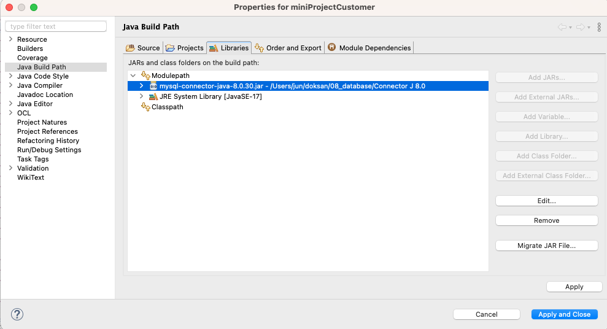

Window Builder 설치

- GUI 환경에서 레이아웃을 구성할 수 있다.
- Help >> Install new Software >> –All Available Sites– >> General Purpose Tools 설치

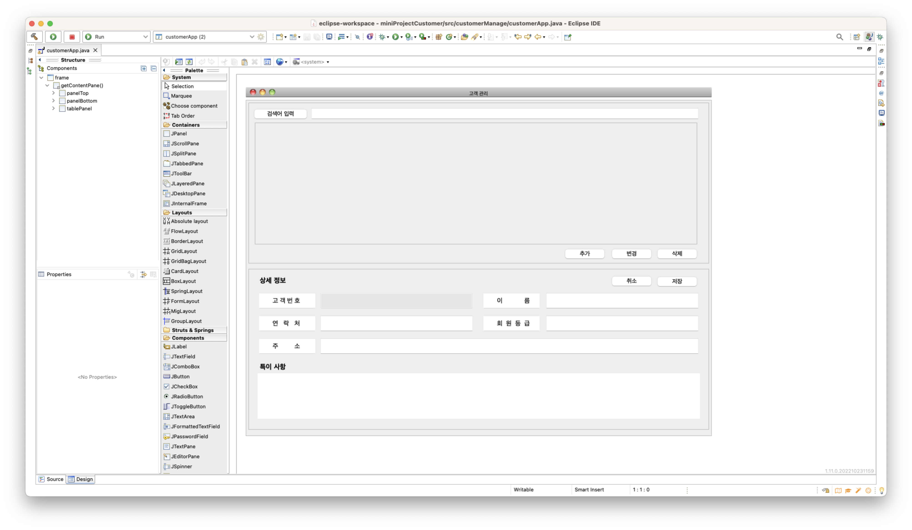


## 윈도우 빌더로 클래스 만들기

1. 패키지 우클릭 >> other >> WindowBuilder >> Swing Designer >> Application Window
2. Class name 입력
3. 좌측 하단의 Design 탭을 클릭한 후 디자인


## 초기 버전

전체 코드는 [github 저장소](https://github.com/lazychoi/javaSwingMysqlCrud)에서 볼 수 있다.

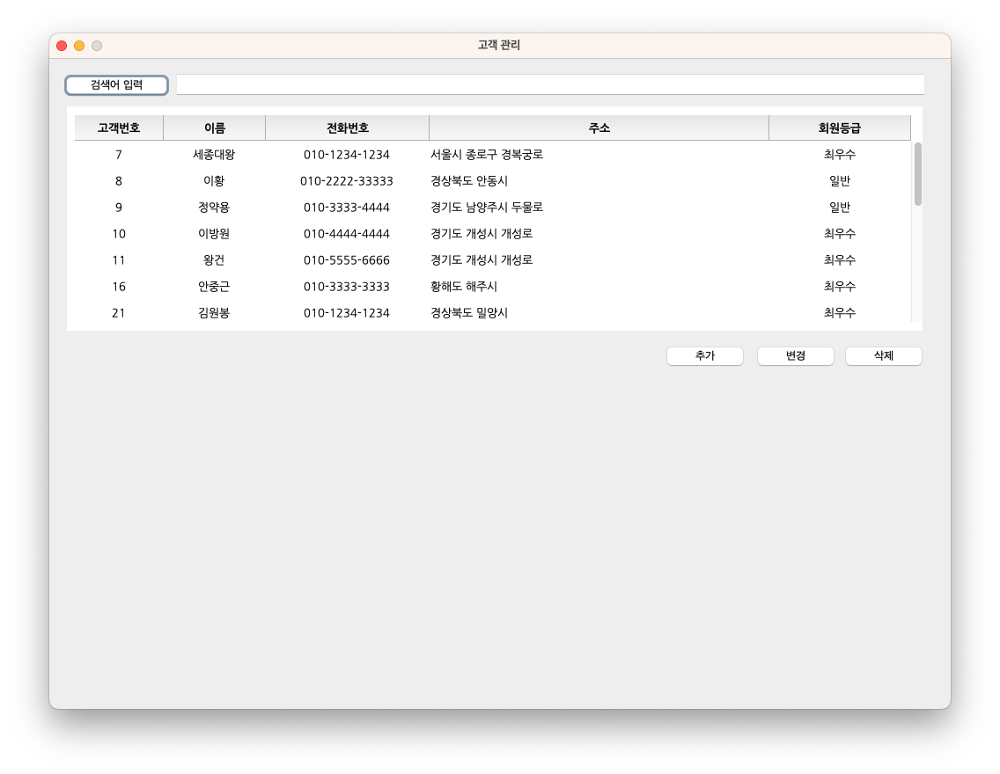

프로그램을 실행하면 

1. 데이터베이스에 저장된 데이터를 불러와 화면에 출력한다. (`select`, `JTable`)
2. 화면에 전체 데이터를 표시할 수 없으면 스크롤바가 나타난다.(`JScrollPane`)
3. 검색어를 입력하면 검색어가 포함된 행만 나타난다. (`TableRowSorter<TableModel>`)
4. `추가` 버튼을 눌러 고객을 추가한다. (하단에 입력 패널 보이고 감추기, `insert`, 화면 갱신)
5. `변경` 버튼을 눌러 고객 정보를 변경한다. (하단에 입력 패널 보이고 감추기, `update`, 화면 갱신)
6. `삭제` 버튼을 눌러 고객 정보를 삭제한다. (`delete`, 화면 갱신)

### 레이아웃

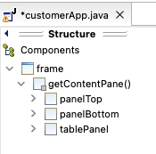

```java
// 패널 배치
frame = new JFrame("고객 관리");    				    // 메인 프레임
frame.setSize(1024, 768);								// 프레임 크기
frame.setDefaultCloseOperation(JFrame.EXIT_ON_CLOSE);	// 종료 버튼 누르면 프로그램 종료
frame.setLocationRelativeTo(null);						// 프레임을 화면 중앙에 배치
frame.setResizable(false);								// 프레임 크기를 변경하지 못하도록 설정
frame.getContentPane().setLayout(null);					// 프레임에 추가되는 컴포넌트 레이아웃 -> Absolute

panelTop = new JPanel();								// 상단 패널
panelTop.setBounds(6, 6, 1012, 354);					// 패널 위치와 크기  -> (x좌표, y좌표, 넓이, 높이)
panelTop.setLayout(null);								// 상단 패널에 추가되는 컴포넌트 레이아웃 -> Absolute
frame.getContentPane().add(panelTop);					// 프레임에 추가하기
panelTop.setVisible(true);								// 패널 보이기

panelBottom = new JPanel();								// 하단 패널
panelBottom.setBounds(6, 372, 1012, 354);				// 패널 위치와 크기  -> (x좌표, y좌표, 넓이, 높이)
panelBottom.setLayout(null);							// 하단 패널에 추가되는 컴포넌트 레이아웃 -> Absolute
frame.getContentPane().add(panelBottom);				// 프레임에 추가하기
panelBottom.setVisible(false);  						// 하단 패널 가리기

tablePanel = new JPanel();								// 테이블 패널 생성
tablePanel.setBounds(20, 50, 972, 268);					// 테이블 패널 위치와 크기
frame.getContentPane().add(tablePanel);					// 테이블 패널 추가
```

### JTable 

```java
public void showTable() {
    data = customer.getCustomers();
    //		for(String[] item:data)        //sql에서 가져온 데이터 확인
    //			for(String ii: item)
    //				System.out.println(ii);
    String[] header = new String[]{"고객번호", "이름", "전화번호", "주소", "회원등급"};

    tableModel = new DefaultTableModel(data, header);  
    table = new JTable(tableModel) {                    // 셀에서 편집할 수 없게 함.
        @Override
        public boolean isCellEditable(int row, int column) {
            return false;
        }
    };
    table.setBounds(50, 50, 975, 255);

    // 셀 값 가운데 정렬
    DefaultTableCellRenderer centerRenderer = new DefaultTableCellRenderer();
    centerRenderer.setHorizontalAlignment( SwingConstants.CENTER );
    table.getColumnModel().getColumn(0).setCellRenderer( centerRenderer );
    table.getColumnModel().getColumn(1).setCellRenderer( centerRenderer );
    table.getColumnModel().getColumn(2).setCellRenderer( centerRenderer );
    table.getColumnModel().getColumn(4).setCellRenderer( centerRenderer );
    TableCellRenderer rendererFromHeader = table.getTableHeader().getDefaultRenderer();
    JLabel headerLabel = (JLabel) rendererFromHeader;
    headerLabel.setHorizontalAlignment(JLabel.CENTER);
    
    table.setSelectionMode(ListSelectionModel.SINGLE_SELECTION);  //행을 하나만 선택할 수 있도록

    // 컬럼 크기
    TableColumnModel colModel = table.getColumnModel();
    colModel.getColumn(0).setPreferredWidth(15);
    colModel.getColumn(1).setPreferredWidth(30);
    colModel.getColumn(2).setPreferredWidth(100);
    colModel.getColumn(3).setPreferredWidth(300);

    table.getTableHeader().setFont(new Font("NanumGothic", Font.BOLD, 13));  // header 폰트 설정
    table.getTableHeader().setPreferredSize(new Dimension(100, 30));		// header 넓이, 높이 
    table.setFont(new Font("NanumGothic", Font.PLAIN, 13));                 // 셀 폰트, 크기
    table.setRowHeight(30);
//		table.setAlignmentX(0);
    
    // 테이블에 스크롤바 추가
    JScrollPane scrollPane = new JScrollPane(table);
    scrollPane.setPreferredSize(new Dimension(975, 255)); //Layout이 적용된 부분에서는 setPreffersize 만 사용 가능
    scrollPane.setVerticalScrollBarPolicy(ScrollPaneConstants.VERTICAL_SCROLLBAR_ALWAYS);
    scrollPane.setBorder(BorderFactory.createEmptyBorder(10, 10, 10, 0));	// padding(상, 좌, 하, 우)
    tablePanel.add(scrollPane); // JScrollPane을 panelTop에 바로 올리면 안 보임. 전용 tablePanel에 올려야 보임

}
```


### 검색어 필터링

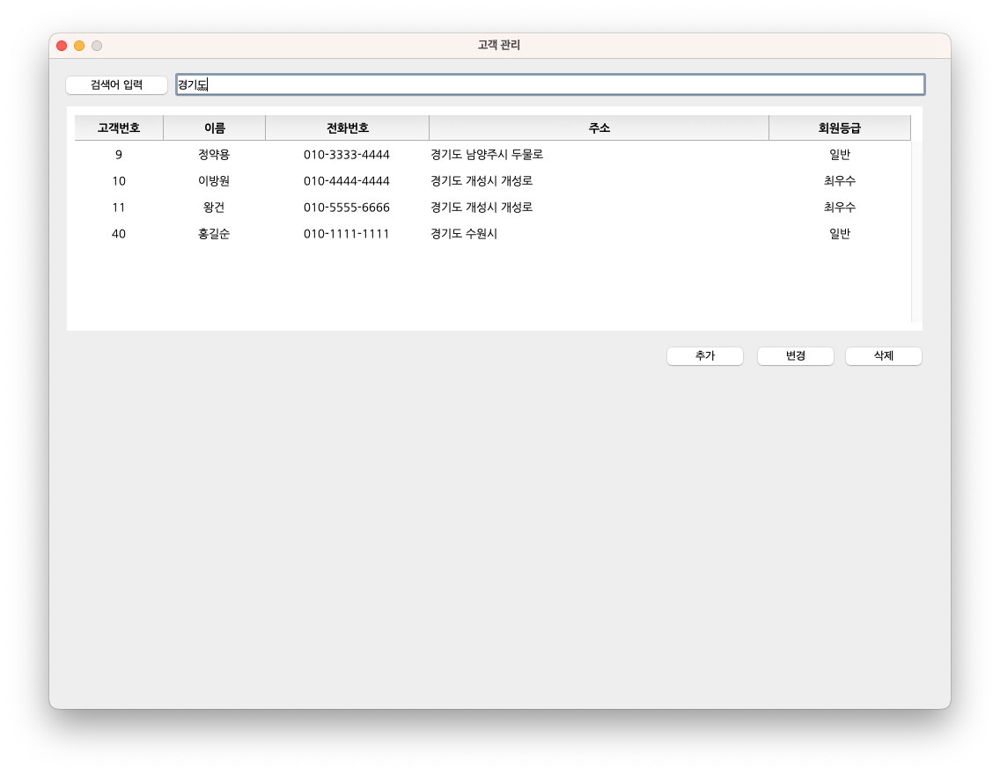

```java
JButton btnSearch = new JButton("검색어 입력"); // 검색어 입력 레이블을 버튼으로 구현(버튼 모양이 레이블보다 예뻐서)
btnSearch.setBounds(6, 10, 129, 30);         // 검색어 입력 레이블 위치와 크기 -> (x좌표, y좌표, 넓이, 높이)
panelTop.add(btnSearch);					 // 상단 패널에 붙이기

searchTextField = new JTextField();   		 // 검색어 입력 텍스트필드 생성
searchTextField.setBounds(135, 9, 857, 30);	 // 검색어 입력 텍스트필드 위치와 크기
searchTextField.setColumns(10);				 // 검색어 길이 설정 
panelTop.add(searchTextField);				 // 상단 패널에 붙이기

searchTextField.addKeyListener(new KeyAdapter() {    // 검색어 입력 텍스트필드 이벤트
    public void keyReleased(KeyEvent e) {
        String val = searchTextField.getText();		 
        TableRowSorter<TableModel> trs = new TableRowSorter<>(table.getModel());
        table.setRowSorter(trs);
        trs.setRowFilter(RowFilter.regexFilter(val));
    }
});
```

## 추가

추가 버튼을 누르면 하단 패널 보임

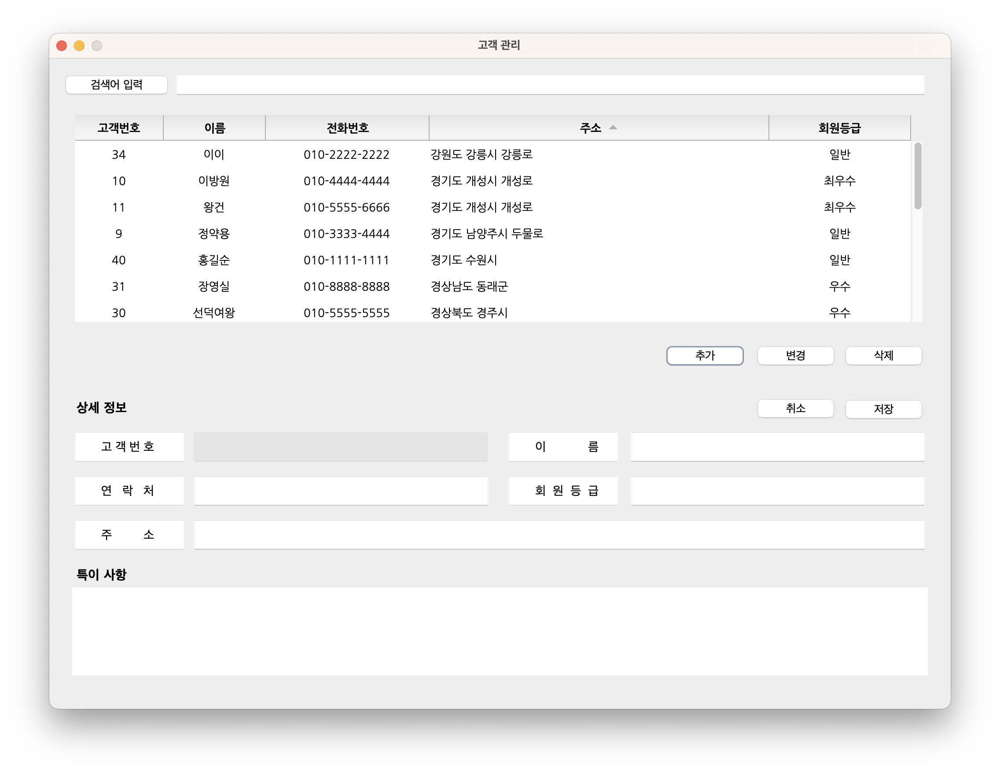

```java
public void addTableRow() {
    btnInsert.addActionListener(new ActionListener() {
        public void actionPerformed(ActionEvent e) {
            panelBottom.setVisible(true);
        }
    });
}
```

1. 고객 정보 입력 
2. 텍스트필드 값이 비어있는지 검사 
3. 데이터베이스에 추가
4. auto increment로 설정되어 있는 id값(고객번호) 반환
5. -1이 아니면, 즉 고객번호가 반환되었으면 UI table에 행 추가
6. "고객 정보가 추가되었습니다" 팝업 창 띄운다.
7. UI table 화면 갱신
8. 하단 패널 감추기

```java
public boolean isValid(String[] inputList) {

    // 필수 입력값이 비어있으면 안내
    if(inputList[0].equals("") | inputList[0].length() == 0) {
        nameTextfield.setText("고객 이름을 입력하세요.");
    } else if(inputList[1].equals("") | inputList[1].length() == 0) {
        telTextfield.setText("고객 전화번호를 입력하세요.");
    } else if(inputList[2].equals("") | inputList[2].length() == 0) {
        addressTextfield.setText("고객 주소를 입력하세요.");
    } else if(inputList[3].equals("") | inputList[3].length() == 0) {
        gradeTextfield.setText("고객 등급을 입력하세요.");
    }

    // 필수 입력칸이 입력되었는지 검사
    for(String item: inputList) {
        if(item.equals("") | item.length() == 0)
            return false;
    }
    return true;
}

public void saveData() {
    btnSave.addActionListener(new ActionListener() {
        public void actionPerformed(ActionEvent e) {

            String[] inputList = new String[4];
            inputList[0] = nameTextfield.getText();
            inputList[1] = telTextfield.getText();
            inputList[2] = addressTextfield.getText();
            inputList[3] = gradeTextfield.getText();

            boolean valid = isValid(inputList);  // 데이터가 모두 입력되었는지 검사  

            // 데이터베이스에 추가 (고객번호 필드는 비어있고 다른 필드는 모두 값이 입력됨)
            if (valid && idTextfield.getText().equals("")) {
                
                // 데이터베이스에 고객정보 추가하고 id 가져오기
                int id = customer.createCustomer(inputList[0], inputList[1], inputList[2], inputList[3]);

                if (id != -1) {
                    String[] newRow = { Integer.toString(id), inputList[0], inputList[1], inputList[2], inputList[3] };
                    
                    tableModel.addRow(newRow);			// UI 테이블에 행 추가

                    JOptionPane.showMessageDialog(null, "고객 정보가 추가되었습니다");

                    tableModel.fireTableDataChanged();  // UI 테이블 정보 갱신
                }
                panelBottom.setVisible(false);          // 하단 패널 가리기
            }
        }
    });
}
```

sql 함수

```java
// table에 데이터 추가
public int createCustomer(String name, String tel, String address, String grade) {
    try {
        con = getConnection();
        psmt = con.prepareStatement(
                "INSERT INTO customertb "
                        + "(name, tel, address, grade) "
                        + "VALUES "
                        + "('" + name + "', '" + tel + "', '" + address + "', '" + grade + "')"  
                ); 
        psmt.executeUpdate();
        psmt = con.prepareStatement("SELECT LAST_INSERT_ID();");
        ResultSet rs = psmt.executeQuery();
        rs.next();
        System.out.println("고객정보가 추가되었습니다.");
        return rs.getInt(1);
    } catch(Exception e) {
        System.out.println(e.getMessage());
        return -1;
    } finally {
        close(psmt, con);
    }
}
```

#### 미해결 문제

텍스트필드를 입력하지 않은 상태로 계속 저장버튼을 누르면 '고객 ...을 입력하세요.'란 메시지가 입력되고 결국에 데이터베이스에 저장이 된다. 

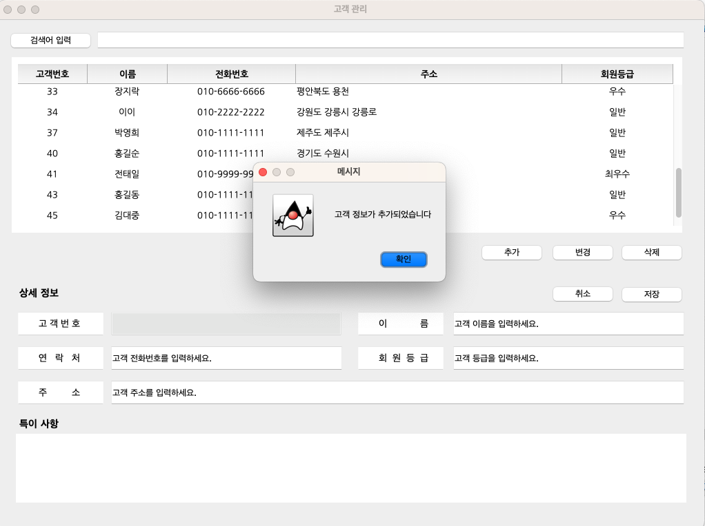

안내 메시지를 텍스트필드에 나타내지 말고 tooltip으로 보여야 하는데, tooltip 메시지는 마우스를 올려야 나타나서 구현하지 못했다. 

## 삭제

먼제 UI table에서 삭제할 행을 선택한다. 선택하지 않고 `삭제` 버튼을 누르면 아래와 같은 팝업이 뜬다.


```java
if( table.getSelectedRow() == -1) {   // table.getSelectedRow() -> 선택한 행이 없으면 -1 반환
    JOptionPane.showMessageDialog(null, "테이블에서 삭제할 행을 선택하세요.");
}    
```

1. UI table에서 삭제할 행 선택
2. 인덱스를 이용해 고객번호(id) 가져오기
3. id를 이용해 데이터베이스의 해당 레코드 삭제
4. UI table 행 삭제
5. 삭제되었다는 팝업 메시지 띄우기

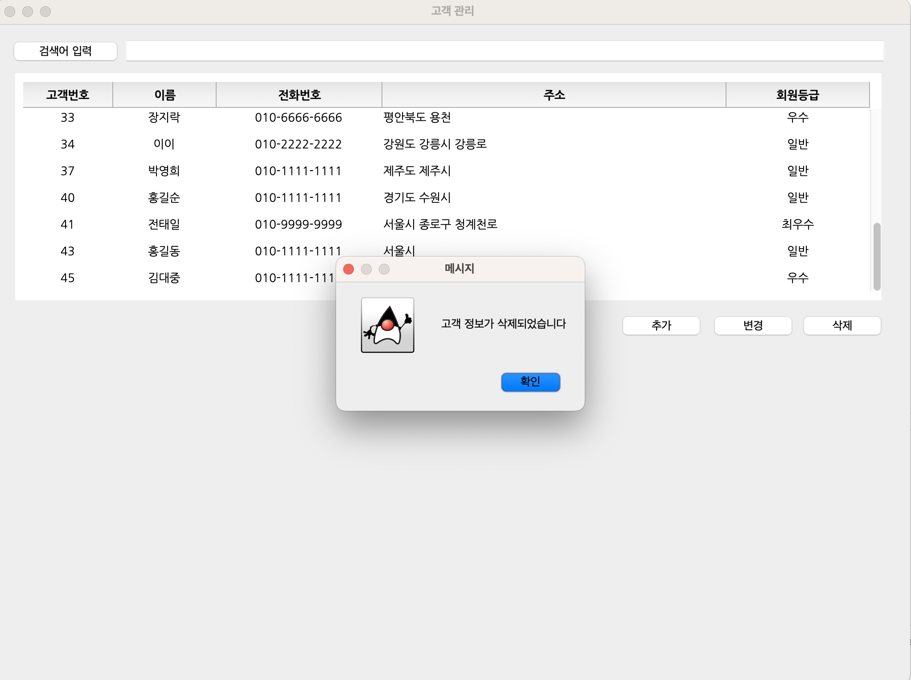

```java
	/**
	 *  UI테이블에서 선택한 행의 고객번호(id) 가져오기 
	 */
	public String getCustomerId(int seledtedIdx) {
		String selectedId = (String) table.getValueAt(seledtedIdx, 0);  // 인덱스 행의 첫번째 컬럼값 반환
		return selectedId;
	}

	/**
	 *  UI테이블에서 선택한 행 삭제 
	 */
	public void deleteTableRow() {

		btnDelete.addActionListener(new ActionListener() {
			public void actionPerformed(ActionEvent e) {

				selectedIdx = table.getSelectedRow();    // 선택한 행 인덱스 반환. 선택한 행이 없으면 -1 반환 
				if( selectedIdx == -1) {   
					JOptionPane.showMessageDialog(null, "테이블에서 삭제할 행을 선택하세요.");
				} else {
					// 선택한 행의 고객번호(id) 가져오기
					String selectedId = getCustomerId(selectedIdx); 
					// db 데이터 삭제
					customer.deleteCustomer(selectedId);
					// UI 테이블 행 삭제
					tableModel.removeRow(selectedIdx);
					
					JOptionPane.showMessageDialog(null, "고객 정보가 삭제되었습니다");
				}
			}
		});
	}
```

sql 함수 - id값을 기준으로 삭제

```java
public void deleteCustomer(String id) {
    try {
        con = getConnection();
        psmt = con.prepareStatement("DELETE FROM customertb WHERE id = '" + id + "'");
        psmt.executeUpdate();
        System.out.println("고객 정보가 삭제되었습니다");
    } catch(Exception e) {
        System.out.println(e.getMessage());
    } finally {
        close(psmt, con);
    }
}
```

## 변경

삭제 때와 마찬가지로 UI table에서 행을 선택하지 않고 `변경`버튼을 누르면 팝업 버튼이 뜬다.

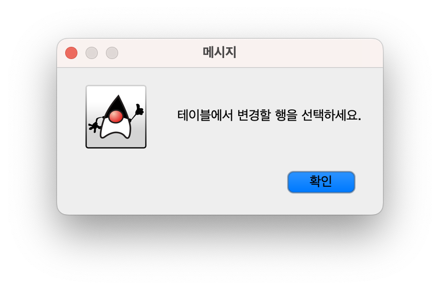

```java
public void updateTableRow() {
    btnUpdate.addActionListener(new ActionListener() {
        public void actionPerformed(ActionEvent e) {
            selectedIdx = table.getSelectedRow();    // 선택한 행이 없으면 -1 반환 
            if( selectedIdx == -1) {   
                JOptionPane.showMessageDialog(null, "테이블에서 변경할 행을 선택하세요.");
            } else {
                idTextfield.setText((String)table.getValueAt(selectedIdx, 0));
                nameTextfield.setText((String)table.getValueAt(selectedIdx, 1));
                telTextfield.setText((String)table.getValueAt(selectedIdx, 2));
                addressTextfield.setText((String)table.getValueAt(selectedIdx, 3));
                gradeTextfield.setText((String)table.getValueAt(selectedIdx, 4));
                
                panelBottom.setVisible(true);

                // 테이블에서 다른 곳을 선택할 수 없도록 설정 
                
            }
        }
    });
}
```

1. UI table에서 변경할 행 선택
2. 하단 패널이 나타나고 텍스트 필드에는 기존 데이터가 입력되어 있다. 단, 고객번호는 편집 불가능하게 처리함(`idTextfield.setEditable(false);`)
3. 저장 버튼을 누르면 데이터를 추가할 때와 마찬가지로 필수 입력 필드가 비어있는지 검사한다.(기존 저장 함수에 코드를 추가한다.)
4. 변경과 추가의 구분은 id값의 유무에 의해 판별한다. 
5. 고객번호(id)를 이용하여 데이터베이스의 값을 변경한다
6. UI table을 갱신하고
7. 변경 작업이 성공했다는 팝업창을 띄운다

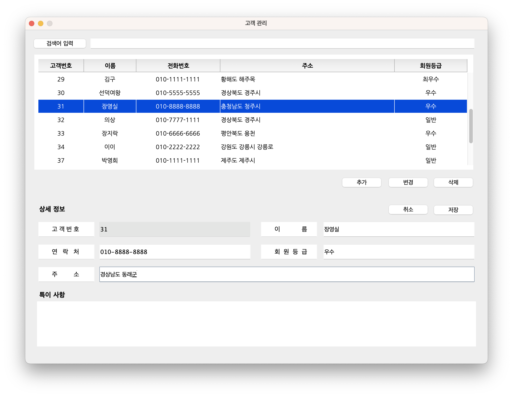

```java
public void saveData() {
    btnSave.addActionListener(new ActionListener() {
        public void actionPerformed(ActionEvent e) {

            String[] inputList = new String[4];
            inputList[0] = nameTextfield.getText();
            inputList[1] = telTextfield.getText();
            inputList[2] = addressTextfield.getText();
            inputList[3] = gradeTextfield.getText();

            boolean valid = isValid(inputList);  // 데이터가 모두 입력되었는지 검사  

            // 데이터베이스에 추가 (고객번호 필드는 비어있고 다른 필드는 모두 값이 입력됨)
            if (valid && idTextfield.getText().equals("")) {
                
                // 데이터베이스에 고객정보 추가하고 id 가져오기
                int id = customer.createCustomer(inputList[0], inputList[1], inputList[2], inputList[3]);

                if (id != -1) {
                    String[] newRow = { Integer.toString(id), inputList[0], inputList[1], inputList[2], inputList[3] };
                    
                    tableModel.addRow(newRow);			// UI 테이블에 행 추가

                    JOptionPane.showMessageDialog(null, "고객 정보가 추가되었습니다");

                    tableModel.fireTableDataChanged();  // UI 테이블 정보 갱신
                }
                panelBottom.setVisible(false);          // 하단 패널 가리기
            
            // 데이터베이스 변경 (고객번호 필드에 값이 있으면 변경 처리)
            } else if (!idTextfield.getText().equals("")) {
                // db update
                customer.updateCustomer(idTextfield.getText(), inputList[0], inputList[1], inputList[2], inputList[3]);
                
                //UI table update. 고객번호 유지
                table.setValueAt(inputList[0], selectedIdx, 1);   
                table.setValueAt(inputList[1], selectedIdx, 2);
                table.setValueAt(inputList[2], selectedIdx, 3);
                table.setValueAt(inputList[3], selectedIdx, 4);
                
                JOptionPane.showMessageDialog(null, "고객 정보가 변경되었습니다");

                tableModel.fireTableDataChanged();  // UI 테이블 정보 갱신
                panelBottom.setVisible(false);
            }
        }
    });
}
```

sql 함수 - id값을 기준으로 변경

```java
// update 
public void updateCustomer(String id, String name, String tel, String address, String grade) {
    try {
        con = getConnection();
        psmt = con.prepareStatement("UPDATE customertb SET name ='" + name + 
                "', tel = '" + tel + 
                "', address = '" + address + 
                "', grade ='" + grade + 
                "' WHERE id ='" + id +"' ;");
        psmt.executeUpdate();
        System.out.println("고객 정보가 변경되었습니다");
    } catch(Exception e) {
        System.out.println(e.getMessage());
    } finally {
        close(psmt, con);
    }
}
```

#### 미해결 문제

저장 후 먹통이 되는 현상이 발생했다. sql 처리한 후에 연결을 종료하는 코드를 넣으니 발생 빈도가 줄긴 했지만 여전히 사라지지 않았다.


## 로그인 화면 추가

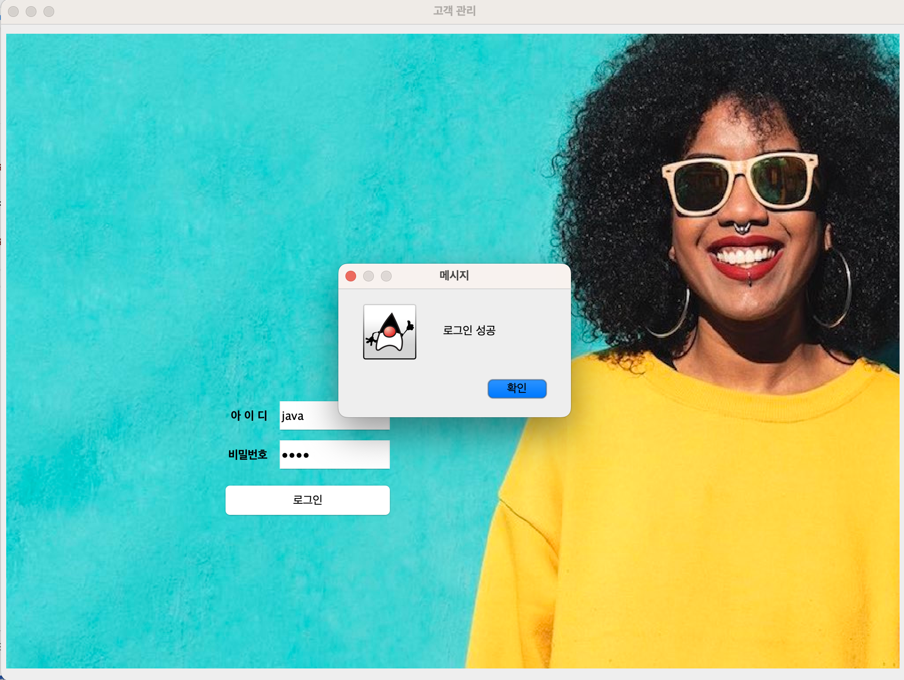

1. 로그인 패널을 만들어 아이디, 비밀번호, 버튼 컴포넌트를 붙이고 
1. 초기에 다른 패널을 모두 가리고 로그인 패널만 보이게 만들었다.
1. 로그인이 성공하면 로그인 패널을 가리고 다른 패널이 보이게 했다.
1. 코드에 아이디와 비밀번호가 있는 것이 좋지 않지만 자바로 구현하는 방법을 찾을 시간이 없어 그대로 두었다.

```java
panelLogin = new JPanel();
panelLogin.setBounds(6, 6, 1012, 720);

BufferedImage bufferedImage = null;
try {
    bufferedImage = ImageIO.read(new File("./images/background.jpeg"));
} catch (IOException e1) { e1.printStackTrace(); }
Image image = bufferedImage.getScaledInstance(1012, 720, Image.SCALE_DEFAULT);
ImagePanel imagePanel = new ImagePanel(image);
panelLogin.add(imagePanel);
imagePanel.setLayout(null);

JLabel labelID = new JLabel("아 이 디");
labelID.setHorizontalAlignment(SwingConstants.RIGHT);
labelID.setFont(new Font("Lucida Grande", Font.BOLD, 13));
labelID.setBounds(240, 415, 60, 30);
imagePanel.add(labelID);

JLabel labelPW = new JLabel("비밀번호");
labelPW.setHorizontalAlignment(SwingConstants.RIGHT);
labelPW.setFont(new Font("Lucida Grande", Font.BOLD, 13));
labelPW.setBounds(240, 459, 60, 30);
imagePanel.add(labelPW);

idText = new JTextField();
idText.setBounds(311, 410, 130, 40);
imagePanel.add(idText);
idText.setColumns(10);

pwText = new JPasswordField();
pwText.setColumns(10);
pwText.setBounds(311, 454, 130, 40);
imagePanel.add(pwText);

btnLogin = new JButton("로그인");
btnLogin.addActionListener(new ActionListener() {
    public void actionPerformed(ActionEvent e) {
        String id = "java";
        String pass = "1234";
        
        System.out.println(idText.getText());
        if(id.equals(idText.getText())&&pass.equals(pwText.getText())){
            JOptionPane.showMessageDialog(null, "로그인 성공");
            
            panelLogin.setVisible(false);
            panelMain.setVisible(true);
            panelTable.setVisible(true);
        } else {
            JOptionPane.showMessageDialog(null, "아이디 또는 비밀번호를 잘못 입력했습니다");
        }
    }
});
btnLogin.setBounds(250, 506, 191, 40);
imagePanel.add(btnLogin);
frame.getContentPane().add(panelLogin);
```

## 과제

- 버튼 클릭 후 먹통 현상의 원인을 찾으니 동시성(Concurency) 문제인 것 같다.
- 문제를 해결하려면 먼저 스레드를 다루는 방법을 익혀야 하고
- 자바 스윙에서 스레드를 어떻게 처리하는지 알아야 한다.
- 스레드에 관한 개념은 [Do it 자바 완전정복 15장 쓰레드](https://www.youtube.com/playlist?list=PLR9w0n2BH7rci0nw5SGiYN0-Ded98-Ew5) 강좌로 잡았다. 아주 좋은 강의다.
- 자바 스윙은 `initial threads`, `event dispatch thread`, `Worker threads` 세 가지를 제공하는데 각 클래스와 어떻게 작동하는지 이해하지 못했다.
