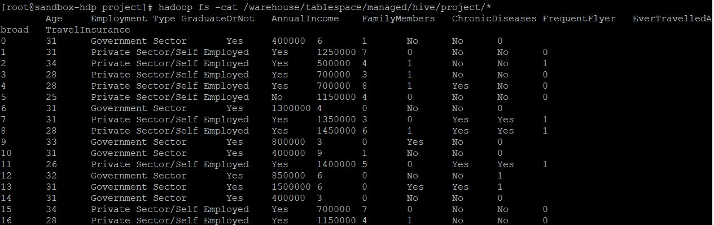
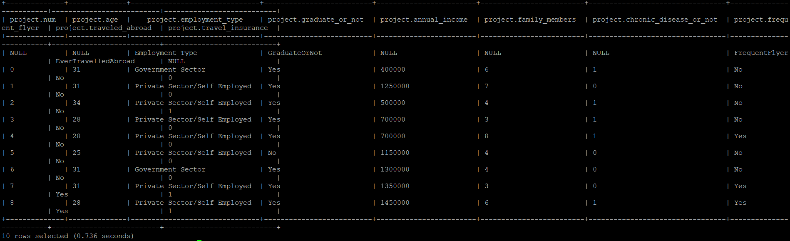
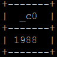
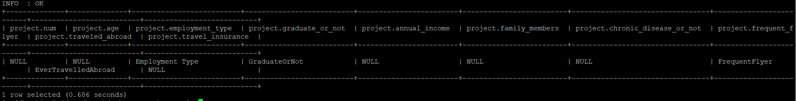
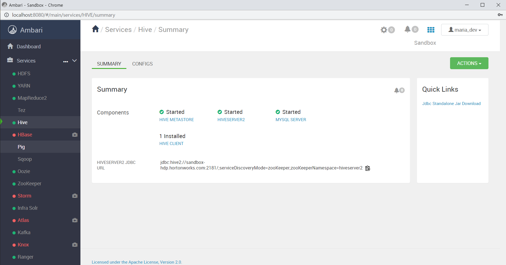
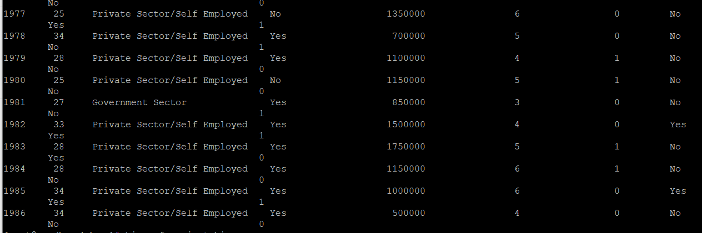
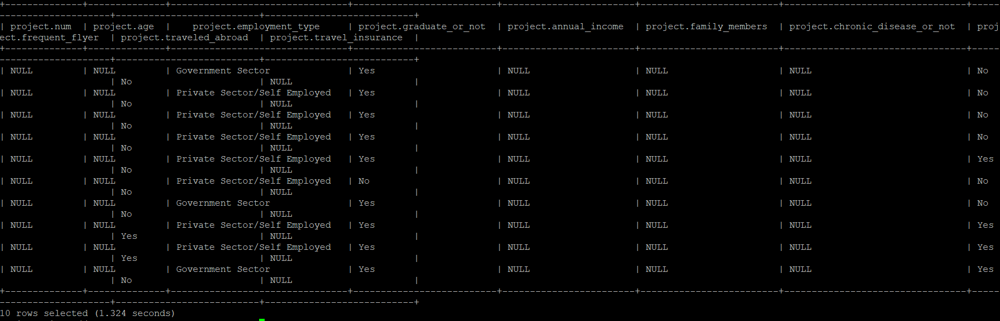
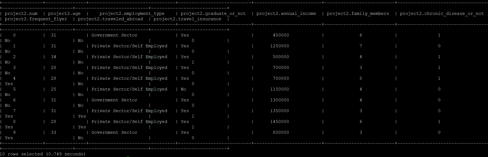

## 프로젝트 과제

1. 프로젝트 기간 : 2023. 1. 20. 금요일
2. 방법: 캐글에서 데이터 받아 하둡에 저장하고 pig, hive를 활용해 데이터를 분석한다.

## 데이터

1. 출처 : [Travel Insurance Prediction Data](https://www.kaggle.com/datasets/tejashvi14/travel-insurance-prediction-data?resource=download){target=_blank}
2. 목적 : 여행자보험에 가입하는 고객의 특성 파악
3. 수집 데이터 : 나이, 직업유형, 대학졸업여부, 연수입, 가족수, 만성질환유무, 잦은항공기탑승여부, 해외여행경험유무
4. 타깃 데이터 : 고객의 여행자보험가입여부
5. 데이터 형태 : TravelInsurancePrediction.csv

## 데이터를 하둡에 업로드 후 pig -> hive 형식으로 저장

1. hortonworks 리눅스에 프로젝트 디렉토리 생성: `[Linux] mkdir /root/project` 
2. 윈도우에 있는 csv 파일을 hortonworks 리눅스의 '/root/project' 디렉토리에 전송(윈도우 터미널에서 실행): `scp -P 2222 TravelInsurancePrediction.csv root@localhost:/root/project`
3. 하둡에 project 디렉토리 만듦: `[Linux] hadoop fs -mkdir /user/root/project`
4. 리눅스에 있는 csv 파일을 하둡의 project 디렉토리에  전송: `[Linux] hadoop fs -put /root/project/TravelInsurancePrediction.csv /user/root/project`
5. 하둡에 있는 csv 파일을 hive의 warehouse로 저장할 스크립트 파일 작성: `[Linux] vi project.pig`

하둡의 '/user/root/project/TravelInsurancePrediction.csv' 파일을 읽어(LOAD) 쉼표로 구분하여(USING PigStorage(',')) insurance 변수에 저장한다. : `insurance = LOAD '/user/root/project/TravelInsurancePrediction.csv' USING PigStorage(',');`

insurance 변수의 첫 번째($0) 컬럼은 int 자료형의 num 변수로, 두 번째($1) 컬럼은 int 자료형의 age 변수로 생성한다. csv의 모든 컬럼을 이렇게 변수로 생성해 project_insure 변수로 저장한다.

```sql
project_insure = FOREACH insurance GENERATE 
    $0 AS num:int 
    $1 AS age:int,
    (이하 생략)
```

project_insure 변수를 hive가 관리하는 '/warehouse/tablespace/managed/hive/project/' 디렉토리에 저장한다.: `STORE project_insure INTO '/warehouse/tablespace/managed/hive/project/';`


전체 코드

```sql
insurance = LOAD '/user/root/project/TravelInsurancePrediction.csv' USING PigStorage(',');
project_insure = FOREACH insurance GENERATE
        $0 AS num:int,
        $1 AS age:int,
        $2 AS employment_type:chararray,
        $3 AS graduate_or_not:chararray,
        $4 AS annual_income:int,
        $5 AS family_members:int,
        $6 AS chronic_disease_or_not:int,
        $7 AS frequent_flyer:chararray,
        $8 AS traveled_abroad:chararray,
        $9 AS travel_insurance:int;
STORE project_insure INTO '/warehouse/tablespace/managed/hive/project/';
```

6. 데이터베이스 테이블을 만들 hive 스크립트 작성 : `[Linux] vi project.hive`

```sql
create table project (
        num int,
        age int,
        (이하 생략)
```

pig 스크립트에서 지정한 변수명과 동일하게 작성한다. 문자 자료형을 pig에서는 chararray로, hive에서는 string으로 설정하는 점이 다르다. 

```sql
ROW FORMAT DELIMITED FIELDS TERMINATED BY '\t'
STORED AS TEXTFILE;
```

hive는 pig로 저장한 파일을 불러와 테이블을 생성한다. csv 파일은 쉼표(,)로 구분되어 있지만, pig로 변환하면서 탭(\t)으로 바뀌었다. 스크립트를 실행한 후에 `hadoop fs -cat /warehouse/tablespace/managed/hive/project/*` 명령으로 파일 내용을 보면 탭으로 구분되어 있음을 확인할 수 있다.

전체 코드

```sql
create table project (
        num int,
        age int,
        employment_type string,
        graduate_or_not string,
        annual_income int,
        family_members int,
        chronic_disease_or_not int,
        frequent_flyer string,
        traveled_abroad string,
        travel_insurance int)
ROW FORMAT DELIMITED FIELDS TERMINATED BY '\t'
STORED AS TEXTFILE;
```

6. 먼저 pig 스크립트 파일을 실행한다.: `[Linux] pig project.pig`
7. pig 스크립트가 잘 실행되어 csv 파일이 hive가 불러들을 수 있게 저장되었는지 확인: `hadoop fs -cat /warehouse/tablespace/managed/hive/project/*` -> 탭으로 구분된 데이터가 보이지 않으면 경로를 잘못 지정했을 수 있으니 확인해서 스크립트를 수정 후 다시 실행한다.



8. hive 스크립트 파일을 실행한다 : `[Linux] hive -f project.hive`

## 생성한 테이블 확인

1. hive로 들어가서 테이블이 만들어졌는지 확인한다. 새로 만든 테이블 이름은 project다.: `[hive] show tables;`


2. 테이블 스키마를 출력한다.: `[hive] describe project;`


3. 10개 데이터만 출력해본다.: `[hive] select * from project limit 10;



## 데이터 분석

### 데이터 개수 확인: `[hive] select count(*) from project;`



### 타겟에 null 존재 여부 확인: `[hive] select * from project where travel_insurance is null;`



### null이 대부분인 행 삭제: `[hive]delete from project where travel_insurance is null;`

Error: Error while compiling statement: FAILED: SemanticException [Error 10414]: Attempt to do update or delete on table default.project that is insert-only transactional (state=42000,code=10414)

행 삭제가 안 된다. 아마도 막아둔 것 같다.

## 장애 발생!!! hive 서버가 실행되지 않는다.

위 에러를 없애기 위해 `/etc/hive/conf/hive-site.xml` 파일을 수정했다. 
그런데, hiveserver가 실행되지 않는 사태 발생!!! 이래저래 시도해도 고쳐지지 않았다.

포기하고 pig로 대신하려 했으나 dump를 실행하면 무한 retry 현상 발생!!!!

결국 hortonworks 재설치 ===> 재설치 중 오류 메시지 ===> 다시 재설치

재설치하려고 교재를 다시 보니 Ambari 대시보드가 있는 걸 알았다. 교재에 있는 아이디와 비밀번호로 로그인하면 모든 프로그램의 상태를 볼 수 있다.



### 여전히 hive에서 문제 발생

이전과 똑같은 방식으로 진행했다. 그런데 pig파일로 warehouse 내로 파일을 보내는 것은 정상적으로 됐으나 hive로 테이블을 만들 때 string형 컬럼만 들어오고 int형 컬럼은 들어오지 않는다. 여러 번 해도 마찬가지.ㅜㅜ





강사님 말씀대로 hive에서 자료형을 모두 string으로 바꾸니 모두 들어왔다.



### 보험 가입, 미가입 그룹별로 나이, 연수입, 가족수 평균 비교

`select travel_insurance, AVG(age) as age,AVG(annual_income) as income, AVG(family_members) as family from project2 group by travel_insurance;`


희안하게도 string 자료형인데 평균 계산이 된다. 자동형변환을 해주는 건가?

윗줄이 보험미가입 그룹, 아랫줄이 보험가입 그룹이다. 나이와 가족수는 차이가 없고 연수입은 차이가 난다는 것을 알 수 있다. 수입이 많은 사람이 적은 사람보다 여행자 보험에 더 많이 가입함을 보여준다.


## pig로 데이터 분석

### csv 파일 변수로 로드: 

```pig
A = load 'travel.csv' using PigStorage(',') as (num:int,age:int,employment_type:chararray,graduate_or_not:chararray,annual_income:int,family_members:int,chronic_disease_or_not:int,frequent_flyer:chararray,traveled_abroad:chararray,travel_insurance:int);
```

### 보험 가입 유무 인원 비교

1. 타겟 컬럼인 보험 가입 유무 변수로 그룹화: `insur = GROUP A BY travel_insurance;`
2. 그룹별 인원 구하기: `total_insur = foreach insur generate group, (chararray)COUNT(A) AS total;`
3. 화면 표시: `dump total_insur;`

결과
(0, 1277)
(1, 710)

=> 보험에 가입하지 않은 사람은 1277명으로 전체의 64% 가입한 사람은 710명으로 전체의 36%이다.

