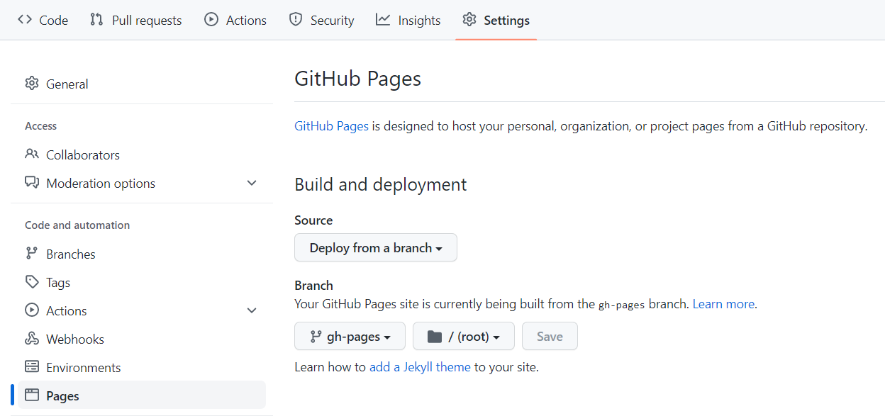

[obsidian-publish-mkdocs](https://github.com/jobindjohn/obsidian-publish-mkdocs){target=_blank} 에서 초록색 'Use this template' 버튼 눌러 깃허브 페이지로 사용할 레포지토리 생성(복사할 때는 main 브랜치만 복사한다.)

나의 레포지토리에 가서 깃헙 페이지로 설정

이 레포지토리를 pc로 clone 한다.  

docs 폴더를 옵시디언 볼트로 지정한다.  

docs 폴더 안에 공개하려고 하는 노트를 넣는다.  

git commit, git push 하면 Github actions가 웹페이지를 만든다.

Actions 버튼을 누르면 변환 과정을 확인할 수 있다.

깃헙 주소로 가면 웹페이지 볼 수 있다.
