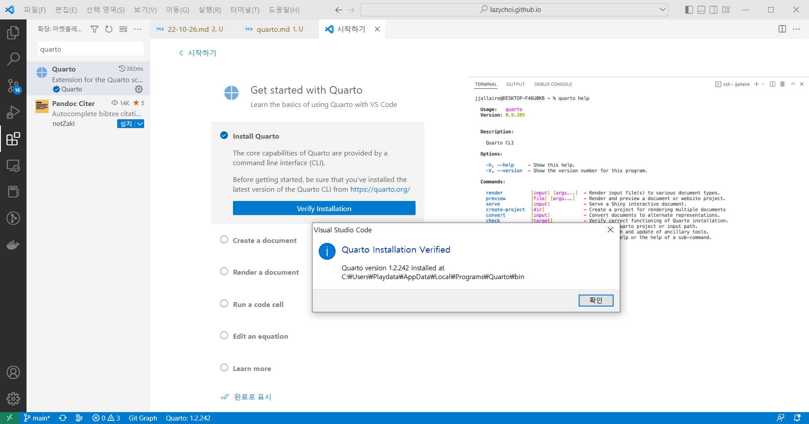
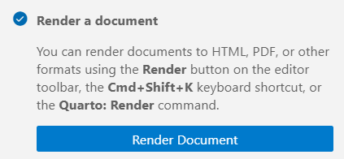
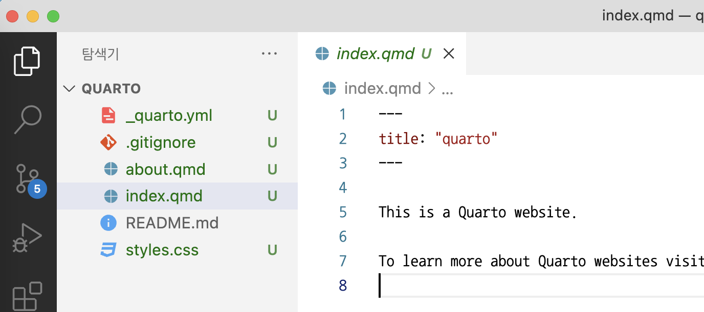

## 설치

- [quarto 홈페이지](https://quarto.org/docs/get-started/)에서 운영체제에 맞는 파일을 받아 실행
- 맥 Homebrew 설치: `brew install --cask quarto`

## vscode에서 사용 tutorial

[공식 문서](https://quarto.org/docs/get-started/hello/vscode.html){target=_blank}

1. vscode에서 quarto vscode extension 설치



2. quarto 문서 만들기


walkthrough.qmd 문서가 열린다.

3. walkthrough.qmd 파일을 렌더링하여 html 파일로 변환한다.



변환하면 같은 폴더에 walkthrough.html 파일과 walkthrough_files 폴더가 만들어진다.

## 주피터 노트북 사용 tutorial

### yml 설정

- 코드 블록 숨기기/보이기 설정
- 코드 블록 숨기기/보이기 버튼 우측 상단에 보이게 설정

## 웹사이트 만들기

- [공식 문서](https://quarto.org/docs/websites/)

==주의할 점!!!== 나는 깃허브에 quarto 리포를 먼저 만들고 로컬에 클론했다. 그래서 Website Project를 선택한 뒤 나타는 창에서 반드시 quarto 폴더의 **부모 폴더**를 선택해야 한다. 그러고 나서 뜨는 입력 창에 웹사이트의 홈 폴더로 사용할 깃허브 폴더명인 quarto를 입력한다. 그러면 quarto 폴더 안에 아래처럼 _quarto.yml, index.qmd, about.qmd, style.css 파일이 만들어진다.



- 미리보기 : 문서 우측 위의 render 버튼 클릭한다. 변경한 후 다시 render 버튼을 눌러야 반영된다.
- 최종 html 파일 만들기: 터미널에서 quarto render -> _site 폴더에 html 파일이 만들어진다.

## 깃허브 페이지를 호스팅 서버로 사용하기

[공식 문서](https://quarto.org/docs/publishing/github-pages.html)

## 사용법

### 멀티 컬럼 사용하기

```material

::: {.grid}
::: {.g-col-5}
1행 1열
:::

::: {.g-col-5}
1행 2열
:::
:::

::: {.grid}
::: {.g-col-5}
2행 1열
:::

::: {.g-col-5}
2행 2열
:::
:::
```

[공식 설명서](https://quarto.org/docs/output-formats/page-layout.html){target=_blank}

### callout

[공식 설명서](https://quarto.org/docs/authoring/callouts.html){target=_blank}
