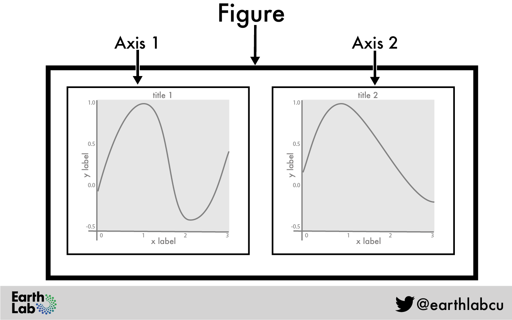
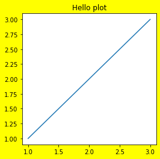

## 출처

- 권철민, 파이썬 머신러닝 완벽 가이드
- [matplotlib tutorial](https://matplotlib.org/stable/tutorials/introductory/quick_start.html){target=_blank}
- [Introduction to Plotting in Python Using Matplotlib](https://www.earthdatascience.org/courses/scientists-guide-to-plotting-data-in-python/plot-with-matplotlib/introduction-to-matplotlib-plots/){target=_blank}

## 주피터 노트북에서 한글 표시 설정

## Figure, Axes 객체

- Figure 객체: 그림 그리기 위한 캔버스 역할. 그림판 크기 조절, 그림을 최종적으로 화면에 나타내는 역할 수행. 실제 그림을 그리지는 않음
- Axes 객체: 실제 그림을 그리는 메서드 보유. X축, Y축, 타이틀, 범례 등의 속성 설정



**Figure 객체**

- 전체 그림판의 크기를 조절: plt.figure(figsize=(가로길이, 세로길이)) 길이 단위는 인치 -> figure 객체 반환
- 그림판 배경색 설정: plt.figure(facecolor='색상명') -> Axes 영역 제외



**Axes 객체**

plt.axes() -> 현재 사용중인 Axes 객체 반환(AxesSubplot)

plt.subplots() -> Figure와 Axes 객체를 함께 반환

```python
fig, ax = plt.subplots()
print('fig type', type(fig), '\nax type', type(ax))
# fig type <class 'matplotlib.figure.Figure'> 
# ax type <class 'matplotlib.axes._subplots.AxesSubplot'>
```

- Axes 객체를 이용해 선 그래프 그리기: ax.plot([1, 2, 3], [2, 4, 6]) = pyplot 모듈의 plt.plot()
- Axes 객체를 이용해 타이틀 설정: ax.title('title') = pyplot 모듈의 plt.title()

## subplots 만들기

- fig, (ax1, ax2, ...) = plt.subplots(nrows = n, ncols = m, figsize = (x, y))
- ax의 개수는 n * m

## 선 그래프

- [공식 문서](https://matplotlib.org/stable/api/_as_gen/matplotlib.pyplot.plot.html){target=_blank}
- plt.plot( x_value, y_value, color=, marker=, linestyle=, linewidth=, markersize=)
- 축 명칭: plt.xlabel('x축 이름'), plt.ylabel('y축 이름')
- 축 눈금값 등: plt.xticks(ticks=np.arange(a, b, c), rotation=n) -> 최솟값, 최댓값, 간격
